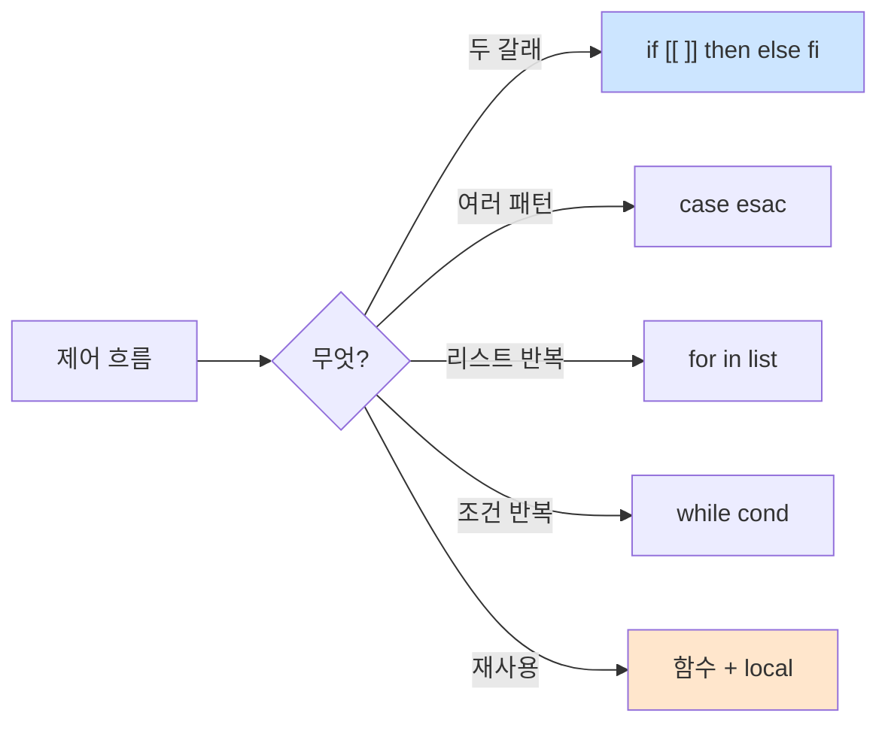

# Bash 제어 흐름 — if·case·for·while·함수

> **한 줄로** · `if`/`case`로 **선택**, `for`/`while`로 **반복**, **함수**로 코드 재사용. `[[ ... ]]`이 `[ ... ]`보다 안전(따옴표 안전, 정규식 지원). 함수 안 변수는 반드시 `local`로 격리. B1-1 monitor.sh의 상태 분기·verify.sh의 검증 반복이 이 흐름의 직접 응용.

---

## 과제 요구사항

### 이게 무슨 작업?

monitor.sh가 결정·반복을 해요:
- "PID가 있나, 없나" → **if**
- "프로세스 상태가 R인가, S인가, Z인가" → **case**
- "포트 20022와 15034 둘 다 LISTEN인가" → **for**
- 로그 함수 만들어서 반복 사용 → **함수**

회사 비유:
- if = **갈림길에서 결정** ("이러면 A, 저러면 B")
- case = **여러 선택지** ("상태가 1이면 X, 2면 Y, 3이면 Z")
- for = **여러 대상에 반복 작업** ("포트 A, B, C 각각 확인")
- 함수 = **표준 작업 절차** (한 번 만들어 여러 곳에서 사용)

### 명세 원문 (원본 그대로)

> **헬스 체크**
> - agent-app 프로세스 존재 여부 확인
> - 미실행 시 `[ALERT] agent-app 미실행` 출력
>
> **자원 수집 + 임계값 경고**
> - CPU > 20%: [WARNING]
> - MEM > 10%: [WARNING]
> - DISK_USED > 80%: [WARNING]

→ 조건 분기 + 반복으로 처리.

### 무엇을 익히나

| 패턴 | 용도 |
|---|---|
| `if [[ ... ]]; then ... fi` | 두 갈래 분기 |
| `case "$X" in pat) ... ;; esac` | 여러 패턴 분기 |
| `for x in list; do ... done` | 리스트 반복 |
| `while cond; do ... done` | 조건 반복 |
| `func() { ... }` + `local` | 함수 재사용 |

### 잘 됐는지 확인하기

```bash
# 1. 스크립트 실행
./monitor.sh

# 2. 출력에 임계값 분기가 정확한지
# CPU=25% 면 [WARNING] CPU threshold exceeded ...
```

---

## 구현 방법

### Step 1 — `if`로 조건 분기

```bash
PID_FILE="/run/agent-app.pid"

if [[ -f "$PID_FILE" ]]; then
    echo "[OK] PID 파일 존재"
else
    echo "[ALERT] agent-app 미실행"
    exit 1
fi
```

자주 쓰는 test:

| 표현 | 의미 |
|---|---|
| `[[ -f $f ]]` | 파일 존재 |
| `[[ -d $d ]]` | 디렉토리 존재 |
| `[[ -z $s ]]` | 빈 문자열 |
| `[[ -n $s ]]` | 비어있지 않음 |
| `[[ $a == $b ]]` | 문자열 같음 |
| `[[ $a -gt $b ]]` | 숫자 큼 |
| `[[ $a =~ ^[0-9]+$ ]]` | 정규식 매칭 |

### Step 2 — `case`로 여러 분기

monitor.sh의 프로세스 상태 분기:

```bash
STATE=$(ps -p "$PID" -o stat= 2>/dev/null | head -c1)

case "$STATE" in
    R|S)
        echo "[OK] state=$STATE"
        ;;
    D)
        echo "[WARN] uninterruptible sleep"
        ;;
    Z)
        echo "[ALERT] zombie"
        exit 1
        ;;
    *)
        echo "[WARN] unknown state=$STATE"
        ;;
esac
```

- `R|S` — 또는(or) 조건
- `*` — 그 외 모든 경우 (반드시 마지막에)
- `;;` — 각 분기 끝

### Step 3 — `for`로 반복

monitor.sh의 여러 포트 검증:

```bash
for port in 20022 15034; do
    if ss -ltn | grep -q ":$port "; then
        echo "[OK] port $port listening"
    else
        echo "[WARNING] port $port not listening"
    fi
done
```

C 스타일도 가능:
```bash
for ((i=0; i<5; i++)); do
    echo "iteration $i"
done
```

### Step 4 — `while`로 조건 반복

```bash
# 파일 한 줄씩 읽기 (★ 표준 패턴)
while IFS= read -r line; do
    echo "line: $line"
done < /etc/passwd
```

`IFS=`(빈 IFS)와 `-r`(backslash escape 비활성)이 한 줄의 정확한 보존을 보장.

### Step 5 — 함수로 재사용

```bash
log() {
    local level="$1"
    shift
    echo "[$(date '+%Y-%m-%dT%H:%M:%S')] [$level] $*" | tee -a "$LOG_FILE"
}

check_threshold() {
    local name="$1"
    local value="$2"
    local thresh="$3"
    if [[ ${value%.*} -gt $thresh ]]; then
        log WARNING "$name threshold exceeded ($value > $thresh)"
    fi
}

# 사용
log INFO "monitor.sh 시작"
check_threshold "CPU" "$CPU_USED" "20"
check_threshold "MEM" "$MEM_USED" "10"
check_threshold "DISK" "$DISK_USED" "80"
```

★ `local`은 **함수 안에서만 유효한 변수**. 안 쓰면 전역과 충돌해서 디버깅 어려운 버그 발생.

전체 구현: [bin/monitor.sh](https://github.com/codewhite7777/codyssey_b1_1/blob/main/bin/monitor.sh)

---

## 개념

### `[`와 `[[`의 차이 (★ 중요)

|  | `[ ... ]` (POSIX) | `[[ ... ]]` (Bash) |
|---|---|---|
| 표준 | POSIX sh | Bash 확장 |
| 따옴표 | **필수** | 자동 (안 써도 OK) |
| 정규식 `=~` | ❌ | ✅ |
| 와일드카드 `==` | ❌ | ✅ |
| 단락 `&&`/`||` | ❌ (대신 `-a`/`-o`) | ✅ |
| 빈 변수 안전 | △ | ✅ |

```bash
# [ 사용 - 따옴표 필수
if [ "$NAME" = "alice" ]; then ...

# [[ 사용 - 따옴표 없어도 OK, 정규식도
if [[ $NAME =~ ^[A-Z] ]]; then ...
```

bash 스크립트라면 **`[[` 권장**.

### 함수와 `local`의 중요성

```bash
# ❌ local 없음 - 전역 오염
NAME="global"

bad_func() {
    NAME="from_function"     # 전역 NAME 변경
}

bad_func
echo "$NAME"     # "from_function" (★ 의도와 다름)

# ✅ local 사용 - 안전
good_func() {
    local NAME="from_function"   # 함수 안에서만
}

good_func
echo "$NAME"     # "global" (보존됨)
```

### 함수의 return — 값이 아니라 exit code

```bash
# ❌ return은 값 반환 X
get_pid() {
    return 12345    # exit code 12345 → 잘못된 사용 (max 255)
}

# ✅ 값 반환은 echo + $()
get_pid() {
    pgrep -f "agent-app" | head -1
}

PID=$(get_pid)   # 명령 치환으로 받기
```

`return 0`/`return 1`은 성공/실패 신호용으로만.

### for의 word-split 함정

```bash
files="a.txt b c.txt"   # 공백 포함

# ❌ word-split으로 4개 됨
for f in $files; do
    echo "$f"   # a.txt, b, c.txt (3개)
done

# ✅ array 사용
files=("a.txt" "b c.txt")
for f in "${files[@]}"; do
    echo "$f"   # a.txt, b c.txt (정확히 2개)
done
```

### while 루프 안 변수 변경의 함정 (★ 미묘)

```bash
count=0
echo "1 2 3" | while read num; do
    count=$((count + 1))     # 서브셸 안에서만 증가
done
echo "$count"                # ★ 0 (예상은 3)
```

`|`(파이프)는 서브셸을 만들어요. 서브셸 안 변수 변경은 부모로 안 전파됨.

해결:
```bash
# Process substitution 사용
count=0
while read num; do
    count=$((count + 1))
done < <(echo "1 2 3")
echo "$count"                # 3
```

### 제어 흐름 한눈에



### B1-1 monitor.sh의 종합 패턴

```bash
#!/usr/bin/env bash
set -euo pipefail

LOG_FILE="${AGENT_LOG_DIR:-/var/log/agent-app}/monitor.log"

# 함수 정의 ----
log() {
    local level="$1"; shift
    echo "[$(date '+%Y-%m-%dT%H:%M:%S')] [$level] $*" | tee -a "$LOG_FILE"
}

check_threshold() {
    local name="$1" value="$2" thresh="$3"
    if [[ "${value%.*}" -gt "$thresh" ]]; then
        log WARNING "$name threshold exceeded ($value > $thresh)"
    fi
}

# 메인 흐름 ----
log INFO "monitor.sh 시작"

# health check (if)
PID=$(pgrep -f "agent-app" | head -1 || true)
if [[ -z "$PID" ]]; then
    log ALERT "agent-app 미실행"
    exit 1
fi

# 자원 측정 후 임계값 분기 (반복)
CPU_USED=$(...)
MEM_USED=$(...)
DISK_USED=$(...)

check_threshold "CPU" "$CPU_USED" "20"
check_threshold "MEM" "$MEM_USED" "10"
check_threshold "DISK" "$DISK_USED" "80"

# 포트 LISTEN 확인 (for)
for port in 20022 15034; do
    if ss -ltn | grep -q ":$port "; then
        log OK "port $port listening"
    else
        log WARNING "port $port not listening"
    fi
done

log INFO "monitor.sh 완료"
exit 0
```

---

## 참고

- `man bash` — Compound Commands, Functions
- 관련 노트: [bash-fundamentals.md](./bash-fundamentals.md) — Bash 기본
- 관련 노트: [bash-substitution.md](./bash-substitution.md) — 변수 치환

---
출처: B1-1 (Layer 4.3) · 학습일: 2026-05-12
