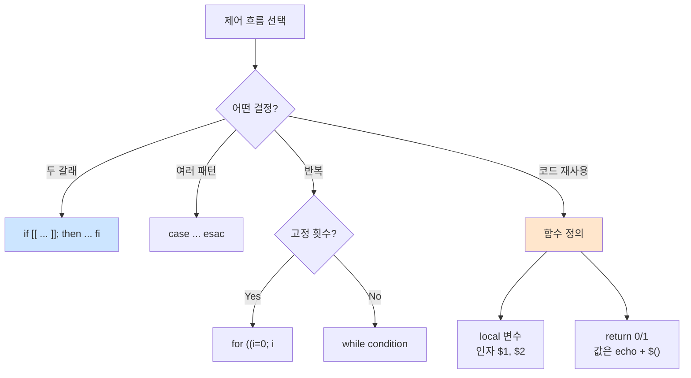

# Bash 제어 흐름: 조건·반복·함수

> **TLDR** · `if [ ... ]; then`(POSIX) vs `if [[ ... ]]; then`(Bash 확장 — 더 안전). `for var in list`(공백 분리) vs `for ((i=0; i<n; i++))`(C 스타일). 함수는 인자 받으면 `$1`, `$2`, return은 exit code(0~255)만 가능 — 값 반환은 `echo`로. `local` 키워드로 함수 내 변수 격리 필수.

## 개요

Bash의 제어 흐름은 다른 언어와 형식이 유사하지만 미묘한 차이가 많다. `[`와 `[[`의 구분, for 루프의 두 가지 형태, 함수의 return 동작 등이 함정을 만든다. 운영 자동화 스크립트는 이 차이를 정확히 알아야 안전하다.

## 왜 알아야 하나

monitor.sh·setup 스크립트의 대부분이 조건·반복·함수의 조합이다. 잘못 쓰면 빈 변수 비교 오류, 의도하지 않은 word splitting, return 값 혼란 같은 버그가 발생한다. 또한 `[[`의 정규식·패턴 매칭은 `[`로는 불가능한 강력한 기능이라, Bash 스크립트만 작성한다면 적극 활용할 가치가 있다.

## if·test — 조건 분기

Bash에서 `if`는 명령의 exit code로 분기한다. test 명령(`[`)이 가장 흔한 조건 표현.

```bash
if [ -f "/etc/passwd" ]; then          # POSIX test
    echo "file exists"
fi

if [[ -f "/etc/passwd" ]]; then        # Bash 확장 (권장)
    echo "file exists"
fi
```

`[` 와 `[[`의 차이:

| | `[ ... ]` | `[[ ... ]]` |
|---|---|---|
| 표준 | POSIX | Bash 확장 |
| word splitting | 발생 (quoting 필수) | 없음 (안전) |
| 정규식 매칭 | 불가 | `=~` 지원 |
| 패턴 매칭 | 불가 | `==` 와일드카드 |
| 단락 평가 | `-a`, `-o` | `&&`, `||` |
| 변수 quoting | **필수** | 권장 (안 해도 안전) |

대부분의 경우 `[[`가 더 안전하고 강력하다. POSIX 호환이 필수가 아니라면 `[[` 사용.

자주 쓰는 test 옵션:

```bash
[ -f "$file" ]      # 일반 파일
[ -d "$dir" ]       # 디렉토리
[ -x "$cmd" ]       # 실행 가능
[ -r "$file" ]      # 읽기 가능
[ -z "$str" ]       # 빈 문자열
[ -n "$str" ]       # 빈 문자열 아님
[ "$a" = "$b" ]     # 문자열 같음
[ "$a" -eq 10 ]     # 정수 같음
[ "$a" -gt 5 ]      # 정수 큼
```

`[[` 만의 강력한 기능:

```bash
[[ "$name" =~ ^[A-Z][a-z]+$ ]]      # 정규식 매칭
[[ "$file" == *.txt ]]              # 와일드카드 (glob)
[[ "$a" == "$b" && "$c" == "$d" ]]  # 단락 평가
```

## case — 패턴 분기

여러 패턴을 분기할 때 if/elif보다 case가 깔끔하다.

```bash
case "$STAT" in
    R|S)     echo "running or sleeping" ;;
    D)       echo "uninterruptible sleep" ;;
    Z)       echo "zombie" ;;
    [TT])    echo "stopped" ;;
    *)       echo "unknown: $STAT" ;;
esac
```

각 패턴 끝에 `;;`(또는 `;&` for fallthrough). 매칭 순서대로 평가되며 첫 매칭만 실행.

monitor.sh의 프로세스 상태 분기에 자주 쓰는 패턴이다.

## 반복문: while, for, until

`while`은 조건이 참(exit 0)인 동안 반복.

```bash
count=0
while [ $count -lt 5 ]; do
    echo "count: $count"
    ((count++))
done

# 파일 한 줄씩 읽기
while IFS= read -r line; do
    echo "line: $line"
done < /etc/passwd
```

★ 파일 읽기 패턴 `while IFS= read -r line`은 매우 자주 쓴다. `IFS=`로 leading/trailing whitespace 보존, `-r`로 backslash escape 비활성.

`for`는 두 가지 형태:

```bash
# 형태 1: 리스트 순회 (Bash 전통)
for file in *.txt; do
    echo "processing $file"
done

for arg in "$@"; do
    echo "arg: $arg"
done

# 형태 2: C 스타일 (Bash 확장)
for ((i = 0; i < 10; i++)); do
    echo "i=$i"
done
```

`until`은 while의 반대 — 조건이 거짓인 동안 반복. 거의 안 쓴다.

## 함수

함수 정의 두 가지 형태:

```bash
# 형태 1: function 키워드 (Bash 확장)
function log() {
    echo "[$(date '+%H:%M:%S')] $*"
}

# 형태 2: 키워드 없이 (POSIX 호환, 권장)
log() {
    echo "[$(date '+%H:%M:%S')] $*"
}
```

함수는 위치 인자로 값을 받는다 — `$1`, `$2`, ..., `$@`.

```bash
greet() {
    local name="${1:-world}"
    echo "Hello, $name!"
}

greet            # Hello, world!
greet "alice"    # Hello, alice!
```

★ `local`로 함수 내 변수를 격리하는 게 매우 중요하다. 안 그러면 함수 안 변수가 호출자 스코프에 영향을 미친다.

```bash
# local 없음 — 위험!
bad() {
    name="from_function"        # ★ 전역 오염
}

# local 사용 — 안전
good() {
    local name="from_function"  # 함수 안에서만
}
```

함수의 return 값은 exit code(0~255)만 가능. 값 반환은 echo + command substitution.

```bash
# exit code로 성공/실패 표시
check_file() {
    [ -f "$1" ] && return 0 || return 1
}

if check_file "/etc/passwd"; then
    echo "exists"
fi

# 실제 값 반환은 echo
get_pid() {
    pgrep -f "$1" | head -1
}

PID=$(get_pid "agent_app.py")
```

## 동작 흐름



## 한 번 보자

monitor.sh의 health check 구조:

```bash
#!/usr/bin/env bash
set -euo pipefail

# 함수 정의
log() {
    local level="$1"
    shift
    echo "[$(date '+%Y-%m-%d %H:%M:%S')] [$level] $*"
}

check_process() {
    local app_name="$1"
    local pid
    pid=$(pgrep -f "$app_name" | head -1 || true)
    if [[ -z "$pid" ]]; then
        log "ERROR" "$app_name not running"
        return 1
    fi
    echo "$pid"
}

# 메인 흐름
PID=$(check_process "agent_app.py")
log "OK" "PID=$PID"

# 상태별 분기
state=$(ps -o state= -p "$PID")
case "$state" in
    [RS])
        log "OK" "state=$state"
        ;;
    D)
        log "WARN" "uninterruptible sleep"
        ;;
    Z)
        log "ERROR" "zombie"
        exit 1
        ;;
    *)
        log "WARN" "unexpected state=$state"
        ;;
esac

# 반복: 여러 포트 검증
for port in 20022 15034; do
    if ss -tulnp | grep -q ":$port "; then
        log "OK" "port $port LISTEN"
    else
        log "WARN" "port $port not LISTEN"
    fi
done
```

## 흔한 함정

> [!WARNING]
> **함수 내 변수 누락**: `local` 없이 `var=...` 하면 호출자 스코프 오염 → 디버깅 매우 어려움. 함수 안 모든 변수는 `local` 키워드로 명시. shellcheck가 경고함.

함수의 변수 누수가 가장 미묘한 버그 원인이다. `local` 누락된 변수가 전역과 같은 이름이면, 함수 호출 후 전역이 바뀌어 있다. monitor.sh가 setup 함수와 측정 함수를 같이 가질 때 이 함정에 빠지기 쉽다.

`[ "$a" -eq 10 ]`에서 `$a`가 빈 문자열이면 syntax error. `[ "${a:-0}" -eq 10 ]` 또는 `[[ ${a:-0} -eq 10 ]]`로 default 값 처리. `[[ ]]`는 빈 변수에도 더 관대하다.

for 루프의 word splitting 함정:

```bash
files="a.txt b.txt"
for f in $files; do          # word split → a.txt, b.txt (정상)
    echo "$f"
done

files="a b.txt c.txt"        # 공백 포함 파일명 있으면 깨짐
for f in $files; do
    echo "$f"                # a / b.txt / c.txt 4개로 나옴
done

# 안전한 패턴: array 사용
files=("a b.txt" "c.txt")
for f in "${files[@]}"; do
    echo "$f"                # 정확히 2개
done
```

함수의 return 값 혼동도 자주 발생한다. `return 10`은 exit code 10이지 "값 10 반환"이 아니다. 실제 값은 `echo`로 출력 후 `$(...)`로 받아야 한다. 100 이상의 큰 수나 음수는 return으로 표현 못 함 (0~255 제한).

`while` 루프 안에서 변수 변경이 서브셸 안에서만 일어나는 함정도 있다.

```bash
count=0
echo "1 2 3" | while read num; do
    ((count++))           # 서브셸 안에서만 증가
done
echo "$count"            # ★ 0 (예상은 3)
```

`< <(...)` process substitution 또는 `lastpipe` shopt로 해결.

## B1-1 매핑

verify.sh의 검증 함수 패턴:

```bash
#!/usr/bin/env bash
set -uo pipefail

failures=0
total=0

check() {
    local cmd="$1"
    local desc="$2"
    ((total++)) || true
    if eval "$cmd"; then
        echo "[OK] $desc"
    else
        echo "[FAIL] $desc"
        ((failures++)) || true
    fi
}

# 검증 항목
check 'systemctl is-active sshd >/dev/null' 'SSH 데몬 실행'
check 'sshd -T | grep -q "^port 20022"' 'SSH 포트 20022 설정'
check 'sshd -T | grep -q "^permitrootlogin no"' 'Root 원격 차단'
check 'ufw status | grep -q "Status: active"' '방화벽 활성'
check 'ufw status | grep -q "20022/tcp.*ALLOW"' 'SSH 포트 허용'
check 'ufw status | grep -q "15034/tcp.*ALLOW"' '앱 포트 허용'
check 'id agent-admin >/dev/null 2>&1' 'agent-admin 계정 존재'
check 'getent group agent-core | grep -q agent-admin' 'admin이 core 멤버'

# 요약
echo "---"
echo "Total: $total, Failures: $failures"
[ $failures -eq 0 ]
```

각 check 호출은 명령과 설명 두 인자를 받고, 결과에 따라 OK/FAIL을 출력한 후 카운트한다. 함수의 표준적 활용이다.

## 인접 토픽

<details>
<summary><b>응용 토픽 — array·associative array·select·process substitution (펼치기)</b></summary>

Bash array는 강력하지만 syntax가 미묘하다.

```bash
arr=("a" "b c" "d")
echo "${arr[0]}"            # a
echo "${arr[@]}"            # 모든 요소 (개별)
echo "${arr[*]}"            # 모든 요소 (한 문자열)
echo "${#arr[@]}"           # 개수

for elem in "${arr[@]}"; do
    echo "$elem"
done
```

Associative array (Bash 4+, hash map):

```bash
declare -A user_age
user_age[alice]=30
user_age[bob]=25
echo "${user_age[alice]}"
for name in "${!user_age[@]}"; do
    echo "$name -> ${user_age[$name]}"
done
```

`select`는 메뉴 생성:

```bash
select opt in "Option 1" "Option 2" "Quit"; do
    case "$opt" in
        "Option 1") echo "selected 1"; break ;;
        "Quit") break ;;
    esac
done
```

Process substitution `<(...)` `>(...)`는 명령 출력을 파일처럼 사용:

```bash
diff <(sort file1) <(sort file2)        # 정렬된 두 파일 비교
while read line; do echo "$line"; done < <(ls /tmp)   # 서브셸 함정 우회
```

`getopts`는 옵션 파싱:

```bash
while getopts ":hv:" opt; do
    case "$opt" in
        h) usage ;;
        v) verbose="$OPTARG" ;;
    esac
done
```

</details>

## 참고

- `man bash` — Compound Commands, Functions
- [Bash Hackers — Arrays](https://wiki.bash-hackers.org/syntax/arrays)
- [BashFAQ](https://mywiki.wooledge.org/BashFAQ)

---
출처: B1-1 (Layer 4.3) · 학습일: 2026-05-11
