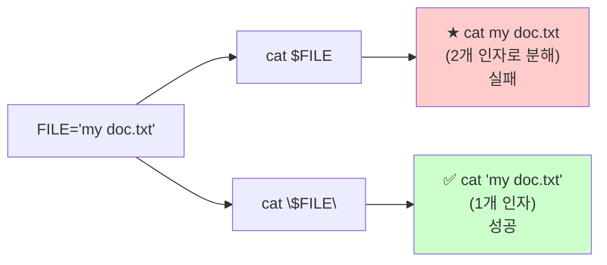

# Bash 스크립팅 기초

> **한 줄로** · Bash는 Linux의 **자동화 표준 언어**. 첫 줄에 `#!/usr/bin/env bash`로 인터프리터 지정, 변수는 `VAR=값` (★ `=` 양쪽 공백 X), **변수 사용 시 항상 `"$VAR"` 큰따옴표**가 가장 흔한 버그를 막아요. B1-1은 명세에서 **Bash만 사용**(Python 등 금지)을 요구.

---

## 과제 요구사항

### 이게 무슨 작업?

monitor.sh와 setup 스크립트들을 **Bash로 작성**하는 게 이번 과제의 핵심. Python·Go 같은 다른 언어로는 안 됩니다.

회사 비유:
- Bash = **만능 자동화 도구** (Linux에는 항상 깔려있음)
- shebang(`#!/usr/bin/env bash`) = **"이 작업은 Bash로 하세요" 라벨**
- exit code = **작업 결과 보고서** (0 = 성공, 다른 숫자 = 실패)
- 변수 = **작업 메모지** (값을 임시로 저장)

### 명세 원문 (원본 그대로)

> **구현 언어**
> - **Bash 스크립트로 작성** (Python·Go 등 대체 금지)
>
> **권장 헤더**
> ```bash
> #!/usr/bin/env bash
> set -euo pipefail
> ```

### 무엇을 익히나

| 기본기 | 설명 |
|---|---|
| shebang | 어떤 인터프리터로 실행할지 첫 줄에 명시 |
| exit code | 0(성공)·non-zero(실패) |
| 변수와 quoting | `"$VAR"` 큰따옴표 필수 |
| 특수 변수 | `$0`, `$1`, `$?`, `$$` 등 |
| 함수 | 재사용 가능한 코드 블록 |

### 잘 됐는지 확인하기

```bash
# 1. 스크립트 실행 가능
chmod +x monitor.sh
./monitor.sh

# 2. exit code 확인
echo $?    # 0이면 성공

# 3. shellcheck로 정적 분석
shellcheck monitor.sh
```

---

## 구현 방법

### Step 1 — shebang으로 인터프리터 지정

스크립트 첫 줄은 항상:

```bash
#!/usr/bin/env bash
```

| 표현 | 의미 |
|---|---|
| `#!/bin/bash` | bash의 절대 경로 (Linux 표준) |
| `#!/usr/bin/env bash` | **PATH에서 bash 찾기** (이식성 ↑, 권장) |
| `#!/bin/sh` | POSIX sh (bash 확장 기능 못 씀) |

`env` 형식이 권장 — macOS·BSD에선 bash 위치가 달라서 절대 경로가 안 맞을 수 있음.

### Step 2 — 변수 사용

```bash
# 선언 (★ = 양쪽 공백 X)
NAME="agent-admin"
PORT=15034

# 사용 (★ 항상 큰따옴표)
echo "Hello, $NAME"
echo "Port: $PORT"
```

**가장 흔한 실수**:
```bash
# ❌ 공백이 있으면 안 됨
NAME = "agent-admin"      # bash 에러

# ❌ 큰따옴표 안 쓰면 위험
FILE="my document.txt"
cat $FILE                 # cat my document.txt 3개 인자 → 실패
cat "$FILE"               # ✅ cat "my document.txt" 1개 인자
```

### Step 3 — 특수 변수 활용

```bash
#!/usr/bin/env bash
# myscript.sh hello world

echo "스크립트 이름: $0"   # ./myscript.sh
echo "첫 인자: $1"          # hello
echo "둘째 인자: $2"        # world
echo "인자 개수: $#"        # 2
echo "PID: $$"              # 현재 셸 PID
echo "직전 결과: $?"        # 0 = 직전 명령 성공
```

| 변수 | 의미 |
|---|---|
| `$0` | 스크립트 이름 |
| `$1`, `$2` | 위치 인자 |
| `$#` | 인자 개수 |
| `$@` | 모든 인자 (개별 단어로) |
| `$?` | 직전 명령 exit code |
| `$$` | 현재 셸 PID |

### Step 4 — exit code로 결과 신호

```bash
#!/usr/bin/env bash

if [ ! -f "/etc/ssh/sshd_config" ]; then
    echo "[ERROR] sshd_config 없음"
    exit 1
fi

echo "[OK] sshd_config 확인됨"
exit 0
```

| Exit code | 의미 |
|---|---|
| `0` | 성공 |
| `1` | 일반 실패 |
| `2` | 명령 사용법 오류 |
| `130` | Ctrl+C로 종료 (128 + 시그널 번호) |

### Step 5 — 함수로 재사용

```bash
#!/usr/bin/env bash

log() {
    echo "[$(date '+%Y-%m-%d %H:%M:%S')] $*"
}

check_file() {
    local path="$1"
    if [ -f "$path" ]; then
        log "[OK] $path 존재"
        return 0
    else
        log "[FAIL] $path 없음"
        return 1
    fi
}

check_file "/etc/ssh/sshd_config" || exit 1
log "검증 완료"
```

`local`은 함수 안에서만 유효한 변수. 함수 밖 변수와 충돌 방지.

전체 구현: [bin/monitor.sh](https://github.com/codewhite7777/codyssey_b1_1/blob/main/bin/monitor.sh)

---

## 개념

### Quoting — 큰따옴표 vs 작은따옴표

```bash
NAME="alice"

echo "Hello, $NAME"     # Hello, alice (큰따옴표 = 변수 expand)
echo 'Hello, $NAME'     # Hello, $NAME (작은따옴표 = 그대로)
```

| 따옴표 | 변수 expand | glob expand | 활용 |
|---|---|---|---|
| `"..."` | ✅ | ❌ | 보통 |
| `'...'` | ❌ | ❌ | 리터럴 전달 (정규식 등) |
| 따옴표 X | ✅ | ✅ | ★ word-split 위험 |

### 왜 큰따옴표가 필요한가?



Bash는 변수 값을 그대로 끼워넣고 다시 토큰화(word-split). 큰따옴표가 이 분해를 막아요.

### `[` vs `[[` (Bash 확장)

| 형식 | 표준 | 차이 |
|---|---|---|
| `[ "$a" = "$b" ]` | POSIX sh | 모든 셸 호환, but 따옴표 필수 |
| `[[ $a = $b ]]` | bash 확장 | 따옴표 자동, 정규식 지원, glob 지원 |

```bash
# [ 사용 - 따옴표 필수
if [ "$NAME" = "alice" ]; then ...

# [[ 사용 - 따옴표 없어도 OK
if [[ $NAME == "alice" ]]; then ...

# [[는 정규식도
if [[ $EMAIL =~ ^.+@.+\..+ ]]; then ...
```

bash 스크립트라면 `[[`가 더 안전·편리. POSIX sh 호환 필요하면 `[`.

### 조건 표현 — 자주 쓰는 것

| 표현 | 의미 |
|---|---|
| `[ -f file ]` | 파일 존재 |
| `[ -d dir ]` | 디렉토리 존재 |
| `[ -z "$s" ]` | 문자열 비어있음 |
| `[ -n "$s" ]` | 문자열 비어있지 않음 |
| `[ "$a" = "$b" ]` | 문자열 같음 |
| `[ "$a" -eq "$b" ]` | 숫자 같음 |
| `[ "$a" -gt "$b" ]` | 숫자 크다 |

### `&&`와 `||` — 조건부 실행

```bash
# 성공 시에만 다음 실행
mkdir /tmp/foo && cd /tmp/foo

# 실패 시에만 다음 실행
grep "pattern" file || echo "not found"

# 조합
[ -f /etc/foo ] && echo "exists" || echo "missing"
```

### `shellcheck` — 정적 분석 (★ 매우 권장)

```bash
$ shellcheck monitor.sh

In monitor.sh line 7:
if [ $name = "alice" ]; then
     ^---^ SC2086: Double quote to prevent globbing and word splitting.
```

거의 모든 흔한 버그를 자동 검출. CI에 통합 권장.

### B1-1 monitor.sh의 기본 구조

```bash
#!/usr/bin/env bash
# monitor.sh — 시스템 관제 자동화

set -euo pipefail     # 안전 모드 (다음 노트)

# 환경 변수 (default 처리)
LOG_FILE="${AGENT_LOG_DIR:-/var/log/agent-app}/monitor.log"

# 로그 함수
log() {
    echo "[$(date '+%Y-%m-%dT%H:%M:%S')] $*" | tee -a "$LOG_FILE"
}

# 메인 로직
log "monitor.sh 시작"
# ... 측정 ...
log "monitor.sh 완료"
exit 0
```

이 패턴 위에 set·trap·control flow를 더 쌓아 갑니다. 다음 노트들 참조.

---

## 참고

- `man bash` — INVOCATION, QUOTING 섹션
- [shellcheck.net](https://www.shellcheck.net/) — 온라인 정적 분석
- 관련 노트: [bash-set-safe.md](./bash-set-safe.md) — 안전 모드
- 관련 노트: [bash-control-flow.md](./bash-control-flow.md) — if/for/case

---
출처: B1-1 (Layer 4.1) · 학습일: 2026-05-12
