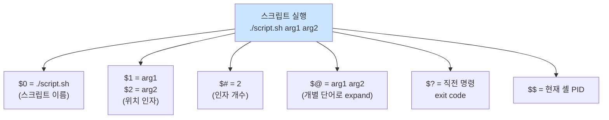

# Bash 스크립팅 기초

> **TLDR** · shebang(`#!/bin/bash`)로 인터프리터 지정, exit code 0/non-zero로 성공/실패 신호, 변수는 `VAR=value` (★ `=` 양쪽 공백 X). **항상 `"$VAR"` 큰따옴표로 감싸기** — 공백 포함 변수의 word-splitting 방지가 가장 흔한 버그 원인. `shellcheck`가 필수 정적 분석 도구.

## 개요

Bash 스크립팅은 Linux 운영의 기본 언어다. 시스템 자동화, CI/CD, 설치 스크립트, monitor.sh 같은 운영 도구가 모두 Bash로 작성된다. Python·Go보다 표현력은 떨어지지만 시스템 명령과의 통합, 어디서나 동작하는 가용성, 짧은 코드가 강점이다.

이번 과제는 명세에서 명시적으로 "Bash로만 작성, Python 등 대체 금지"라고 요구한다. 운영 자동화 도구를 Bash로 만드는 게 학습 목표.

## 왜 알아야 하나

Bash의 함정 대부분은 quoting과 변수 expansion에서 비롯된다. 가장 자주 만나는 버그는 공백 포함 변수의 word-splitting (`$file` → `cat file` 대신 `cat` `file1` `file2` 처럼 분해), unset 변수가 빈 문자열로 평가되는 함정, exit code 무시 등이다. shellcheck로 정적 분석할 수 있지만 근본적으로 문법을 정확히 이해해야 사고를 줄인다.

또한 systemd unit, Docker entrypoint, CI 워크플로우 등 다양한 환경에서 Bash 스크립트가 실행되므로, 이식성·안전성 패턴을 알아두는 게 운영자의 기본기다.

## shebang — 인터프리터 지정

스크립트 첫 줄은 어떤 인터프리터로 실행할지 지정한다.

```bash
#!/bin/bash                    # bash 절대 경로 (Linux 표준)
#!/usr/bin/env bash            # PATH에서 bash 찾기 (이식성 ↑)
#!/bin/sh                      # POSIX sh (bash 기능 X, 더 portable)
```

`#!/usr/bin/env bash`가 더 portable한 이유는 macOS·BSD에서 bash가 `/usr/local/bin/bash`에 있을 수 있어 절대 경로가 안 맞을 수 있기 때문이다. env가 PATH를 따라 bash를 찾아준다. 단 `env` 자체는 거의 모든 시스템에서 `/usr/bin/env`에 있어 안정적.

shebang은 파일 첫 줄 정확히 `#!`로 시작해야 한다. 공백 X, BOM X, 다른 텍스트 X.

## exit code — 성공·실패 신호

Bash 명령의 종료 상태는 정수다. **0 = 성공, non-zero = 실패**.

```
$ ls /tmp
$ echo $?
0

$ ls /nonexistent
ls: cannot access '/nonexistent': No such file or directory
$ echo $?
2
```

`$?`는 직전 명령의 exit code. 스크립트에서 명시적으로 exit code 지정:

```bash
exit 0    # 성공
exit 1    # 일반 실패
exit 2    # 명령 사용법 오류 (conventional)
exit 130  # SIGINT (Ctrl+C) — 128 + 시그널 번호
```

`if`·`while`·`&&`·`||` 같은 control flow는 모두 exit code를 기반으로 동작한다.

```bash
if grep -q "pattern" file; then
    # grep이 0(매칭됨) 반환 시 실행
    echo "found"
fi

command_a && command_b   # a 성공 시에만 b 실행
command_a || command_b   # a 실패 시에만 b 실행
```

## 변수와 quoting

Bash 변수는 `name=value` 형식 (★ `=` 양쪽 공백 X).

```bash
name="alice"
age=30
greet="Hello, $name"           # 큰따옴표는 변수 expansion
greet='Hello, $name'           # 작은따옴표는 expansion 안 함 → 그대로 출력
```

**큰따옴표 quoting의 중요성** — 가장 흔한 Bash 버그의 근원이다.

```bash
file="my document.txt"
cat $file                      # ★ word-split → cat my document.txt (3개 인자!)
cat "$file"                    # 정상 → cat 하나의 인자
```

shellcheck가 항상 경고하는 패턴: `"$var"`, `"$@"`, `"${array[@]}"`. 거의 모든 변수 사용은 따옴표로 감싸야 안전하다.

특수 변수의 의미를 그림으로 정리:



| 변수 | 의미 |
|---|---|
| `$0` | 스크립트 이름 |
| `$1`, `$2`, ... | 위치 인자 |
| `$#` | 인자 개수 |
| `$@` | 모든 인자 (개별 단어로) |
| `$*` | 모든 인자 (한 문자열로) |
| `$?` | 직전 명령 exit code |
| `$$` | 현재 셸 PID |
| `$!` | 마지막 백그라운드 프로세스 PID |

## 한 번 보자

기본 스크립트 패턴:

```bash
#!/usr/bin/env bash
# script.sh — 사용 예시

# 변수 (default 값 처리)
name="${1:-world}"             # 첫 인자, 없으면 'world'

# 출력
echo "Hello, $name!"

# 조건
if [ "$name" = "alice" ]; then
    echo "Welcome back, alice"
fi

# exit
exit 0
```

```
$ chmod +x script.sh
$ ./script.sh
Hello, world!
$ ./script.sh alice
Hello, alice!
Welcome back, alice
$ echo $?
0
```

shellcheck로 정적 분석:

```
$ shellcheck script.sh
(아무 출력 없으면 OK)

# 문제 있으면:
In script.sh line 7:
if [ $name = "alice" ]; then
     ^---^ SC2086: Double quote to prevent globbing and word splitting.
```

## 흔한 함정

> [!WARNING]
> **변수 quoting 누락**: `cat $file`은 공백 포함 파일명에서 깨짐 (`cat my document.txt`로 3개 인자 분해). **항상 `"$file"`** 사용. shellcheck로 정적 검출 가능, CI에 통합 권장.

Bash 함정의 절반은 quoting 누락이다. 공백 포함 변수, glob 문자(`*`, `?`)가 포함된 변수가 unquoted로 사용되면 의도하지 않은 word-splitting이나 pathname expansion이 발생한다. `IFS=$' \t\n'`이 기본이라 공백·탭·개행에서 분리된다.

`=` 양쪽 공백 함정도 자주 만난다. `name = alice`는 "`name` 명령을 `=` `alice` 인자로 실행" 으로 해석되어 실패. 반드시 `name=alice`(공백 없음).

산술 비교에서 `[ $a -gt 10 ]`은 `$a`가 빈 문자열이면 syntax error. `[ "${a:-0}" -gt 10 ]`처럼 default 값 처리 또는 `[[ ${a:-0} -gt 10 ]]`(bash 확장 문법) 사용이 안전하다.

exit code 무시도 흔한 버그다. `cmd1 | cmd2`에서 `cmd1`이 실패해도 파이프 전체 exit code는 `cmd2`의 것이다. `set -o pipefail`로 해결 (다음 노트).

bash와 sh 혼동도 자주 만나는 함정이다. `#!/bin/sh`로 시작했는데 `[[`나 `array=()` 같은 bash 확장 문법을 쓰면 dash(Debian sh)에서 깨진다. bash 기능을 쓸 거면 명시적으로 `#!/usr/bin/env bash`.

## B1-1 매핑

monitor.sh와 setup 스크립트의 기본 구조:

```bash
#!/usr/bin/env bash
# monitor.sh — 시스템 관제 자동화

set -euo pipefail              # 안전 모드 (다음 노트)

# 변수 (환경 변수 default 값으로 처리)
LOG_FILE="${AGENT_LOG_DIR:-/var/log/agent-app}/monitor.log"
APP_NAME="agent_app.py"

# 함수 활용
log() {
    echo "[$(date '+%Y-%m-%d %H:%M:%S')] $*" | tee -a "$LOG_FILE"
}

# 프로세스 확인 (|| true로 set -e 우회)
PID=$(pgrep -f "$APP_NAME" || true)
if [ -z "$PID" ]; then
    log "[ERROR] $APP_NAME not running"
    exit 1
fi

log "[OK] PID=$PID"
exit 0
```

이번 과제의 모든 스크립트는 이 기본 패턴 위에 쌓인다. 다음 노트들에서 set·trap·control flow·substitution을 각각 깊이 다룬다.

## 인접 토픽

<details>
<summary><b>응용 토픽 — POSIX sh·shellcheck·shfmt·dash·zsh (펼치기)</b></summary>

POSIX sh는 Bash의 부분집합으로, 더 portable하지만 array·`[[`·`(())` 같은 편의 기능이 없다. 컨테이너 base image(alpine, busybox)는 보통 sh(dash)만 가지므로 sh 호환 스크립트를 작성하면 어디서나 동작한다. 단 운영 자동화 도구는 보통 Bash 가용성을 전제로 작성.

zsh는 macOS 기본 셸로, Bash와 거의 호환되지만 일부 미묘한 차이가 있다. 인터랙티브 사용에는 우수하지만 스크립트는 보통 Bash 또는 sh로 작성한다.

shellcheck는 셸 스크립트 정적 분석 도구로 거의 필수다. quoting 누락, dead code, 잘못된 비교 등을 자동 검출한다. CI 파이프라인에 통합 권장.

shfmt는 셸 스크립트 자동 포맷터. `shfmt -w script.sh`로 일관된 들여쓰기.

dash는 Debian·Ubuntu의 `/bin/sh` 구현으로 매우 가볍고 빠르지만 Bash 확장은 지원 안 함. 시스템 부트 스크립트가 빠른 이유.

Bash 5.x는 4.x에 비해 associative array 개선, BASH_ARGV0 추가 등 여러 향상이 있다. macOS는 라이선스 이슈로 Bash 3.x를 기본 유지 — `brew install bash`로 최신 버전 설치 가능.

</details>

## 참고

- `man bash` — INVOCATION, EXPANSION, QUOTING 섹션
- [Bash Pitfalls](https://mywiki.wooledge.org/BashPitfalls) — 흔한 함정 목록
- [shellcheck.net](https://www.shellcheck.net/) — 온라인 정적 분석
- [Google Shell Style Guide](https://google.github.io/styleguide/shellguide.html)

---
출처: B1-1 (Layer 4.1) · 학습일: 2026-05-11
