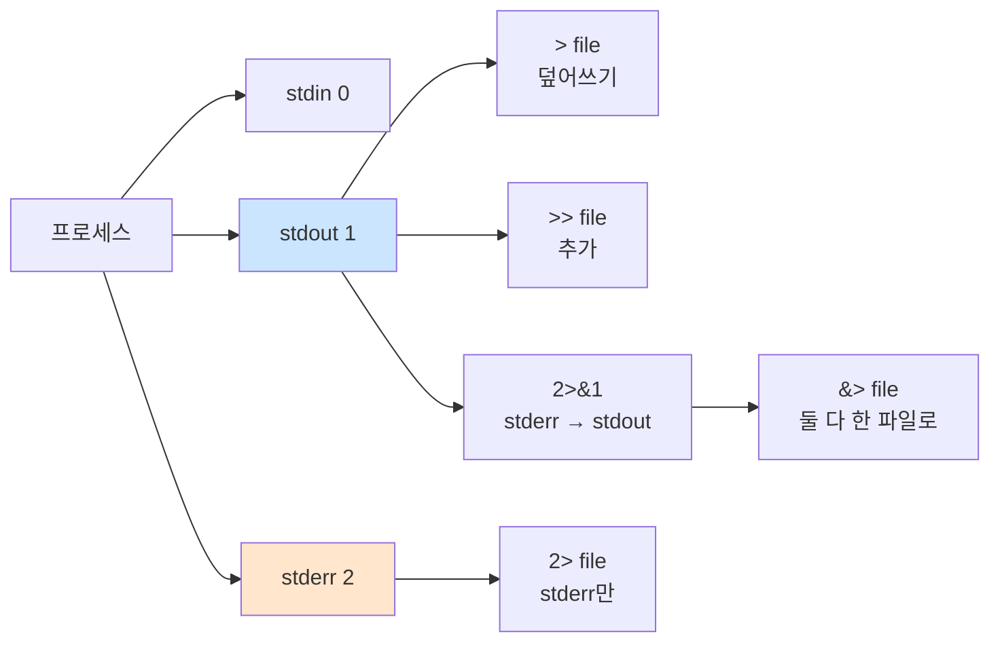

# Bash 치환·확장·리다이렉션

> **TLDR** · `$(cmd)`(명령 치환)·`${var:-default}`(파라미터 확장)·`>`/`>>`/`<`/`2>&1`(리다이렉션)이 운영 스크립트의 일상 도구. 백틱 `` `cmd` `` 대신 `$(cmd)` 권장(중첩 가능, 읽기 쉬움). 파라미터 확장의 `${var:-x}`, `${var%suffix}`, `${var//pat/repl}` 패턴이 매우 강력.

## 개요

Bash의 표현력 대부분은 치환·확장·리다이렉션에서 나온다. 단순한 `echo "Hello"` 너머의 모든 동적 동작 — 명령 결과를 변수에 받기, 변수의 부분 추출·치환, 파일로 출력 보내기 — 이 영역에 속한다. monitor.sh 같은 스크립트는 거의 모든 줄이 이 기능을 활용한다.

## 왜 알아야 하나

`ps`의 출력에서 PID 추출, `df`의 5번째 컬럼에서 사용률 추출, 환경 변수의 default 값 처리, 명령 출력을 파일에 추가 등 — 운영 스크립트의 일상이 이 기능들이다. 정확히 알지 못하면 awk·sed 같은 외부 도구를 과도하게 호출해 느려지거나, 미묘한 quoting 함정에 빠진다.

## 명령 치환

명령의 stdout을 문자열로 받는다.

```bash
NOW=$(date '+%Y-%m-%d %H:%M:%S')
PID=$(pgrep -f agent_app.py | head -1)
USERS=$(who | wc -l)

# trailing newline 제거됨 (Bash 특성)
echo "현재 시간: $NOW"
```

전통적 백틱 표기 `` `cmd` `` 보다 `$(cmd)`가 권장된다. 이유:
- **중첩 가능**: `$(echo $(date))` vs 백틱은 escape 지옥
- **가독성**: 백틱은 작은따옴표와 혼동
- **POSIX 표준**

```bash
# 백틱 (피하기)
result=`echo \`date\``

# $() 권장
result=$(echo $(date))
```

명령 치환은 서브셸에서 실행되므로 환경 변수 변경이 부모로 전파되지 않는다 (자주 함정).

## 파라미터 확장

변수에 대한 다양한 변환을 한 줄로 표현. Bash의 매우 강력한 기능.

### Default 값 처리

```bash
${var:-default}    # var unset/empty → "default", 아니면 $var
${var:=default}    # 위와 같지만 var에도 default 할당
${var:?error msg}  # var unset/empty → error msg 출력 후 종료
${var:+value}      # var 있으면 "value", 아니면 빈 문자열
```

```bash
LOG_FILE="${AGENT_LOG_DIR:-/var/log/agent-app}/monitor.log"
PORT="${PORT:?PORT 환경변수가 필요합니다}"   # 없으면 에러
```

### 부분 추출

```bash
${var:offset:length}    # 부분 문자열
${#var}                 # 문자열 길이
```

```bash
str="Hello, World"
echo "${str:7:5}"       # World
echo "${#str}"          # 12
```

### prefix/suffix 제거

```bash
${var#prefix}      # 짧은 prefix 제거 (greedy 아님)
${var##prefix}     # 긴 prefix 제거 (greedy)
${var%suffix}      # 짧은 suffix 제거
${var%%suffix}     # 긴 suffix 제거
```

```bash
file="/var/log/agent-app/monitor.log"
echo "${file##*/}"      # monitor.log (마지막 / 다음)
echo "${file%/*}"       # /var/log/agent-app (마지막 / 이전)
echo "${file%.log}"     # /var/log/agent-app/monitor (.log 제거)
```

★ `${file##*/}`는 `basename`과 동등, `${file%/*}`는 `dirname`과 동등. 외부 명령 호출 없이 처리 가능 — 성능 이점.

### 치환

```bash
${var/pattern/replacement}     # 첫 매칭만
${var//pattern/replacement}    # 모든 매칭
${var/#pattern/replacement}    # 시작 부분만
${var/%pattern/replacement}    # 끝 부분만
```

```bash
path="/usr/local/bin"
echo "${path//\//:}"           # :usr:local:bin (모든 /를 :로)
echo "${path/local/global}"    # /usr/global/bin (첫 매칭만)
```

### 대소문자 변환

```bash
${var^}     # 첫 글자 대문자
${var^^}    # 모두 대문자
${var,}     # 첫 글자 소문자
${var,,}    # 모두 소문자
```

```bash
name="alice"
echo "${name^}"        # Alice
echo "${name^^}"       # ALICE
```

## 산술 확장

`$((...))`로 정수 산술. Bash는 floating point 안 됨 (bc·awk 사용).

```bash
echo $((2 + 3))            # 5
echo $((10 / 3))           # 3 (정수 나누기)
echo $((10 % 3))           # 1 (나머지)
echo $((1 << 4))           # 16 (비트 시프트)

count=0
((count++))                # count 증가 (값 사용 X)
((count > 5)) && echo "큼"
```

floating point가 필요하면:

```bash
echo "scale=2; 10/3" | bc          # 3.33
echo "scale=2; 10/3" | awk '{print}'    # awk도 가능
printf "%.2f\n" $(echo "10/3" | bc -l)   # 3.33
```

## 리다이렉션

stdin·stdout·stderr를 파일이나 다른 명령으로 보내기.



주요 패턴:

```bash
cmd > file              # stdout을 file로 (덮어쓰기)
cmd >> file             # stdout을 file에 추가
cmd 2> file             # stderr만 file로
cmd > file 2>&1         # stdout + stderr 모두 file로 (★ 순서 중요)
cmd &> file             # 위와 동등 (Bash 확장)
cmd > /dev/null         # stdout 버리기
cmd > /dev/null 2>&1    # 모든 출력 버리기
cmd < input             # stdin을 file에서
```

`2>&1`의 순서가 중요:

```bash
cmd > file 2>&1         # ✓ 둘 다 file로
cmd 2>&1 > file         # ✗ stderr는 terminal, stdout만 file
```

이유: 왼쪽부터 처리. `2>&1`은 "stderr를 stdout과 같은 곳으로" — 그 시점 stdout이 terminal이면 stderr도 terminal로.

Heredoc과 herestring:

```bash
# Heredoc — 여러 줄 입력
cat <<EOF
Hello
$USER
EOF

# Heredoc 변수 expansion 안 함 (작은따옴표)
cat <<'EOF'
$USER will be literal
EOF

# Herestring — 한 줄 입력
grep "alice" <<< "alice bob carol"
```

## 한 번 보자

monitor.sh의 자주 쓰는 패턴들:

```bash
#!/usr/bin/env bash
set -euo pipefail

# 환경 변수 default (파라미터 확장)
LOG_DIR="${AGENT_LOG_DIR:-/var/log/agent-app}"
LOG_FILE="$LOG_DIR/monitor.log"

# 명령 치환
TIMESTAMP=$(date '+%Y-%m-%d %H:%M:%S')
PID=$(pgrep -f 'agent_app\.py' | head -1 || true)

# 산술 확장 — PID 카운트
if [[ -n "$PID" ]]; then
    PID_COUNT=$(echo "$PID" | wc -l)
    echo "$PID_COUNT 프로세스 실행 중"
fi

# 파라미터 확장 — 파일명 추출
SCRIPT_NAME="${0##*/}"             # monitor.sh
SCRIPT_DIR="${0%/*}"               # /path/to/dir

# 리다이렉션 — 로그 추가
echo "[$TIMESTAMP] PID:$PID" >> "$LOG_FILE"

# stderr 분리 — 에러는 별도 로그
cmd_that_might_fail >> "$LOG_FILE" 2>> "$LOG_DIR/monitor.err"

# 둘 다 한 파일로 (단순)
cmd_that_might_fail >> "$LOG_FILE" 2>&1
```

awk·sed 대신 파라미터 확장으로 처리하는 예:

```bash
# awk 사용
file=$(df / | awk 'NR==2 {gsub("%", ""); print $5}')

# 순수 Bash로
df_line=$(df / | tail -1)
read -r filesystem size used avail percent mounted <<< "$df_line"
percent="${percent%\%}"           # % 제거
echo "사용률: $percent%"
```

## 흔한 함정

> [!WARNING]
> **명령 치환의 trailing newline 손실**: `$()` 사용 시 trailing newline이 자동 제거됨. 정상이지만 의도된 newline이 필요할 때 문제. `value=$(cmd; printf x); value="${value%x}"` 같은 트릭으로 보존 가능.

명령 치환의 trailing newline 제거는 거의 항상 도움되지만 가끔 함정이다. 파일 내용을 그대로 변수에 받아야 할 때 newline 누락이 영향. 일반적으로는 신경 안 써도 됨.

`$()`는 서브셸이므로 변수 변경이 부모로 안 간다.

```bash
result=""
result=$(echo "foo")           # 정상 — stdout을 받음
$(result="foo")                # ★ 의미 없음 — result는 서브셸 안에서만
```

`*`·`?` glob 함정도 자주 만난다.

```bash
files=$(ls *.txt)              # 매칭 안 되면 "*.txt" 그대로
```

`shopt -s nullglob`로 매칭 없으면 빈 문자열로 처리, `shopt -s failglob`로 에러로 처리. monitor.sh에서는 보통 nullglob.

`<<<`(herestring)에 trailing newline이 자동 추가된다. `read -r line <<< "$value"`에서 line은 value + newline... 보통 문제 없지만 미묘한 케이스 있음.

`2>&1`의 위치를 놓치면 stderr가 redirect 안 된다. 매번 헷갈리므로 가능하면 `&>`(Bash 확장) 쓰기.

## B1-1 매핑

monitor.sh의 핵심 데이터 추출 패턴:

```bash
# CPU 사용률 (top + awk + 파라미터 확장)
CPU_RAW=$(top -b -n 2 -d 0.5 | grep "Cpu(s)" | tail -1 | awk -F'id,' '{print 100 - $1}' | awk '{print $NF}')
CPU_USED="${CPU_RAW%.*}"           # 정수부만 (소수점 제거)

# 메모리 사용률 (free + awk)
MEM_USED=$(free | awk '/^Mem:/ {printf "%.1f", $3/$2 * 100}')

# 디스크 사용률 (df + 파라미터 확장)
DISK_LINE=$(df / | tail -1)
read -r _ _ _ _ DISK_PCT _ <<< "$DISK_LINE"
DISK_USED="${DISK_PCT%\%}"         # % 제거

# 로그 포맷 출력
echo "[$(date '+%Y-%m-%d %H:%M:%S')] PID:$PID CPU:${CPU_USED}% MEM:${MEM_USED}% DISK_USED:${DISK_USED}%" >> "$LOG_FILE"
```

`read -r _ _ _ _ DISK_PCT _ <<< "$line"`는 5번째 컬럼만 추출하는 Bash 네이티브 패턴. awk 호출 없이 처리.

## 인접 토픽

<details>
<summary><b>응용 토픽 — printf·process substitution·xargs·tee (펼치기)</b></summary>

`printf`는 `echo`보다 강력하고 portable한 출력 도구. 형식 지정자(`%s`, `%d`, `%f`)와 escape 처리가 일관된다.

```bash
printf "%-10s %5d %8.2f\n" "alice" 100 3.14
# alice         100     3.14
```

Process substitution `<(...)` `>(...)`는 명령을 파일처럼 사용:

```bash
# 두 정렬 결과 diff
diff <(sort file1) <(sort file2)

# 명령 출력을 여러 곳에 전달
ls | tee >(grep .txt > txt_files) >(grep .log > log_files) > /dev/null
```

`xargs`는 stdin을 명령 인자로 변환:

```bash
echo "file1 file2 file3" | xargs ls -l        # ls -l file1 file2 file3
find . -name "*.tmp" | xargs rm               # 모든 tmp 삭제
find . -name "*.tmp" -print0 | xargs -0 rm    # null-separated (안전)
```

`tee`는 stdin을 파일과 stdout에 동시에:

```bash
echo "message" | tee file.log                 # stdout + file
echo "message" | tee -a file.log              # 추가 모드
sudo cmd | tee /etc/important.conf            # sudo 권한으로 파일 쓰기
```

monitor.sh의 `tee -a "$LOG_FILE"`는 stdout과 파일 동시 출력에 자주 쓴다.

</details>

## 참고

- `man bash` — EXPANSION 섹션 (매우 자세)
- [BashFAQ/073: parameter expansion](https://mywiki.wooledge.org/BashFAQ/073)
- [Bash Hackers — Parameter expansion](https://wiki.bash-hackers.org/syntax/pe)

---
출처: B1-1 (Layer 4.4) · 학습일: 2026-05-11
