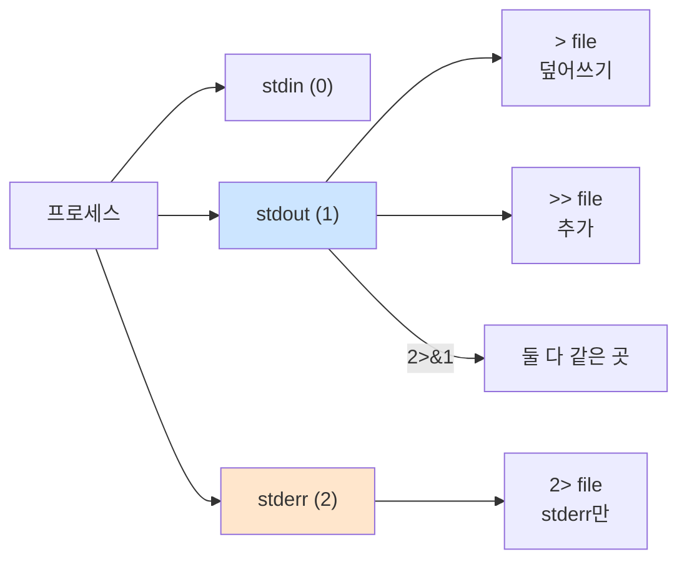

# Bash 치환·확장·리다이렉션

> **한 줄로** · `$(cmd)`로 **명령 결과 받기**, `${var:-default}`로 **변수 다듬기**, `>`/`>>`/`2>&1`로 **출력 보내기**. monitor.sh가 CPU/MEM/DISK를 측정·기록하는 매 줄이 이 3가지 도구로 구성. 백틱 `` `cmd` `` 대신 `$(cmd)` 사용.

---

## 과제 요구사항

### 이게 무슨 작업?

monitor.sh가 하는 일은 결국:
1. **명령 실행 결과 받기** (top·free·df 출력)
2. **결과에서 필요한 부분만 뽑기** (사용률 숫자만)
3. **로그 파일에 저장** (>> monitor.log)

회사 비유:
- 명령 치환 `$(cmd)` = **명령 결과를 "메모지에 옮겨 적기"**
- 파라미터 확장 `${var/.../...}` = **메모를 다듬기·자르기**
- 리다이렉션 `>>` = **결과를 보고서에 추가**

### 명세 원문 (원본 그대로)

> **로그 출력 형식**
> ```
> [2026-05-09 14:30:00] [RESOURCE MONITORING]
> CPU Usage : 25.3%
> MEM Usage : 5.2%
> DISK Used : 23%
> ```
>
> **결과를 monitor.log에 append**

→ 명령 결과를 받아 → 다듬어 → 파일에 추가.

### 무엇을 익히나

| 도구 | 용도 |
|---|---|
| `$(cmd)` | 명령의 stdout을 문자열로 |
| `${var:-default}` | 변수 default 값 처리 |
| `${var%pattern}` | suffix 제거 |
| `>>` | 파일에 추가 (append) |
| `2>&1` | stderr를 stdout으로 합치기 |
| Heredoc `<<EOF` | 여러 줄 입력 |

### 잘 됐는지 확인하기

```bash
# 명령 결과 받기
NOW=$(date '+%Y-%m-%dT%H:%M:%S')
echo "현재: $NOW"

# 파라미터 확장 — % 제거
PCT="80%"
echo "${PCT%\%}"     # 80
```

---

## 구현 방법

### Step 1 — 명령 치환 `$(...)`

명령의 출력을 문자열로 받기.

```bash
# 현재 시간
NOW=$(date '+%Y-%m-%dT%H:%M:%S')

# 프로세스 PID
PID=$(pgrep -f agent-app | head -1)

# 디스크 사용률
DISK=$(df / | awk 'NR==2 {gsub("%",""); print $5}')

echo "[$NOW] PID=$PID, DISK=${DISK}%"
```

★ 백틱(`` `cmd` ``)은 옛 표기. `$(cmd)`가 권장 — 중첩 가능, 가독성 좋음.

### Step 2 — 파라미터 확장으로 값 다듬기

monitor.sh의 흔한 패턴:

```bash
# 환경 변수 default
LOG_FILE="${AGENT_LOG_DIR:-/var/log/agent-app}/monitor.log"

# 소수점 제거 (정수 비교 위해)
CPU_RAW="25.3"
CPU_INT="${CPU_RAW%.*}"     # 25 (소수점 이하 제거)

# % 제거
PCT="80%"
NUM="${PCT%\%}"             # 80

# 경로에서 파일명만
FILE_PATH="/var/log/agent-app/monitor.log"
NAME="${FILE_PATH##*/}"     # monitor.log (마지막 / 다음)
DIR="${FILE_PATH%/*}"       # /var/log/agent-app (마지막 / 이전)
```

자주 쓰는 파라미터 확장:

| 형식 | 의미 |
|---|---|
| `${var:-default}` | unset이면 default |
| `${var:=default}` | unset이면 default + 할당 |
| `${var:?msg}` | unset이면 에러 종료 |
| `${var:+value}` | 있으면 value |
| `${#var}` | 길이 |
| `${var:offset:length}` | 부분 문자열 |
| `${var#prefix}` | 짧은 prefix 제거 |
| `${var##prefix}` | 긴 prefix 제거 (greedy) |
| `${var%suffix}` | 짧은 suffix 제거 |
| `${var%%suffix}` | 긴 suffix 제거 |
| `${var/pat/repl}` | 첫 매칭 치환 |
| `${var//pat/repl}` | 모든 매칭 치환 |
| `${var^^}` | 모두 대문자 |
| `${var,,}` | 모두 소문자 |

### Step 3 — 산술 확장 `$((...))`

```bash
echo $((2 + 3))         # 5
echo $((10 / 3))        # 3 (정수)
echo $((10 % 3))        # 1 (나머지)

count=0
((count++))             # count 증가
((count > 5)) && echo "큼"
```

★ Bash는 **정수만** — 소수점은 `bc`나 `awk` 필요:
```bash
echo "scale=2; 10/3" | bc      # 3.33
printf "%.2f\n" $(echo "10/3" | bc -l)
```

### Step 4 — 리다이렉션

```bash
# stdout을 파일로
echo "log line" > /tmp/log.txt        # 덮어쓰기
echo "log line" >> /tmp/log.txt       # 추가 (append)

# stderr만
cmd 2> /tmp/err.txt

# stdout + stderr 모두 한 파일로
cmd >> /tmp/log.txt 2>&1              # ★ 순서 중요
# 또는 (Bash 확장)
cmd &>> /tmp/log.txt

# stdout 버리기
cmd > /dev/null

# 모든 출력 버리기
cmd > /dev/null 2>&1
```

`2>&1`의 순서 — 항상 redirect 뒤에:
```bash
cmd > file 2>&1     # ✅ 둘 다 file로
cmd 2>&1 > file     # ❌ stderr는 터미널, stdout만 file
```

### Step 5 — 종합 — monitor.sh의 자원 추출

```bash
LOG_FILE="${AGENT_LOG_DIR:-/var/log/agent-app}/monitor.log"

# CPU (top + awk)
CPU_USED=$(top -b -n 2 -d 0.5 | grep "Cpu(s)" | tail -1 \
    | awk -F'id,' '{print 100 - $1}' | awk '{print $NF}')

# 메모리 (free + awk)
MEM_USED=$(free | awk '/^Mem:/ {printf "%.1f", $3/$2 * 100}')

# 디스크 (df + 파라미터 확장)
DISK_LINE=$(df / | tail -1)
read -r _ _ _ _ DISK_PCT _ <<< "$DISK_LINE"
DISK_USED="${DISK_PCT%\%}"   # % 제거

# 로그 추가
{
    echo "[$(date '+%Y-%m-%dT%H:%M:%S')] [RESOURCE MONITORING]"
    printf "CPU Usage : %s%%\n" "$CPU_USED"
    printf "MEM Usage : %s%%\n" "$MEM_USED"
    printf "DISK Used : %s%%\n" "$DISK_USED"
} >> "$LOG_FILE" 2>&1
```

`{ ... } >> file` 그룹은 여러 명령의 출력을 한 번에 redirect.

전체 구현: [bin/monitor.sh](https://github.com/codewhite7777/codyssey_b1_1/blob/main/bin/monitor.sh)

---

## 개념

### `$()` vs 백틱

```bash
# ❌ 백틱 (옛 표기)
result=`echo \`date\``       # 중첩 시 escape 지옥

# ✅ $() 권장
result=$(echo $(date))       # 중첩 자연스러움
```

`$()`가 표준. 백틱은 절대 쓰지 마세요.

### 파라미터 확장 vs 외부 명령

```bash
file="/var/log/monitor.log"

# basename·dirname 호출
NAME=$(basename "$file")     # 외부 명령
DIR=$(dirname "$file")

# 파라미터 확장 (★ 더 빠름)
NAME="${file##*/}"           # 외부 명령 호출 없음
DIR="${file%/*}"
```

스크립트가 매분 실행되면 외부 명령 호출 절약이 의미 있음.

### 명령 치환의 서브셸 함정

```bash
result=$(cd /tmp && pwd)     # /tmp (정상)
echo "$PWD"                  # 원래 위치 — cd는 서브셸 안에서만

# ★ 변수 변경도 서브셸 안에서만
$(MY_VAR="hello")            # 의미 없음 — 부모는 못 봄
```

### 리다이렉션 흐름



### Heredoc — 여러 줄 입력

```bash
# 변수 expand 됨
cat <<EOF
Hello, $USER
Today is $(date +%Y-%m-%d)
EOF

# 변수 expand 안 됨 (★ 그대로 출력)
cat <<'EOF'
$USER 그대로
$(date) 그대로
EOF

# 파일 작성
sudo tee /etc/foo.conf <<'EOF' >/dev/null
KEY=value
EOF
```

`<<'EOF'`(작은따옴표)는 expansion 없이 그대로. setup 스크립트에서 설정 파일 작성할 때 매우 유용.

### `tee` — stdout과 파일 동시에

```bash
# 화면에도 보이고 파일에도 저장
echo "log" | tee /tmp/log.txt

# 추가 모드
echo "log" | tee -a /tmp/log.txt

# sudo 권한으로 파일 쓰기 (★ 흔한 패턴)
echo "PORT 20022" | sudo tee -a /etc/ssh/sshd_config >/dev/null
```

`sudo command > file`은 sudo가 command만 root로 실행, redirect는 본인 권한 → 실패. `tee` 사용이 정답.

### `read`로 라인 파싱

```bash
# df 출력의 5번째 컬럼 추출 (★ awk 없이)
DISK_LINE=$(df / | tail -1)
read -r FS SIZE USED AVAIL PCT MOUNT <<< "$DISK_LINE"
echo "사용률: ${PCT%\%}%"
```

`<<<`(herestring)은 문자열을 stdin으로 전달. `read`가 공백으로 분리해서 각 변수에 할당.

### B1-1 patterns 한 줄 정리

```bash
# 환경 변수 default
LOG="${AGENT_LOG_DIR:-/var/log/agent-app}/monitor.log"

# 소수점 → 정수
INT="${VAL%.*}"

# % 제거
NUM="${PCT%\%}"

# 파일 추가
echo "line" >> "$LOG"

# 둘 다 추가
cmd >> "$LOG" 2>&1
```

---

## 참고

- `man bash` — EXPANSION 섹션
- 관련 노트: [bash-fundamentals.md](./bash-fundamentals.md) — 기본
- 관련 노트: [bash-control-flow.md](./bash-control-flow.md) — if/for/case

---
출처: B1-1 (Layer 4.4) · 학습일: 2026-05-12
