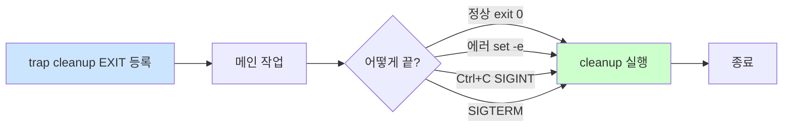

# Bash trap — 시그널 처리와 자동 청소

> **한 줄로** · `trap '청소함수' EXIT`로 **스크립트가 어떻게 끝나든 청소 보장** (정상·에러·Ctrl+C·SIGTERM 모두). 임시 파일·lock·중간 상태 정리에 필수. `trap '핸들러' ERR`로 에러 자동 추적도 가능.

---

## 과제 요구사항

### 이게 무슨 작업?

회사 비유:
- 스크립트가 일하는 동안 **임시 메모지**(/tmp/...) 사용
- 일이 끝나면 메모지 **반드시 폐기** 필요
- 정상 종료뿐 아니라 **갑자기 중단돼도** 폐기되어야 함
- `trap` = **"끝날 때 자동으로 호출되는 청소함수"** 등록

명세는 trap을 명시적으로 요구하진 않지만, **자기평가의 트러블슈팅·견고성 항목**에서 가치 있어요. 특히 logrotate 직접 구현 시 임시 파일 처리에 필요.

### 명세 원문 (원본 그대로)

명세는 trap 직접 언급 X. 하지만:

> **자기평가**
> - 트러블슈팅을 통해 무엇이 어디에서 막혔고 어떻게 해결했는지를 설명할 수 있다
> - 멱등 + 에러 핸들링이 견고한가

→ 갑작스러운 종료에서도 부분 상태가 남지 않아야 견고.

### 무엇을 익히나

| 이벤트 | 발동 시점 |
|---|---|
| `EXIT` | **스크립트 종료** (정상·에러·시그널 모두) — 가장 중요 |
| `ERR` | 명령 실패 (set -e와 조합) |
| `INT` | Ctrl+C |
| `TERM` | SIGTERM |
| `HUP` | 터미널 종료 |

### 잘 됐는지 확인하기

```bash
cat <<'EOF' > /tmp/trap-test.sh
#!/usr/bin/env bash
cleanup() {
    echo "[cleanup] 청소 실행"
}
trap cleanup EXIT
echo "메인 작업"
exit 0
EOF
chmod +x /tmp/trap-test.sh
/tmp/trap-test.sh
```

기대 출력:
```
메인 작업
[cleanup] 청소 실행
```

---

## 구현 방법

### Step 1 — `trap` 기본 문법

```bash
trap '핸들러' 시그널이나_이벤트
```

```bash
trap 'echo cleanup' EXIT       # 종료 시
trap 'echo INT 받음' INT       # Ctrl+C 시
trap '' HUP                    # 무시
trap - INT                     # 기본 동작으로 복귀
```

### Step 2 — 임시 파일 청소 패턴

가장 자주 쓰는 EXIT trap.

```bash
#!/usr/bin/env bash
set -euo pipefail

TMPFILE=$(mktemp)

# 청소 함수
cleanup() {
    local exit_code=$?
    echo "[cleanup] 종료 코드 $exit_code"
    rm -f "$TMPFILE"
}

# trap 등록 (★ 자원 할당 후 즉시)
trap cleanup EXIT

# 메인 작업
echo "data" > "$TMPFILE"
process "$TMPFILE"
# ... 정상이든 에러든 $TMPFILE는 청소됨
```

`trap cleanup EXIT` 한 줄이 정상·에러·Ctrl+C·SIGTERM 모든 경로에서 청소 보장.

### Step 3 — 에러 위치 추적 (ERR trap)

```bash
#!/usr/bin/env bash
set -euo pipefail

# 에러 핸들러
on_error() {
    local exit_code=$?
    local line_no=$1
    echo "[ERROR] 줄 $line_no에서 '$BASH_COMMAND' 실패 (exit=$exit_code)" >&2
}

trap 'on_error $LINENO' ERR

# 메인 작업
ls /etc/passwd
ls /nonexistent      # ★ 여기 실패 → ERR trap 동작
echo "도달 안 함"
```

ERR trap이 자동으로 알려주는 정보:
- `$BASH_COMMAND` — 실패한 명령
- `$LINENO` — 줄 번호 (전달 인자로)
- `$?` — exit code

### Step 4 — setup 스크립트의 partial state 청소

setup 도중 실패하면 부분적으로 만들어진 디렉토리·파일 정리.

```bash
#!/usr/bin/env bash
set -euo pipefail

CREATED_DIRS=()

cleanup() {
    local code=$?
    if [[ $code -ne 0 && ${#CREATED_DIRS[@]} -gt 0 ]]; then
        echo "[cleanup] 부분 상태 정리"
        for dir in "${CREATED_DIRS[@]}"; do
            rmdir "$dir" 2>/dev/null || true
        done
    fi
}
trap cleanup EXIT

# 작업
mkdir -p "/home/agent-admin/agent-app"
CREATED_DIRS+=("/home/agent-admin/agent-app")

mkdir -p "/home/agent-admin/agent-app/upload_files"
CREATED_DIRS+=("/home/agent-admin/agent-app/upload_files")

# 실패하면 위 디렉토리들 정리됨
```

전체 setup 예시: [setup/04-directories.sh](https://github.com/codewhite7777/codyssey_b1_1/blob/main/setup/04-directories.sh)

---

## 개념

### EXIT trap의 효과



★ 어떤 경로로 끝나든 EXIT trap은 발동. cleanup의 골든 룰.

### EXIT vs ERR 차이

| trap | 발동 |
|---|---|
| **EXIT** | 모든 종료 (성공/실패 무관) |
| **ERR** | 명령 실패 시만 |

대부분 EXIT만 등록해도 충분. ERR은 디버깅·로깅용.

### 시그널별 발동 조건

| 시그널 | 언제 |
|---|---|
| `EXIT` | 스크립트 종료 (이벤트, 시그널 X) |
| `ERR` | 명령 실패 (이벤트) |
| `INT` | Ctrl+C (시그널 2) |
| `TERM` | `kill PID` (시그널 15, 기본) |
| `HUP` | 터미널 종료 (시그널 1) |
| `KILL` | ★ trap 불가 (커널 직접 처리) |
| `STOP` | ★ trap 불가 |

`SIGKILL`(9)과 `SIGSTOP`은 trap 불가. 어떤 핸들러도 못 잡음.

### 시그널 무시·복귀

```bash
# 무시
trap '' INT       # Ctrl+C 무시

# 기본 동작 복귀
trap - INT        # 무시 해제, 다시 일반 Ctrl+C

# 사용 예 — critical section
trap '' INT
critical_db_operation
finalize
trap - INT
```

### trap 함정 — 덮어쓰기

```bash
# ❌ 두 번째 trap이 첫 번째를 덮어씀
trap 'cleanup_a' EXIT
trap 'cleanup_b' EXIT       # ★ a는 이제 실행 안 됨

# ✅ 한 함수에서 모두 처리
cleanup_all() {
    cleanup_a
    cleanup_b
}
trap cleanup_all EXIT
```

같은 이벤트에 여러 trap을 누적할 수 없음.

### cleanup 함수 안 에러 처리

```bash
cleanup() {
    set +e                    # 청소 중 에러는 무시
    rm -f "$TMPFILE"
    release_lock
    # ...
}
```

청소 중 또 에러 나면 무한 루프나 깨끗하지 않은 종료. `set +e`로 보호.

### `exit` 명시 권장

```bash
cleanup() {
    local code=$?
    rm -f "$TMPFILE"
    exit "$code"        # ★ 원래 exit code 보존
}
trap cleanup EXIT
```

cleanup이 새로 exit code 만들면 원래 실패 정보가 사라짐. `$?` 보존 권장.

### B1-1 monitor.sh의 trap (간단 버전)

monitor.sh는 매분 실행되는 짧은 스크립트라 trap 부담은 작아요. 다만 임시 파일을 쓴다면 권장:

```bash
#!/usr/bin/env bash
set -euo pipefail

TMPFILE=""
cleanup() {
    [[ -n "$TMPFILE" && -f "$TMPFILE" ]] && rm -f "$TMPFILE"
}
trap cleanup EXIT

# 측정 작업
TMPFILE=$(mktemp)
ps aux > "$TMPFILE"
# ... 분석 ...

# 정상 종료든 에러든 정리됨
```

### `flock` — 중복 실행 방지 (보너스)

cron이 monitor.sh를 매분 실행하는데, 전 실행이 안 끝났을 때 새 실행 시작되는 race 막기:

```cron
* * * * * /usr/bin/flock -n /tmp/monitor.lock /path/monitor.sh
```

`-n`은 lock 못 잡으면 즉시 종료. 스크립트 종료 시 lock 자동 해제.

trap과 직접 관련은 없지만 운영 견고성의 짝꿍.

---

## 참고

- `man bash` — SHELL BUILTIN COMMANDS의 `trap`
- `man 7 signal` — 시그널 종류
- 관련 노트: [process-and-signals.md](./process-and-signals.md) — 시그널 이해
- 관련 노트: [bash-set-safe.md](./bash-set-safe.md) — set -e와의 조합

---
출처: B1-1 (Layer 4.5) · 학습일: 2026-05-12
