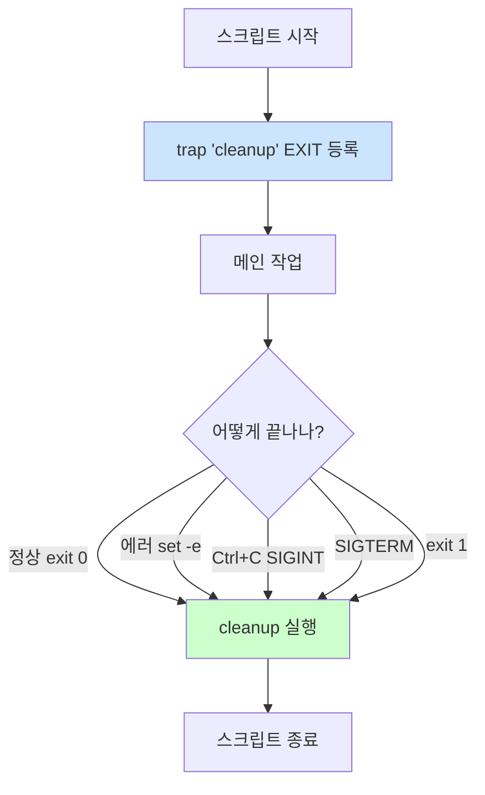

# Bash trap — 시그널 처리와 cleanup

> **TLDR** · `trap 'cleanup' EXIT`로 스크립트 종료 시점 cleanup 자동화 (정상·에러·시그널 모두). `trap '' INT`로 시그널 무시, `trap - INT`로 기본 동작 복귀. 임시 파일·lock·partial state cleanup에 필수. `trap 'echo "err at $LINENO"' ERR`로 에러 추적도 강력.

## 개요

장기 실행 스크립트나 자원을 만드는 스크립트는 갑작스러운 종료(Ctrl+C, SIGTERM, 에러)에 대비해 cleanup 코드를 가져야 한다. 임시 파일이 남거나, lock이 풀리지 않거나, 부분적으로 만들어진 상태가 남으면 다음 실행이 깨진다.

`trap`은 시그널이나 셸 이벤트(EXIT, ERR) 발생 시 핸들러를 실행하는 Bash 내장 명령이다. C 언어의 `signal()`·`atexit()`와 비슷한 역할.

## 왜 알아야 하나

운영 스크립트가 정상 종료뿐 아니라 에러·외부 중단에서도 깔끔히 정리되도록 보장하려면 trap이 필수다. 예를 들어 monitor.sh가 임시 파일을 만든 후 cron이 timeout으로 죽이면, 임시 파일이 누적되며 디스크를 야금야금 잡아먹는다. trap EXIT로 해결.

또한 trap ERR은 디버깅에 강력하다 — 어느 줄에서 어떤 명령이 실패했는지 자동 로깅할 수 있다. silent failure를 막는 또 다른 안전망.

## trap 기본 문법

```bash
trap 'handler_command' SIGNAL...
```

`handler_command`는 시그널이나 이벤트 발생 시 실행할 문자열. 함수명도 가능. 여러 시그널에 동시 등록 가능.

```bash
trap 'echo "cleanup"' EXIT          # 스크립트 종료 시
trap 'echo "interrupted"' INT       # Ctrl+C 받으면
trap 'echo "term"' TERM             # SIGTERM 받으면
trap 'echo "err at $LINENO"' ERR    # 에러 발생 시 (set -e와 조합)
trap '' HUP                         # SIGHUP 무시
trap - INT                          # SIGINT 기본 동작 복귀 (이전 trap 제거)
```

## 주요 trap 이벤트

| 이벤트 | 발동 시점 |
|---|---|
| `EXIT` | 스크립트 종료 (정상·에러·시그널 모두) |
| `ERR` | 명령이 non-zero 반환 (set -e와 조합 권장) |
| `DEBUG` | 매 명령 실행 전 (디버깅용) |
| `RETURN` | 함수·source 종료 시 |
| 시그널 (`INT`, `TERM`, `HUP`, ...) | 해당 시그널 수신 |

★ EXIT는 가장 자주 쓰는 trap이다. 정상 종료든 에러든 항상 발동하므로 cleanup 보장.

## cleanup 패턴

```bash
#!/usr/bin/env bash
set -euo pipefail

# 임시 파일 생성
TMPFILE=$(mktemp)
LOCKFILE="/tmp/monitor.lock"

# cleanup 함수 정의
cleanup() {
    local exit_code=$?
    echo "cleanup at exit code $exit_code"
    rm -f "$TMPFILE"
    rm -f "$LOCKFILE"
    exit $exit_code
}

trap cleanup EXIT

# lock 획득
if ! mkdir "$LOCKFILE" 2>/dev/null; then
    echo "이미 실행 중"
    exit 1
fi

# 메인 작업
echo "data" > "$TMPFILE"
process "$TMPFILE"
# ... 에러가 나도 set -e로 종료되며 cleanup 호출됨
```

`trap cleanup EXIT` 한 줄이 정상·에러·Ctrl+C·SIGTERM 모든 경로에서 cleanup 호출을 보장한다.

## trap의 실행 흐름



이 그림이 trap EXIT의 가치를 보여준다 — 어떤 경로로 종료되든 cleanup이 실행된다.

## ERR trap — 에러 추적

`set -e`와 조합하면 강력한 디버깅 도구.

```bash
#!/usr/bin/env bash
set -euo pipefail

# 에러 위치 자동 로깅
error_handler() {
    local exit_code=$?
    local line_no=$1
    local cmd="$BASH_COMMAND"
    echo "[ERROR] line $line_no: '$cmd' exited with $exit_code" >&2
    exit $exit_code
}

trap 'error_handler $LINENO' ERR

# 메인 작업
process_step_1
process_step_2
process_step_3       # 여기서 실패하면 line 번호와 명령 출력
```

ERR trap이 발동되면 자동으로:
- `$BASH_COMMAND` — 실패한 명령
- `$LINENO` — 발생 줄 번호 (전달 인자로)
- `$?` — exit code

production debugging에서 매우 유용한 패턴이다.

## 시그널 무시·제어

특정 시그널을 무시하거나 임시 비활성화:

```bash
# Ctrl+C 무시 (critical section 동안)
trap '' INT

critical_operation
update_database
finalize

trap - INT           # 기본 동작 복귀
```

`trap ''`는 무시, `trap -`은 default 복귀.

★ SIGKILL과 SIGSTOP은 trap 불가 (커널이 직접 처리). 어떤 trap도 이 두 시그널을 잡거나 무시할 수 없다.

## 한 번 보자

```bash
#!/usr/bin/env bash
set -euo pipefail

# 자원 변수
TMPDIR=$(mktemp -d)
LOG_FILE="$TMPDIR/work.log"

# cleanup 함수
cleanup() {
    local code=$?
    echo "[cleanup] removing $TMPDIR (exit=$code)"
    rm -rf "$TMPDIR"
}

# 에러 핸들러
on_error() {
    local line=$1
    local cmd="$BASH_COMMAND"
    echo "[ERROR] line $line: '$cmd'" >&2
}

# trap 등록
trap cleanup EXIT
trap 'on_error $LINENO' ERR

# 메인 작업
echo "start" > "$LOG_FILE"
sleep 1
ls /nonexistent  # 일부러 실패 → ERR trap + EXIT cleanup
echo "이건 실행 안 됨"
```

실행:

```
$ ./script.sh
[ERROR] line 24: 'ls /nonexistent'
[cleanup] removing /tmp/tmp.XYZabc (exit=2)
```

ERR로 어느 줄에서 무엇이 실패했는지 알 수 있고, EXIT로 임시 디렉토리도 정리된다.

## 흔한 함정

> [!WARNING]
> **`set -e`와 ERR trap 조합 시 trap이 먼저 실행되고 그 다음 종료**. ERR trap에서 `exit` 안 하면 일부 케이스에서 의도와 다른 동작. 항상 trap 끝에 `exit $code` 명시 권장.

trap의 가장 미묘한 함정은 함수·서브셸에서의 상속이다. 기본적으로 ERR·RETURN·DEBUG trap은 함수에 상속되지 않는다. `set -E`(errtrace) 옵션으로 ERR을 함수에도 적용 가능.

```bash
set -eE                       # E를 추가
trap 'handler' ERR
```

trap을 함수 안에 등록하면 그 함수에서만 유효한 게 아니라 호출자 스코프 전체에 영향. 함수 안에서 trap 변경할 때 주의.

여러 번 `trap`을 호출하면 마지막 등록만 유효하다 (덮어쓰기). 누적되지 않으므로 여러 핸들러 필요하면 한 함수에서 모두 처리하거나 명시적으로 추가.

```bash
# ★ 잘못된 패턴 — 두 번째 trap이 첫 번째를 덮어씀
trap 'cleanup_a' EXIT
trap 'cleanup_b' EXIT          # 이제 cleanup_a 실행 안 됨

# 올바른 패턴 — 한 함수에서 모두
cleanup_all() {
    cleanup_a
    cleanup_b
}
trap cleanup_all EXIT
```

cleanup 함수 안에서 또 명령이 실패하면 무한 루프 가능. `set +e` 안에서 cleanup 실행하거나 명시적 exit code 처리:

```bash
cleanup() {
    set +e        # cleanup 중 에러는 무시
    rm -f "$TMPFILE"
    release_lock
    # ...
}
```

시그널 핸들러는 async-signal-safe 함수만 호출해야 안전하다는 원칙이 있지만, Bash 스크립트에서는 거의 모든 외부 명령을 trap 핸들러에서 호출해도 작동한다. 단 매우 짧은 핸들러가 권장된다.

## B1-1 매핑

monitor.sh의 cleanup 패턴 (필요 시):

```bash
#!/usr/bin/env bash
set -euo pipefail

# 임시 파일 사용 시
TMPFILE=""

cleanup() {
    [ -n "$TMPFILE" ] && [ -f "$TMPFILE" ] && rm -f "$TMPFILE"
}
trap cleanup EXIT

TMPFILE=$(mktemp)

# 측정 작업
ps aux > "$TMPFILE"
# ... 분석 ...

# 정상 종료든 에러든 cleanup 호출됨
```

monitor.sh가 매분 실행되는 짧은 스크립트라 일반적으로 cleanup 부담은 작다. 다만 logrotate 직접 구현 시 임시 파일 사용한다면 trap이 유용.

setup 스크립트에서는 더 중요하다. 멱등 보장을 위한 partial state cleanup:

```bash
# setup/04-directories.sh
set -euo pipefail

CREATED_DIRS=()
cleanup() {
    if [ ${#CREATED_DIRS[@]} -gt 0 ] && [ $? -ne 0 ]; then
        echo "[cleanup] 부분 생성된 디렉토리 정리"
        for dir in "${CREATED_DIRS[@]}"; do
            rmdir "$dir" 2>/dev/null || true
        done
    fi
}
trap cleanup EXIT

mkdir -p "$AGENT_HOME"
CREATED_DIRS+=("$AGENT_HOME")
mkdir -p "$AGENT_HOME/upload_files"
CREATED_DIRS+=("$AGENT_HOME/upload_files")
# 실패하면 위 두 디렉토리 모두 정리
```

verify.sh에서도 ERR trap으로 어디서 검증이 실패했는지 추적할 수 있다.

## 인접 토픽

<details>
<summary><b>응용 토픽 — DEBUG trap·flock·systemd·watchdog (펼치기)</b></summary>

`trap 'echo "before: $BASH_COMMAND"' DEBUG`로 매 명령 실행 전 hook을 걸 수 있다. 매우 침습적이라 실제 운영에는 잘 안 쓰지만, 스크립트 디버깅 시 어느 줄까지 실행됐는지 추적할 때 유용.

`flock`은 파일 기반 lock 메커니즘으로, 같은 스크립트의 중복 실행을 방지한다.

```bash
exec 200> /tmp/myscript.lock
flock -n 200 || { echo "이미 실행 중"; exit 1; }
# 메인 작업 — 스크립트 종료 시 lock 자동 해제 (FD 닫힘)
```

systemd service는 cleanup 측면에서 더 우수하다. `ExecStopPost=`로 종료 후 hook, `Restart=on-failure`로 자동 재시작, cgroup으로 자식 프로세스도 함께 정리.

watchdog 패턴은 장기 실행 데몬에서 자기 진단·재시작 메커니즘이다. 별도 watchdog 프로세스가 메인을 모니터링하고 hang되면 SIGKILL+재시작. B1-2 트러블슈팅의 watchdog 주제와 관련.

`atexit` 같은 다른 언어의 패턴과 비교해 보면 Bash trap은 단순하지만 강력하다. Python의 atexit, Go의 defer와 비슷한 역할.

</details>

## 참고

- `man bash` — SHELL BUILTIN COMMANDS의 `trap`
- `man 7 signal` — 시그널 종류
- [Bash Hackers — trap](https://wiki.bash-hackers.org/commands/builtin/trap)

---
출처: B1-1 (Layer 4.5) · 학습일: 2026-05-11
