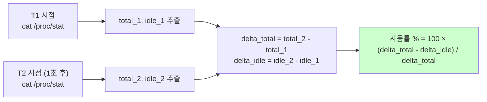

# CPU 사용률 측정

> **TLDR** · CPU 사용률은 `/proc/stat`의 누적 jiffies 카운터를 **두 시점 차이**로 계산. `top`은 자기가 명시적으로 측정 간격을 가져 정확하지만, `ps`의 %CPU는 시작 후 누적 평균이라 idle 프로세스도 높게 보일 수 있음. monitor.sh는 `top -b -n 2 -d 0.5` 또는 `/proc/stat` 직접 파싱이 정석.

## 개요

CPU 사용률 측정은 시스템 모니터링의 가장 기본이지만, 의외로 미묘한 영역이다. "CPU 50%"라는 한 숫자가 실제로는 측정 방법·기간·관점에 따라 다른 의미를 가지며, 도구마다 보여주는 값이 다르다. monitor.sh가 의도한 대로 작동하려면 어떤 도구가 어떤 의미의 %를 반환하는지 정확히 알아야 한다.

Linux의 CPU 사용률은 모두 커널이 `/proc/stat`에 노출하는 누적 jiffies 카운터(시스템 시작 후 각 모드에서 보낸 시간)에서 파생된다. 사용률은 두 시점의 카운터 차이를 비교해 계산하는데, 이 측정 간격이 짧을수록 순간 부하를 잘 보여주지만 noise도 크다.

## 왜 알아야 하나

운영에서 "CPU 100%다"라는 보고를 받으면 "어느 도구가 어떤 측정 모드로 본 값인가?"가 첫 질문이다. `ps`로 본 %CPU가 90%여도 idle 프로세스의 누적 평균이라 실제 부하는 0일 수도 있고, `top`의 %CPU가 700%면 멀티코어에서 7코어 점유했다는 의미일 수 있다. 이 해석 차이를 모르면 잘못된 진단으로 이어진다.

이번 과제는 CPU > 20% 경고를 요구한다. 어떤 값을 기준으로 할지 — 시스템 전체 CPU vs 특정 프로세스 CPU vs idle 비율 — 가 명세에 명시되지 않았으므로 monitor.sh의 설계 결정이다. 일반적으로 시스템 전체 CPU 사용률을 기준으로 하는 게 자연스럽다.

## /proc/stat 구조와 측정 원리

CPU 측정의 모든 원천 데이터는 `/proc/stat`에 있다.

```
$ cat /proc/stat | head -5
cpu  12345 678 9012 345678 4567 0 89 0 0 0
cpu0 6172 339 4506 172839 2283 0 44 0 0 0
cpu1 6173 339 4506 172839 2284 0 45 0 0 0
intr 1234567 ...
ctxt 9876543
```

`cpu` 라인의 각 숫자는 시스템 시작 후 그 모드에서 보낸 jiffies(보통 10ms 단위) 누적값이다.

| 열 | 모드 | 의미 |
|---|---|---|
| 1 | user | 일반 사용자 프로세스 |
| 2 | nice | nice 값 변경된 사용자 프로세스 |
| 3 | system | 커널 코드 (시스템 콜 처리 등) |
| 4 | **idle** | 아무것도 안 함 |
| 5 | iowait | I/O 대기 |
| 6 | irq | 하드웨어 인터럽트 처리 |
| 7 | softirq | 소프트웨어 인터럽트 |
| 8 | steal | 가상화 환경에서 다른 VM에 뺏긴 시간 |

사용률 계산은 두 시점의 차이로 이루어진다.



이 두 시점 측정이 CPU% 계산의 핵심이다. 한 시점만 보면 누적값일 뿐 사용률을 알 수 없다. `top`이 첫 측정 후 1초 기다리고 두 번째 측정을 하는 이유가 이것이다.

## top vs ps의 차이

가장 자주 만나는 두 도구의 CPU% 의미가 다른 것이 함정의 원인이다.

`top`은 자기가 명시적으로 1초(기본) 또는 `-d`로 지정한 간격으로 `/proc/stat`을 두 번 읽어 계산한다. 그래서 보여주는 값이 "지난 N초 동안의 평균 부하"라는 의미를 가진다. `top -b -n 1`(배치 모드 1회)에서는 첫 측정이 누적 통계라 부정확할 수 있고, `top -b -n 2 -d 1`처럼 2회 측정 후 두 번째 값을 쓰는 게 정확하다.

`ps aux`의 %CPU는 다르다. 각 프로세스의 (CPU 사용 시간 / 프로세스 살아있는 시간) — 즉 **시작 후 누적 평균**이다. 오래 살아있는 프로세스는 시작 직후 1초만 CPU를 점유했더라도 그 후 idle해도 평균이 천천히 떨어진다. monitor.sh가 ps의 %CPU를 그대로 사용하면 "지난 1분간 부하"가 아니라 "프로세스 생애 평균"을 보고하게 된다.

## 한 번 보자

```
$ top -b -n 1 | head -5
top - 14:30:01 up 5 days, 12:34, 2 users, load average: 0.50, 0.43, 0.40
Tasks: 234 total,   1 running, 233 sleeping,   0 stopped,   0 zombie
%Cpu(s):  2.3 us,  0.8 sy,  0.0 ni, 96.7 id,  0.1 wa,  0.0 hi,  0.1 si,  0.0 st
MiB Mem :  7891.0 total,   2345.0 free,   3456.0 used,   2090.0 buff/cache
MiB Swap:  2048.0 total,   2048.0 free,      0.0 used.   4123.0 avail Mem
```

`%Cpu(s)` 라인이 핵심이다. `us`(user) + `sy`(system) + `ni`(nice) + `wa`(iowait) + `hi`(irq) + `si`(softirq) + `st`(steal) = 사용률 (보통 `id` idle의 보수).

monitor.sh에서 사용률을 추출하는 패턴은 두 가지가 있다.

```bash
# 패턴 1: top의 idle 값에서 100% 빼기 (간단)
cpu_used=$(top -b -n 1 | grep "Cpu(s)" | awk -F'id,' '{print 100 - $1 + 0}' | awk '{print $NF}')

# 패턴 2: 2회 측정해 안정화 (정확)
cpu_used=$(top -b -n 2 -d 0.5 | grep "Cpu(s)" | tail -1 | awk -F'id,' '{print 100 - $1 + 0}' | awk '{print $NF}')
```

`/proc/stat`을 직접 파싱하는 방법은 더 정밀하다.

```bash
read -r cpu user nice system idle iowait irq softirq steal < /proc/stat
total_1=$((user + nice + system + idle + iowait + irq + softirq + steal))
idle_1=$idle

sleep 1

read -r cpu user nice system idle iowait irq softirq steal < /proc/stat
total_2=$((user + nice + system + idle + iowait + irq + softirq + steal))
idle_2=$idle

delta_total=$((total_2 - total_1))
delta_idle=$((idle_2 - idle_1))
cpu_used=$(( (delta_total - delta_idle) * 100 / delta_total ))
echo "CPU 사용률: ${cpu_used}%"
```

특정 프로세스의 CPU%만 추적할 때는 `pidstat -p PID 1`가 가장 정확하다. 1초 간격으로 한 번 출력하므로 burst pattern 관찰에 적합하다.

## 흔한 함정

> [!WARNING]
> **가장 흔한 오해**: `ps aux | head` 로 본 %CPU가 시스템 전체 부하라고 착각. `ps`의 %CPU는 **프로세스 생애 누적 평균**이라 idle 프로세스도 높게 보일 수 있음. 시스템 전체 부하는 `top -b -n 1`이나 `/proc/stat`을 봐야 정확.

CPU 측정의 함정은 도구별 의미 차이와 멀티코어 표시 방식에서 발생한다. `top`의 %CPU는 측정 간격(보통 1초) 동안의 평균이라 짧은 burst를 놓칠 수 있다. 더 정확한 순간 부하가 필요하면 `pidstat -p PID 1`을 쓰는데, 이건 매초 출력하므로 patterns을 관찰할 수 있다.

멀티코어 환경에서 `top`의 %CPU가 100%를 초과하는 것은 정상이다 — 단일 프로세스가 N개 코어를 점유하면 N×100%까지 가능하다. Irix mode(Shift+I)로 토글하면 단일 코어 기준 백분율로 전환된다. 이 차이를 모르면 "왜 700%가 나오지" 하며 당황한다.

`iowait` 시간은 CPU가 한가하지만 I/O 응답을 기다리는 시간이다. iowait이 높으면 CPU 부하는 낮아도 시스템이 느린 느낌이 들 수 있다. 디스크 병목 진단에 유용한 신호로, NVMe 시대에는 줄어들었지만 NFS·네트워크 디스크 환경에서는 여전히 중요하다.

가상화 환경에서는 `steal` 시간을 봐야 한다. 호스트가 다른 VM에 CPU를 양보한 시간으로, "CPU는 한가한데 왜 느리지?" 같은 클라우드 인스턴스 성능 이슈의 단서가 된다. steal이 5% 이상이면 노이지 네이버(noisy neighbor) 의심.

## B1-1 매핑

monitor.sh의 CPU 사용률 측정은 다음 패턴이 권장된다.

```bash
# 시스템 전체 CPU 사용률 (top 사용, 2회 측정으로 안정화)
CPU_USED=$(top -b -n 2 -d 0.5 | grep "Cpu(s)" | tail -1 \
  | awk -F'id,' '{print 100 - $1 + 0}' \
  | awk '{print $NF}' \
  | cut -d. -f1)

# 임계값 비교 (CPU > 20%)
if [ "$CPU_USED" -gt 20 ]; then
    echo "[WARNING] CPU 사용률 ${CPU_USED}% > 20%"
fi
```

`-n 2 -d 0.5`로 두 번 측정해 첫 측정의 부정확성을 피하는 패턴이 정석이다.

명세는 정수 비교를 요구하지만 top 출력은 소수점을 포함할 수 있어 `cut -d. -f1`로 정수부만 추출하거나 `awk`로 round 처리한다. 만약 명세의 출력 포맷(예: `CPU:25.3%`)을 따라야 한다면 소수점 1자리까지 보존해서 출력하고 비교 시에만 정수화하는 식으로 분리하면 깔끔하다.

monitor.log 포맷에 맞추려면 다음과 같이 작성한다.

```bash
# 1.2% 같은 소수 포함 형식
CPU_USED_RAW=$(top -b -n 2 -d 0.5 | grep "Cpu(s)" | tail -1 | awk -F'id,' '{print 100 - $1}' | awk '{print $NF}')
printf "CPU:%.1f%%\n" "$CPU_USED_RAW"
```

## 인접 토픽

<details>
<summary><b>응용 토픽 — pidstat·perf·eBPF·load average (펼치기)</b></summary>

CPU 측정의 정밀한 도구로 `pidstat`이 있다. sysstat 패키지에 포함되며, 매초 또는 지정한 간격으로 프로세스별 %CPU를 출력해 burst pattern 관찰에 적합하다. `pidstat -p PID 1`로 특정 프로세스를 실시간 추적한다. 짧은 spike도 놓치지 않는다.

`perf`는 더 깊은 CPU 프로파일링 도구다. CPU cycles, cache miss, branch mispredict 등 하드웨어 PMC(Performance Monitoring Counter)를 활용해 핫스팟을 찾는다. `perf record -p PID -- sleep 30` + `perf report`로 함수 단위 CPU 사용을 분석할 수 있다. production 디버깅의 강력한 도구지만 학습 비용이 있다.

eBPF + bpftrace는 syscall·schedule 추적의 현대적 도구다. `tcplife`, `runqlat`, `cpudist` 같은 도구로 어떤 프로세스가 어떻게 CPU를 사용하는지 매우 낮은 오버헤드로 추적한다. 커널에 동적으로 코드를 주입하므로 strace보다 가볍다.

load average(`uptime`의 1·5·15분 평균)는 CPU 사용률과 다른 지표다. R(running) + D(disk wait) 상태 프로세스 수의 평균으로, CPU 부하뿐 아니라 I/O 병목도 반영한다. load average가 코어 수보다 높으면 큐가 차 있다는 신호다. 8코어 머신에서 load avg 16이면 평균 두 배 부하.

</details>

## 참고

- `man top`, `man ps`, `man pidstat`
- `man 5 proc` — `/proc/stat` 형식 정의
- [Brendan Gregg's Linux Performance](https://www.brendangregg.com/linuxperf.html)

---
출처: B1-1 (Layer 3.1) · 학습일: 2026-05-11
