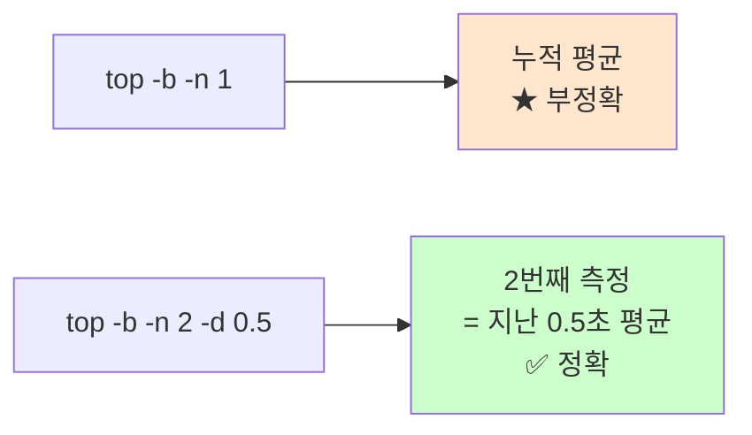

# CPU 사용률 측정

> **한 줄로** · 컴퓨터의 CPU가 **얼마나 바쁜지를 0~100% 숫자로 측정**하는 작업. B1-1은 monitor.sh가 CPU 사용률을 측정해서 **20% 초과 시 `[WARNING]` 출력**하라고 요구. `top` 명령이 가장 간단·정확한 측정 도구.

---

## 과제 요구사항

### 이게 무슨 작업?

CPU는 컴퓨터의 "두뇌" 역할. 일이 많으면 바쁘고(사용률 ↑), 한가하면 놀고 있어요(사용률 ↓). 사용률은 **지난 잠깐 동안 두뇌가 얼마나 일했는지** 백분율로 표현.

명세는 monitor.sh가 1분마다 CPU 사용률을 측정해서:
- 정상이면 그대로 기록
- **20%를 넘으면 `[WARNING]` 메시지를 출력**

### 명세 원문 (원본 그대로)

> **자원 수집**
> - CPU 사용률(%)
> - 메모리 사용률(%)
> - 디스크 사용률(Root partition, Used %)
>
> **임계값 경고(경고만 출력)**
> - **CPU > 20%: [WARNING]**
> - MEM > 10%: [WARNING]
> - DISK_USED > 80%: [WARNING]

### 무엇을 측정하나

| 항목 | 값 |
|---|---|
| 측정 대상 | 시스템 전체 CPU 사용률 |
| 출력 형식 | 정수 또는 소수 % (`25.3%` 같이) |
| 임계값 | **20% 초과 시 `[WARNING]` 출력** |
| 측정 도구 | `top` (권장) 또는 `/proc/stat` 직접 |

### 잘 됐는지 확인하기

```bash
# 1. 현재 CPU 사용률 확인
top -b -n 1 | grep "Cpu(s)"

# 2. monitor.sh의 측정 결과 확인
sudo /home/agent-admin/agent-app/bin/monitor.sh
# 출력에 "CPU Usage : XX.X%" 라인이 보여야 함
```

기대 결과:
```
%Cpu(s):  2.3 us,  0.8 sy, ..., 96.7 id, ...
                                  ↑
                       idle (놀고 있는 비율) — 100에서 빼면 사용률
```

---

## 구현 방법

### 가장 단순한 방법 — `top` 사용

```bash
CPU_USED=$(top -b -n 2 -d 0.5 | grep "Cpu(s)" | tail -1 \
    | awk -F'id,' '{print 100 - $1}' \
    | awk '{print $NF}')
echo "CPU 사용률: ${CPU_USED}%"
```

각 부분의 의미:

| 부분 | 의미 |
|---|---|
| `top -b` | 배치 모드 (대화형 X, 한 번 출력) |
| `-n 2` | 2번 측정 |
| `-d 0.5` | 측정 간격 0.5초 |
| `tail -1` | 2번째 측정 결과만 사용 (★ 첫 번째는 부정확) |
| `awk -F'id,'` | "id," 앞뒤로 분리 → idle 비율 추출 |
| `100 - $1` | 100에서 idle 빼서 "바쁜 비율" 계산 |

### Step 1 — 측정

```bash
# 2회 측정으로 안정화
CPU_USED=$(top -b -n 2 -d 0.5 | grep "Cpu(s)" | tail -1 \
    | awk -F'id,' '{print 100 - $1}' \
    | awk '{print $NF}')
```

### Step 2 — 임계값 비교

```bash
THRESH_CPU=20
CPU_USED_INT="${CPU_USED%.*}"   # 소수점 제거 (정수 비교 위해)
[ -z "$CPU_USED_INT" ] && CPU_USED_INT=0

if [ "$CPU_USED_INT" -gt "$THRESH_CPU" ]; then
    echo "[WARNING] CPU threshold exceeded (${CPU_USED}% > ${THRESH_CPU}%)"
fi
```

`${CPU_USED%.*}`는 "25.3" → "25"로 만드는 트릭 (소수점 이하 잘라냄).

### Step 3 — 출력 형식

명세의 monitor.sh 출력 예시:
```
[RESOURCE MONITORING]
CPU Usage : 25.3%
MEM Usage : 5.2%
DISK Used  : 23%

[WARNING] CPU threshold exceeded (25.3% > 20%)
```

monitor.sh 코드에서:
```bash
printf "CPU Usage : %s%%\n" "$CPU_USED"
```

전체 monitor.sh: [bin/monitor.sh](https://github.com/codewhite7777/codyssey_b1_1/blob/main/bin/monitor.sh)

---

## 개념

### CPU 사용률이란?

CPU는 매 순간 다음 중 하나의 상태에 있어요:
- **일하는 중**: 사용자 프로그램 실행 (user)
- **시스템 일**: 커널 작업 (system)
- **I/O 대기**: 디스크/네트워크 응답 기다림 (iowait)
- **놀고 있음**: 아무것도 안 함 (idle)

지난 1초간:
- idle 비율 70% → 사용률 30%
- idle 비율 5% → 사용률 95% (매우 바쁨)

### `top` vs `ps`의 차이 (★ 함정)

`top`과 `ps` 둘 다 %CPU를 보여주지만 의미가 달라요.

| 도구 | %CPU 의미 |
|---|---|
| **`top`** | 측정 간격(보통 1초) 동안의 평균 |
| `ps` | **프로세스 시작 후 누적 평균** (지금 idle해도 높게 보일 수 있음) |

→ 시스템 부하 측정엔 **`top` 권장**.

### 왜 2번 측정?

`top -b -n 1`(1회만)은 첫 측정이 부정확해요. CPU 사용률은 두 시점의 차이로 계산하는데, 1회 측정은 비교 대상이 없어서 시스템 시작 후 누적 평균이 나옵니다.



### 멀티코어에서의 %CPU

4코어 컴퓨터에서 한 프로세스가 모든 코어를 100% 사용하면 **`top`에서 400%로 보일 수 있어요** (코어 수 × 100%). 시스템 전체 사용률을 볼 때는 `Cpu(s)` 라인을 보면 0~100% 범위로 보입니다.

monitor.sh는 시스템 전체(`Cpu(s)`) 사용률을 측정하므로 항상 0~100% 범위.

---

## 참고

- `man top` — top의 모든 옵션
- `man 5 proc` — `/proc/stat` 형식 정의
- 관련 노트: [memory-measurement.md](./memory-measurement.md), [disk-usage-df-vs-du.md](./disk-usage-df-vs-du.md)

---
출처: B1-1 (Layer 3.1) · 학습일: 2026-05-12
