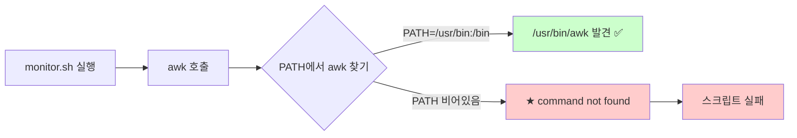

# cron 환경 함정과 해결

> **한 줄로** · cron은 명령을 **빈 환경**으로 실행하기 때문에 `.bash_profile`·`.bashrc`를 안 읽고 PATH도 매우 짧아요(`/usr/bin:/bin`만). "로컬에선 잘 되는데 cron만 안 됨"의 99%가 이 함정. B1-1 monitor.sh도 절대 경로 + crontab 상단 `PATH=...` 명시로 회피.

---

## 과제 요구사항

### 이게 무슨 작업?

monitor.sh는 cron으로 매분 실행돼야 해요. 로컬에서는 `bash monitor.sh` 잘 되는데 **cron에서만 동작 안 하는 경우**가 매우 흔합니다.

회사 비유:
- 평소 출근하면 책상에 **모든 도구**가 준비돼 있음 (.bash_profile이 셋업)
- cron 비서는 **빈손**으로 일 시작 — 책상도, 도구도, 연락처도 없음
- → 비서에게 일 시킬 때는 **모든 정보를 메모로 명시**해야 함

### 명세 원문 (원본 그대로)

명세는 cron 환경 함정을 직접 언급하진 않아요. 하지만 **monitor.sh가 cron에서 매분 정상 동작**해야 한다고 요구하고, **자기평가 항목**에 다음이 있어요:

> 트러블슈팅을 통해 무엇이 어디에서 막혔고 어떻게 해결했는지를 설명할 수 있다

→ "PATH 함정·환경 변수 함정"을 알고 해결하면 자기평가 통과.

### 무엇이 다른가

| 항목 | 일반 셸 (SSH 로그인) | cron 실행 |
|---|---|---|
| `.bash_profile` 읽음? | ✅ | ❌ |
| `.bashrc` 읽음? | ✅ | ❌ |
| PATH | `/usr/local/sbin:/usr/local/bin:/usr/sbin:/usr/bin:...` | `/usr/bin:/bin` |
| HOME | `/home/user` | `/home/user` (있음) |
| USER | `user` | `user` (있음) |
| LANG | `ko_KR.UTF-8` 등 | 빈 값 또는 C |
| AGENT_* 환경 변수 | ✅ (.bash_profile에서 set) | ❌ (안 읽으니까) |

### 잘 됐는지 확인하기

```bash
# cron 환경 그대로 재현
env -i HOME=$HOME PATH=/usr/bin:/bin bash monitor.sh

# 위가 실패하면 PATH 함정
```

`env -i`는 환경을 깨끗이 비우는 옵션. cron과 똑같은 환경 만들기.

---

## 구현 방법

3가지 방어 패턴을 **모두** 적용하면 안전.

### 방어 1 — 절대 경로 사용

스크립트 안에서 명령을 절대 경로로 호출.

```bash
# ❌ cron에서 위험
top -b -n 2 -d 0.5

# ✅ 안전
/usr/bin/top -b -n 2 -d 0.5
```

명령의 절대 경로 찾는 법:
```bash
which top      # /usr/bin/top
which awk      # /usr/bin/awk
command -v df  # /usr/bin/df
```

### 방어 2 — crontab 상단에 환경 변수 명시

```cron
SHELL=/bin/bash
PATH=/usr/local/sbin:/usr/local/bin:/usr/sbin:/usr/bin:/sbin:/bin
MAILTO=""

* * * * * /home/agent-admin/agent-app/bin/monitor.sh >> /var/log/agent-app/cron.log 2>&1
```

각 줄의 효과:
- `SHELL=/bin/bash` — cron이 명령 실행할 셸 지정
- `PATH=...` — 명령 찾을 경로 (★ 핵심)
- `MAILTO=""` — cron이 출력을 메일로 안 보냄 (메일 시스템 없을 때 안전)

### 방어 3 — 스크립트 첫 줄에서 PATH 명시

가장 안전한 방법은 스크립트 자체가 자기 PATH를 setup.

```bash
#!/usr/bin/env bash
set -euo pipefail

# cron 환경 방어 — 어떤 환경에서 실행되어도 OK
export PATH="/usr/local/sbin:/usr/local/bin:/usr/sbin:/usr/bin:/sbin:/bin"
export LC_ALL=C

# 필요한 환경 변수 명시적 set
AGENT_HOME="${AGENT_HOME:-/home/agent-admin/agent-app}"
AGENT_LOG_DIR="${AGENT_LOG_DIR:-/var/log/agent-app}"

# 본문
...
```

`${AGENT_HOME:-기본값}`은 "환경 변수가 비어있으면 기본값 사용"의 트릭.

### 진단·검증

cron에 등록 후 1-2분 후 결과 확인:

```bash
# 1. crontab 등록 확인
sudo -u agent-admin crontab -l

# 2. cron 로그에 명령이 실행됐는지
sudo grep monitor /var/log/syslog
# 또는 systemd 환경에서
sudo journalctl -u cron --since "5 minutes ago"

# 3. monitor.log에 새 라인 누적
sudo tail -20 /var/log/agent-app/monitor.log

# 4. cron 출력 (스크립트 자체 에러)
sudo tail /var/log/agent-app/cron.log
```

전체 구현: [setup/06-cron.sh](https://github.com/codewhite7777/codyssey_b1_1/blob/main/setup/06-cron.sh)

---

## 개념

### 왜 cron은 init 파일을 안 읽나?

배경에는 **셸 4-cell 매트릭스**가 있어요.

| 셸 종류 | 읽는 init 파일 |
|---|---|
| **login + interactive** (SSH 로그인) | `/etc/profile` → `.bash_profile` → `.bashrc` |
| non-login + interactive (`xterm` 새 창) | `.bashrc` |
| login + non-interactive (`bash --login script.sh`) | `.bash_profile` |
| **non-login + non-interactive** (cron, systemd) | **★ 아무것도 안 읽음** |

cron은 마지막 경우 → 어떤 init 파일도 안 읽음 → 환경 변수 거의 비어있음.

### cron 환경의 실제 내용

```bash
# crontab에 등록한 스크립트의 첫 부분에
env > /tmp/cron-env.txt

# 1분 후 확인
cat /tmp/cron-env.txt
```

전형적인 cron 환경:
```
PATH=/usr/bin:/bin
HOME=/home/agent-admin
LOGNAME=agent-admin
SHELL=/bin/sh    ← bash가 아닐 수도
PWD=/home/agent-admin
```

→ 일반 셸 대비 매우 빈약.

### PATH 함정의 시나리오



cron은 보통 `/usr/bin:/bin` 정도는 있어서 `awk`·`grep`·`top`은 찾을 수 있어요. 문제는 `/usr/local/bin`에 설치된 도구(예: 직접 컴파일한 명령) — 이건 PATH에 없어서 못 찾음.

### 환경 변수 함정의 시나리오

`.bash_profile`에 다음이 있다고 가정:
```bash
export AGENT_HOME=/home/agent-admin/agent-app
export AGENT_LOG_DIR=/var/log/agent-app
```

monitor.sh가 `$AGENT_HOME/bin/foo`를 호출하면:

| 환경 | `$AGENT_HOME` 값 | 결과 |
|---|---|---|
| SSH 로그인 후 실행 | `/home/agent-admin/agent-app` | ✅ |
| `bash monitor.sh` 직접 실행 | `/home/agent-admin/agent-app` (이미 set됨) | ✅ |
| **cron 실행** | **빈 값** | **★ //bin/foo로 실행 → 실패** |

해결: 스크립트 안에서 `AGENT_HOME="${AGENT_HOME:-/home/agent-admin/agent-app}"` 명시.

### LANG·LC_ALL 함정 (참고)

```bash
# 로컬에서
$ LANG=ko_KR.UTF-8 date
2026년 5월 12일 화요일 14시 30분

# cron에서 (LANG 비어있음)
Tue May 12 14:30:00 KST 2026
```

스크립트가 날짜 출력 형식에 의존하면 문제. monitor.sh는 ISO 형식(`date +%Y-%m-%dT%H:%M:%S`)으로 명시적이라 안전.

### "내 컴퓨터에선 됨" 증후군

cron 디버깅의 황금 룰:


**진단 명령**:
```bash
# 완전히 비운 환경에서 실행 (cron 시뮬레이션)
env -i HOME=$HOME LOGNAME=$USER PATH=/usr/bin:/bin /bin/sh -c "bash monitor.sh"
```

이게 실패하면 cron에서도 실패합니다.

### `MAILTO` — 출력의 행방

cron은 명령의 stdout·stderr 출력을 **메일로 보내려고** 시도해요. 메일 시스템이 없으면 시스템 로그에 에러가 쌓입니다.

세 가지 처리 옵션:

| 옵션 | 효과 |
|---|---|
| `MAILTO=""` | 메일 발송 시도 안 함 (가장 안전) |
| `MAILTO="me@example.com"` | 지정된 메일로 발송 (메일 시스템 필요) |
| 명령에 `>>file 2>&1` 추가 | 출력을 파일로 redirect (cron은 메일 보낼 게 없으니 발송 안 함) |

B1-1은 **둘 다** 적용 — `MAILTO=""` + redirect.

---

## 참고

- `man 5 crontab` — 환경 변수 처리 정식 정의
- 관련 노트: [cron-fundamentals.md](./cron-fundamentals.md) — cron 기본
- 관련 노트: [shell-environment.md](./shell-environment.md) — 4-cell 매트릭스

---
출처: B1-1 (Layer 5.2) · 학습일: 2026-05-12
