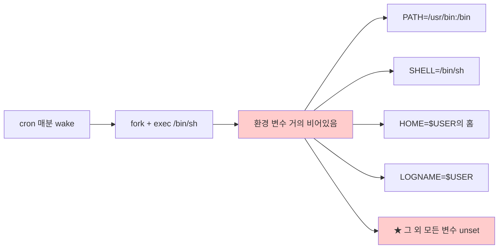

# cron 환경 함정과 해결

> **TLDR** · cron은 **non-interactive non-login 셸**로 명령 실행 → `.bash_profile`·`.bashrc` 안 읽음, PATH 거의 비어있음(`/usr/bin:/bin`), 환경 변수 거의 없음. 해결: 절대 경로 사용 또는 스크립트 첫 줄에서 `PATH=...` 명시 또는 crontab 상단에 환경 변수 정의. "로컬은 되는데 cron만 안 됨"의 99%가 이 함정.

## 개요

cron의 모든 함정 중 가장 자주 부딪히는 것이 환경 차이다. 대화형 셸에서는 잘 동작하던 명령이 cron에서는 "command not found"로 실패하거나, 변수가 unset이라 깨지는 사례가 끊임없이 발생한다. 이 차이의 근본 원인은 cron이 셸을 어떤 모드로 띄우는지에 있다.

이 노트는 cron 환경의 정확한 모델을 짚고, monitor.sh가 cron에서 안정적으로 동작하도록 하는 패턴을 정리한다.

## 왜 알아야 하나

운영 자동화의 단골 디버깅 시나리오 — "월요일 아침 cron이 안 돈 채로 일주일이 지났음을 발견" — 가 거의 모두 환경 함정이다. PATH 누락, 환경 변수 안 set, 시간대 차이, locale 차이 등이 누적되어 silent failure로 이어진다. cron 환경의 특성을 정확히 이해하고 명시적으로 처리하면 이 사고를 거의 모두 막을 수 있다.

이번 과제 명세는 `AGENT_HOME`, `AGENT_PORT` 등 여러 환경 변수를 정의하고 monitor.sh가 이를 사용한다고 가정한다. SSH 접속 시에는 `.bash_profile`이 자동 로드되지만 cron에서는 안 되므로, 명시적으로 처리해야 한다.

## cron 환경의 실제 상태

cron이 실행하는 명령의 환경은 매우 제한적이다.



cron이 실제로 set하는 환경 변수를 확인할 수 있는 디버깅 트릭:

```bash
# crontab에 추가
* * * * * env > /tmp/cron-env.txt

# 1분 후
$ cat /tmp/cron-env.txt
HOME=/home/agent-admin
LOGNAME=agent-admin
PATH=/usr/bin:/bin
SHELL=/bin/sh
PWD=/home/agent-admin
```

위 5개 정도가 거의 전부다. 비교를 위해 SSH 접속 후 `env`를 실행하면 50-100개의 변수가 나온다 — LANG, LC_ALL, USER, EDITOR, JAVA_HOME, AGENT_HOME 등.

## 왜 환경이 비어있나

cron 데몬은 작업을 실행할 때 `fork()` + `execve()`로 자식 프로세스를 만든다. execve에 전달되는 환경 변수(`envp[]`)는 cron daemon 자신이 가진 최소한의 변수뿐. 사용자의 `.bash_profile`·`.bashrc`는 인터랙티브 셸 또는 login 셸 시작 시 source되는 파일인데, cron이 띄우는 셸은 그 어느 쪽도 아니다.

이는 [shell-environment 노트](./shell-environment.md)의 4-cell 매트릭스의 "non-interactive non-login" 사분면에 해당한다. 그 셸은 어떤 startup 파일도 자동으로 안 읽는다.

## 해결 패턴

cron 환경 함정의 해결은 세 가지 접근이 있다.

### 접근 1: 스크립트 안에서 환경 명시

가장 명시적이고 권장되는 패턴.

```bash
#!/usr/bin/env bash
# monitor.sh

set -euo pipefail

# PATH 명시 — /usr/local/bin이 가장 먼저 와야 사이트 설치 도구 우선
export PATH=/usr/local/sbin:/usr/local/bin:/usr/sbin:/usr/bin:/sbin:/bin

# locale 강제 — POSIX C로 도구 출력 형식 안정화
export LC_ALL=C

# 필요한 환경 변수 source
[ -f /home/agent-admin/.bash_profile ] && . /home/agent-admin/.bash_profile

# 또는 직접 설정
export AGENT_HOME="/home/agent-admin/agent-app"
export AGENT_LOG_DIR="/var/log/agent-app"

# 메인 로직
...
```

장점: 어디서 실행하든(cron, 수동, systemd) 일관된 환경. 단점: 매번 명시 부담.

### 접근 2: crontab 상단에 환경 변수 정의

cron 파일 자체에 환경 변수를 두는 방법.

```cron
# /var/spool/cron/crontabs/agent-admin

SHELL=/bin/bash
PATH=/usr/local/sbin:/usr/local/bin:/usr/sbin:/usr/bin:/sbin:/bin
AGENT_HOME=/home/agent-admin/agent-app
AGENT_LOG_DIR=/var/log/agent-app
MAILTO=""

* * * * * /home/agent-admin/agent-app/bin/monitor.sh
```

각 cron 라인이 같은 환경을 공유. 단점: crontab 안에 hardcoded라 변경 추적 어려움.

### 접근 3: BASH_ENV 활용

`BASH_ENV` 환경 변수가 가리키는 파일을 non-interactive bash가 source한다 (인터랙티브에서는 무시).

```cron
SHELL=/bin/bash
BASH_ENV=/home/agent-admin/.bash_profile

* * * * * /home/agent-admin/agent-app/bin/monitor.sh
```

`.bash_profile`이 적절히 작성되어 있다면 한 줄로 환경 복제 가능. 단점: `.bash_profile`이 너무 무거우면 cron 실행이 느려짐.

대부분의 운영 환경은 접근 1(스크립트 내 명시)을 선호한다. 명시적이고, 어디서 실행하든 같은 동작이며, 디버깅이 쉽다.

## 한 번 보자

cron 디버깅의 표준 절차:

```bash
# 1. 어떤 환경에서 실행되는지 확인
* * * * * /usr/bin/env > /tmp/cron-test.txt 2>&1

# 1분 후 확인
$ cat /tmp/cron-test.txt
HOME=/home/agent-admin
LOGNAME=agent-admin
PATH=/usr/bin:/bin
...
```

```bash
# 2. 실패하는 명령을 직접 cron 환경으로 테스트
env -i HOME=$HOME PATH=/usr/bin:/bin bash -c '/path/to/script.sh'
# env -i: 모든 환경 변수 clear, 명시한 것만 set
# 이게 cron에서 실행되는 환경과 거의 동등
```

```bash
# 3. cron 로그 확인
sudo grep CRON /var/log/syslog | tail
sudo journalctl -u cron --since "10 min ago"

# 4. 명령 자체의 출력 캡처
* * * * * /path/script.sh >> /tmp/script.log 2>&1
# stdout과 stderr 모두 파일에
```

## 흔한 함정

> [!WARNING]
> **PATH 부재가 가장 흔한 함정**: cron의 PATH는 `/usr/bin:/bin`만. `/usr/local/bin`(brew, 수동 설치), `~/.local/bin`(pip --user)의 명령은 모두 "command not found". 항상 절대 경로 사용 또는 스크립트에서 `PATH=...` 명시.

cron 환경 함정은 항상 "왜 로컬은 되는데 cron만 안 되지" 질문으로 나타난다. 디버깅의 첫 단계는 cron 환경을 정확히 재현해보는 것 — `env -i`로 환경 비우고 cron이 set하는 최소 변수만 추가한 후 같은 명령을 실행하면 같은 실패가 재현된다.

`sudo` 사용 시 더 미묘하다. cron이 user crontab으로 실행되어 그 사용자 권한인데, 안에서 `sudo cmd`를 호출하면 비밀번호를 묻거나 stdin이 없어서 실패한다. 해결: sudoers의 NOPASSWD 또는 root crontab으로 직접 등록.

시간대 차이도 자주 만나는 함정. cron은 시스템 시간대를 따르는데, 도커 컨테이너의 기본 시간대(UTC)와 운영 환경(KST 등)이 다르면 "왜 9시간 뒤에 실행되지" 같은 사고. `cat /etc/timezone` 또는 `timedatectl`로 확인.

locale 차이는 출력 형식을 깨뜨린다. `date`나 `ps`의 출력이 시스템 locale에 따라 한국어로 나오면 awk 파싱이 실패. `export LC_ALL=C`로 POSIX 표준 형식 강제가 안전.

stdout/stderr 누락 함정은 silent failure의 단골. cron이 명령 출력을 사용자 메일로 보내는데, 메일이 설정 안 된 시스템에서는 그냥 사라진다. `>> /tmp/log 2>&1` 명시적 캡처 + `MAILTO=""`(메일 비활성)이 표준 패턴.

`source` vs `.` 함정도 가끔 있다. `source`는 Bash 확장, `.`은 POSIX. cron의 기본 셸 `/bin/sh`(dash)는 `source` 미지원. `SHELL=/bin/bash` 명시하거나 `.` 사용.

## B1-1 매핑

이번 과제의 cron 안전 패턴:

```cron
# /var/spool/cron/crontabs/agent-admin

SHELL=/bin/bash
PATH=/usr/local/sbin:/usr/local/bin:/usr/sbin:/usr/bin:/sbin:/bin
MAILTO=""

# 매분 monitor.sh 실행, 로그 캡처
* * * * * /home/agent-admin/agent-app/bin/monitor.sh >> /var/log/agent-app/cron.log 2>&1
```

monitor.sh의 안전 헤더:

```bash
#!/usr/bin/env bash
set -euo pipefail

# 환경 명시 (cron 환경 함정 회피)
export PATH=/usr/local/sbin:/usr/local/bin:/usr/sbin:/usr/bin:/sbin:/bin
export LC_ALL=C

# 환경 변수 source (.bash_profile에서)
[ -f /home/agent-admin/.bash_profile ] && . /home/agent-admin/.bash_profile

# 또는 명시적 default
: "${AGENT_HOME:=/home/agent-admin/agent-app}"
: "${AGENT_LOG_DIR:=/var/log/agent-app}"
export AGENT_HOME AGENT_LOG_DIR

# 메인 로직
LOG_FILE="$AGENT_LOG_DIR/monitor.log"
echo "[$(date '+%Y-%m-%d %H:%M:%S')] start" >> "$LOG_FILE"
```

`: "${VAR:=default}"`는 "VAR 없으면 default 할당"의 idiom. SSH 접속 시에는 `.bash_profile`로 set, cron에서는 default 적용.

setup 스크립트(06-cron.sh)도 환경 변수 명시:

```bash
#!/usr/bin/env bash
set -euo pipefail

# agent-admin의 crontab 갱신 (멱등)
sudo -u agent-admin bash <<'EOF'
TMPCRON=$(mktemp)

cat > "$TMPCRON" <<EOC
SHELL=/bin/bash
PATH=/usr/local/sbin:/usr/local/bin:/usr/sbin:/usr/bin:/sbin:/bin
MAILTO=""

# monitor.sh 매분 실행
* * * * * /home/agent-admin/agent-app/bin/monitor.sh >> /var/log/agent-app/cron.log 2>&1
EOC

crontab "$TMPCRON"
rm -f "$TMPCRON"
EOF

echo "[OK] cron registered for agent-admin"
```

heredoc 안 또 heredoc — `'EOF'` 작은따옴표로 외부 expansion 방지, 안쪽 `EOC` 일반.

## 인접 토픽

<details>
<summary><b>응용 토픽 — systemd timer 환경·MAILTO·flock·anacron (펼치기)</b></summary>

systemd timer는 환경 처리가 훨씬 명시적이다. `.service` 파일의 `Environment=` 또는 `EnvironmentFile=`로 정확히 명시하며, journalctl로 통합 로깅. cron 환경 함정의 대부분이 사라진다.

```ini
[Service]
EnvironmentFile=/etc/default/myapp
Environment=PATH=/usr/local/bin:/usr/bin:/bin
ExecStart=/path/to/script.sh
```

`MAILTO` 변수는 cron 표준이지만 함정이 있다. 비어 있으면(`MAILTO=""`) 메일 안 보냄, 미설정이면 사용자명으로 시도, 유효한 이메일이면 그 주소로 발송. 메일 시스템이 없는 환경에서 출력이 stderr로 갈 줄 알지만 실제로는 sendmail이 없어 그냥 사라지는 경우 많음. `MAILTO=""` + 명시적 `>> log 2>&1` 패턴이 안전.

`flock`은 cron 작업의 중복 실행 방지에 매우 유용. monitor.sh가 매분 실행되는데 전 실행이 끝나기 전에 새 인스턴스가 시작되는 race condition을 막는다.

```cron
* * * * * /usr/bin/flock -n /tmp/monitor.lock /path/monitor.sh
```

anacron은 시스템이 항상 켜져 있지 않은 환경(노트북, 데스크톱)에서 누락된 작업을 따라잡는 보완 도구. cron이 9시에 실행 예정이었는데 그때 시스템이 꺼져 있었다면, 켜진 후 anacron이 그 작업을 실행.

</details>

## 참고

- `man 5 crontab` — 환경 변수 처리 섹션
- `man bash` — INVOCATION 섹션 (non-interactive 동작)
- [shell-environment 노트](./shell-environment.md) — startup 파일 모델
- [healthchecks.io](https://healthchecks.io/) — cron job 모니터링

---
출처: B1-1 (Layer 5.2) · 학습일: 2026-05-11
