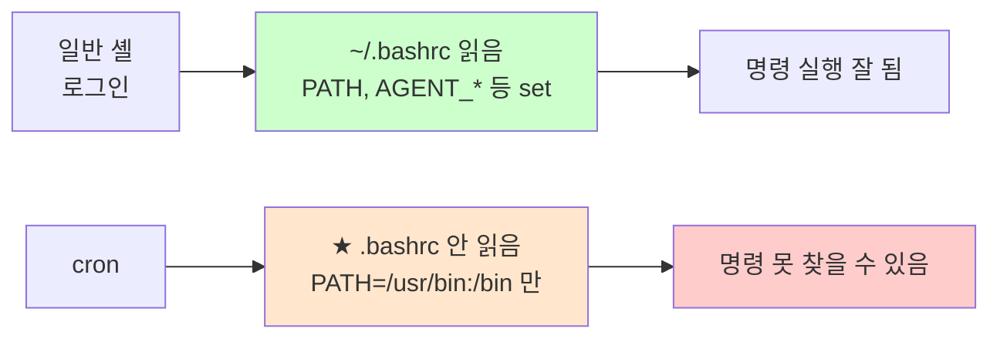

# cron — 자동 실행 스케줄러

> **한 줄로** · cron은 **정해진 시간에 알아서 명령을 실행해 주는 비서** 같은 도구. B1-1은 "agent-admin 계정의 crontab으로 monitor.sh를 **매분 실행** 등록"하고 "1~2분 내 monitor.log에 새 라인 자동 누적 확인"을 요구.

---

## 과제 요구사항

### 이게 무슨 작업?

여러분이 매분마다 직접 모니터링 스크립트를 실행할 순 없겠죠. 컴퓨터에 **"매분 한 번씩 이 명령을 실행해 줘"** 라고 시켜둬야 합니다. 이 일을 해주는 도구가 **cron**이에요.

회사 비유:
- cron = 자동 비서
- crontab = 비서에게 알려주는 "**할 일 목록**"
- "매분 monitor.sh 실행" = 비서에게 "1분마다 monitor.sh 한 번씩 돌려줘" 메모 남기기

### 명세 원문 (원본 그대로)

> **자동 실행(cron) 설정**
> - agent-admin 계정의 crontab으로 monitor.sh를 매분 실행되도록 등록한다.
> - 등록 후 1~2분 내 monitor.log에 새 라인이 자동으로 누적되는 것을 확인한다.

### 무엇을 어디에 등록하나

| 항목 | 값 |
|---|---|
| 등록 위치 | `agent-admin` 사용자의 crontab (개인 작업 목록) |
| 실행 주기 | 매분 (1분마다) |
| 실행할 명령 | `/home/agent-admin/agent-app/bin/monitor.sh` |
| 로그 저장 | `/var/log/agent-app/monitor.log` (monitor.sh가 직접 기록) |

### crontab 형식 — 5칸 + 명령

cron에 등록하는 한 줄은 5칸의 시간 + 명령으로 구성돼요.

```
* * * * * /path/to/script.sh
│ │ │ │ │
│ │ │ │ └─ 요일 (0-7, 일=0 또는 7)
│ │ │ └─── 월 (1-12)
│ │ └───── 일 (1-31)
│ └─────── 시 (0-23)
└───────── 분 (0-59)
```

각 칸의 의미와 대표 표기:

| 표기 | 의미 |
|---|---|
| `*` | 모든 값 (제한 없음) |
| `5` | 정확히 5 |
| `*/5` | 5 단위로 (0, 5, 10, 15, ...) |
| `1-30/5` | 1~30 사이 5 단위 |

### 매분 실행을 어떻게 표현?

```cron
* * * * * /home/agent-admin/agent-app/bin/monitor.sh
```

5칸 모두 `*` — "모든 분·시·일·월·요일에 실행" → 결국 **매분**.

> [!WARNING]
> 가장 흔한 혼동: `*/5 * * * *`(5분마다) vs `5 * * * *`(매시 5분). 둘은 완전히 다른 의미예요. 헷갈리면 [crontab.guru](https://crontab.guru/)에 붙여넣어 한국어/영어로 확인 가능.

### 잘 됐는지 확인하기

```bash
# 1. agent-admin의 crontab 등록 확인
sudo -u agent-admin crontab -l

# 2. 1-2분 대기 후 monitor.log 누적 확인 (명세 요구)
sleep 90
sudo tail /var/log/agent-app/monitor.log
```

기대 결과: 매분 한 줄씩 누적되어 있어야 함.

---

## 구현 방법

### Step 1 — crontab 파일 준비

agent-admin의 crontab에 한 줄 추가합니다. 멱등하게 처리하려면 기존 monitor.sh 줄을 제거 후 재등록.

```bash
# 임시 파일에 새 crontab 작성
TMPCRON=$(mktemp)

# 기존 crontab에서 monitor.sh 줄과 환경 변수 라인 제거
sudo -u agent-admin crontab -l 2>/dev/null \
    | grep -v 'monitor\.sh' \
    | grep -v '^SHELL=' \
    | grep -v '^PATH=' \
    | grep -v '^MAILTO=' \
    > "$TMPCRON" || true
```

### Step 2 — 새 항목 추가

```bash
cat >> "$TMPCRON" <<'EOC'
SHELL=/bin/bash
PATH=/usr/local/sbin:/usr/local/bin:/usr/sbin:/usr/bin:/sbin:/bin
MAILTO=""
* * * * * /home/agent-admin/agent-app/bin/monitor.sh >> /var/log/agent-app/cron.log 2>&1
EOC
```

각 줄의 의미:
- `SHELL=/bin/bash` — cron이 명령을 실행할 셸
- `PATH=...` — 명령을 찾을 경로 (★ cron은 기본 PATH가 매우 짧음)
- `MAILTO=""` — cron이 결과를 메일로 안 보냄 (메일 시스템 없을 때 안전)
- 마지막 줄 — 매분 monitor.sh 실행 + 출력은 cron.log에 저장

### Step 3 — 등록

```bash
sudo -u agent-admin crontab "$TMPCRON"
rm -f "$TMPCRON"
```

### Step 4 — 검증

```bash
# crontab 등록 확인
sudo -u agent-admin crontab -l

# 1-2분 대기 후 monitor.log 누적 확인
sleep 90
sudo tail /var/log/agent-app/monitor.log
```

전체 자동화 스크립트: [setup/06-cron.sh](https://github.com/codewhite7777/codyssey_b1_1/blob/main/setup/06-cron.sh)

---

## 개념

### cron이 어떻게 동작하나

cron 데몬(`crond`)이 백그라운드에서 매분마다 깨어나서, 등록된 모든 crontab을 확인하고 시간이 맞는 명령을 실행합니다.


### user crontab vs system cron

cron 등록 방법은 두 가지가 있어요.

| 방식 | 위치 | 누구로 실행? | B1-1 사용 |
|---|---|---|---|
| **user crontab** | `crontab -e`로 편집 | 그 사용자 권한 | ✅ |
| system cron | `/etc/cron.d/*` 파일 | 파일에 명시한 사용자 | (대안) |
| 특수 디렉토리 | `/etc/cron.daily/` 등 | root | X |

B1-1은 "agent-admin 계정의 crontab"이라고 명시 → user crontab.

### 시간 표기 예시

| 표기 | 의미 |
|---|---|
| `* * * * *` | **매분** (B1-1) |
| `*/5 * * * *` | 5분마다 |
| `0 * * * *` | 매시 정각 |
| `30 2 * * *` | 매일 새벽 2시 30분 |
| `0 9 * * 1-5` | 평일 오전 9시 |

### cron 환경 함정 (★ 중요)

cron은 명령을 실행할 때 **거의 빈 환경**으로 시작합니다.



해결: crontab 상단에 `PATH=...` 명시 + 스크립트 안에서 절대 경로 사용. 자세한 내용은 [cron-environment-gotchas.md](./cron-environment-gotchas.md).

---

## 참고

- `man 5 crontab` — 형식 정식 정의
- `man 1 crontab` — 명령 사용법
- [crontab.guru](https://crontab.guru/) — 형식 검증·해석
- 관련 노트: [cron-environment-gotchas.md](./cron-environment-gotchas.md) — 환경 함정 깊이
- 관련 노트: [log-rotation.md](./log-rotation.md) — monitor.log 보존 정책

---
출처: B1-1 (Layer 5.1) · 학습일: 2026-05-12
