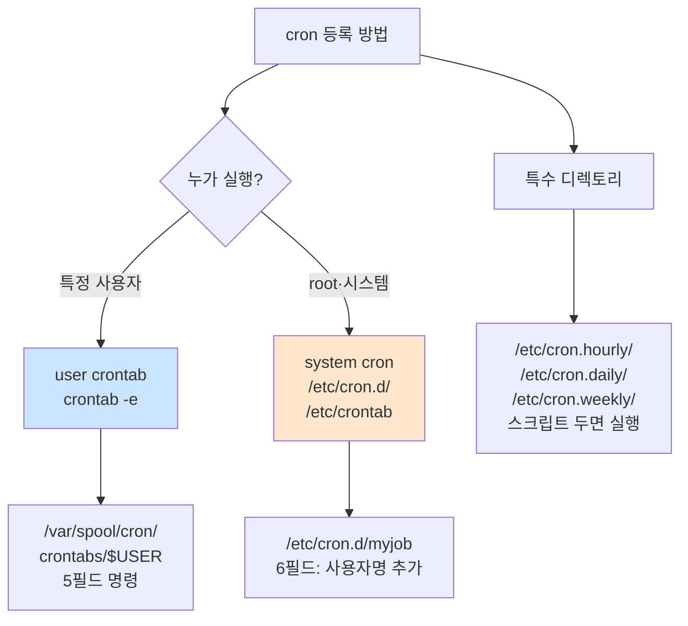
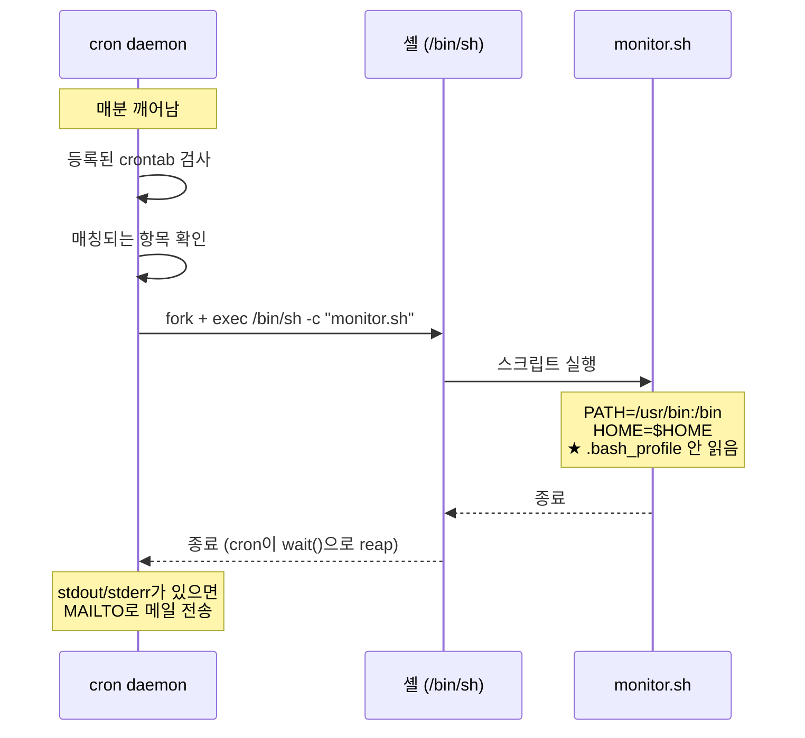

# cron 기초

> **TLDR** · cron은 시간 기반 작업 스케줄러. 형식 `분 시 일 월 요일 명령` (5개 필드 + 명령). user crontab(`crontab -e`)은 사용자별, system cron(`/etc/cron.d/`)은 시스템 전역. `*/5 * * * *`(5분마다) vs `5 * * * *`(매시 5분)의 차이가 가장 흔한 혼동. 절대 경로·명시적 환경 변수가 함정 회피의 핵심.

## 개요

cron은 Unix 계열 시스템의 표준 작업 스케줄러로, 특정 시간이나 주기로 명령을 실행한다. 1975년 V7 Unix에서 등장한 이후 거의 모든 Linux·BSD·macOS에 기본 탑재되어 있다. 최근에는 systemd timer가 대안으로 부상했지만, cron은 여전히 단순하고 가벼운 스케줄러로 광범위하게 쓰인다.

이번 과제는 monitor.sh를 매분 실행하기 위해 cron을 활용한다. agent-admin 계정의 user crontab으로 등록하는 게 표준 패턴.

## 왜 알아야 하나

cron의 가장 큰 가치는 단순성이다. 한 줄 등록으로 작업이 주기 실행되며, 별도 daemon 관리·재시작 정책 같은 systemd 복잡성이 없다. 백업·로그 회전·헬스체크·정기 cleanup 같은 일상적 자동화의 80%가 cron으로 처리된다.

하지만 cron의 미묘한 함정들도 많다. PATH 부재로 명령 못 찾기, 다른 사용자의 cron이 root 권한 못 받기, 시간대 혼란, 환경 변수 누락 등이 자주 만나는 사고. 정확히 이해하지 않으면 "로컬에서는 잘 되는데 cron에서만 안 됨" 디버깅에 시간 낭비.

## crontab 형식

cron의 가장 기본 단위는 한 줄짜리 항목 — 5개 시간 필드 + 명령.

```
 ┌───────── 분 (0-59)
 │ ┌─────── 시 (0-23)
 │ │ ┌───── 일 (1-31)
 │ │ │ ┌─── 월 (1-12)
 │ │ │ │ ┌─ 요일 (0-7, 0과 7은 일요일)
 │ │ │ │ │
 * * * * * 명령
```

각 필드의 표기:

| 표기 | 의미 |
|---|---|
| `*` | 모든 값 |
| `5` | 정확히 5 |
| `1,15,30` | 1 또는 15 또는 30 |
| `1-5` | 1부터 5까지 |
| `*/5` | 5 단위로 (0, 5, 10, ...) |
| `1-30/5` | 1-30 사이 5 단위로 |

예시 모음:

```cron
* * * * *           # 매분 (★ 이번 과제)
*/5 * * * *         # 5분마다
0 * * * *           # 매시 정각
30 2 * * *          # 매일 02:30
0 9 * * 1-5         # 평일 오전 9시
0 0 1 * *           # 매월 1일 00:00
@reboot             # 부팅 시 1회 (특수)
@daily              # 매일 00:00 (= 0 0 * * *)
```

★ `*/5 * * * *` vs `5 * * * *` 차이가 가장 흔한 혼동:
- `*/5 * * * *`: **5분 단위** (00, 05, 10, 15, ..., 55분)
- `5 * * * *`: **매시 5분** (01:05, 02:05, 03:05, ...)

## user crontab vs system cron

사용자 crontab과 시스템 cron의 차이를 명확히 알아야 한다.



**user crontab** (`crontab -e`로 편집):
- 형식: `분 시 일 월 요일 명령` (5필드 + 명령)
- 저장 위치: `/var/spool/cron/crontabs/$USER`
- 실행 권한: 그 사용자의 권한
- 가장 흔한 사용 패턴

**system cron** (`/etc/cron.d/`):
- 형식: `분 시 일 월 요일 USER 명령` (★ 사용자 필드 추가)
- 패키지 매니저가 자동 설치하는 작업에 흔히 사용
- root 권한 작업이 많음

**특수 디렉토리** (`/etc/cron.hourly/`, `daily/`, `weekly/`, `monthly/`):
- 그 디렉토리 안 실행 가능한 스크립트가 자동 실행
- 시간 제어는 없고 "매시/매일/매주/매월 한 번"
- `run-parts`로 디렉토리 안 모든 스크립트 실행

## crontab 명령

```bash
crontab -e              # 본인 crontab 편집 (에디터 열림)
crontab -l              # 본인 crontab 출력
crontab -r              # 본인 crontab 삭제 (조심!)
crontab -u alice -e     # alice의 crontab 편집 (root 권한 필요)

# 다른 사용자의 cron 등록
sudo crontab -u agent-admin -e
sudo crontab -u agent-admin -l
```

`crontab -e`로 열린 에디터에서 저장하면 syntax 검증 후 적용된다. 잘못된 형식은 에디터 종료 시 에러로 알려준다.

## 실행 흐름과 로그

cron daemon(`crond` 또는 `systemd-cron`)이 매분 깨어나서 등록된 항목을 검사하고 시간이 맞으면 명령을 실행한다. 각 실행은 별도 자식 프로세스로 fork되어 격리.



cron 로그는 보통 `/var/log/syslog`(Ubuntu) 또는 `/var/log/cron`(RHEL)에 남는다.

```bash
sudo grep CRON /var/log/syslog | tail
journalctl -u cron        # systemd 환경
```

## 한 번 보자

cron 등록의 표준 흐름:

```bash
# 1. crontab 편집
crontab -e

# 2. 에디터에서 추가
* * * * * /home/agent-admin/agent-app/bin/monitor.sh >> /var/log/agent-app/cron.log 2>&1

# 3. 저장 후 확인
crontab -l
```

```
$ crontab -l
# 매분 monitor.sh 실행
* * * * * /home/agent-admin/agent-app/bin/monitor.sh >> /var/log/agent-app/cron.log 2>&1
```

cron 실행 자체 확인 (1-2분 대기 후):

```bash
sudo grep "CRON.*monitor" /var/log/syslog | tail
# Mar 11 14:30:01 host CRON[1234]: (agent-admin) CMD (/home/agent-admin/agent-app/bin/monitor.sh)

# 또는 로그 누적 확인
tail /var/log/agent-app/cron.log
tail /var/log/agent-app/monitor.log
```

## 흔한 함정

> [!WARNING]
> **`* * * * *` (매분) vs `*/5 * * * *` (5분마다) vs `5 * * * *` (매시 5분)** — 가장 흔한 cron 혼동. 특히 `5 * * * *`을 "5분마다"로 착각하면 의도와 완전히 다른 스케줄. cron syntax validator(crontab.guru)로 항상 검증 권장.

cron 등록의 가장 흔한 실수는 시간 형식 혼동이다. `5 * * * *`을 "5분마다"로 착각해서 실제로는 매시 5분에만 실행되는 경우가 자주 일어난다. [crontab.guru](https://crontab.guru/)에서 plain English로 변환해 확인하는 게 안전.

PATH 부재가 두 번째로 흔한 함정이다. cron 환경에는 `/usr/bin:/bin` 정도만 있어 `/usr/local/bin/aws`나 `~/.local/bin/myapp` 같은 명령이 "command not found"로 실패한다. 다음 노트(`cron-environment-gotchas.md`)에서 깊이 다룬다.

다른 사용자의 cron이 의도한 권한을 못 받는 경우도 있다. user crontab은 그 사용자 권한으로 실행되므로, sudo 권한 작업은 sudo 비밀번호 입력이 필요하거나 sudoers의 NOPASSWD 설정이 필요하다. cron 안에서 `sudo cmd` 실행 시 stdin이 없어 비밀번호 못 받으면 실패.

표준 출력·에러를 캡처 안 하면 사라진다. cron은 기본적으로 명령의 stdout/stderr를 사용자 메일로 전송한다 (MAILTO 환경 변수 기본 = 사용자명). 메일이 설정 안 된 시스템에서는 그냥 사라지므로 디버깅 어려움. `>> /var/log/cron.log 2>&1`로 명시적 캡처 권장.

시간대 혼동도 흔한 함정이다. cron daemon은 시스템 시간대를 따른다. 도커 컨테이너는 보통 UTC, 호스트는 KST 같은 차이가 있으면 "왜 9시간 뒤에 실행되지?" 같은 사고가 일어난다. `date`로 시스템 시간대 확인 필수.

## B1-1 매핑

이번 과제의 cron 요구사항:
- agent-admin 계정의 crontab으로 monitor.sh를 매분 실행
- 등록 후 1-2분 내 monitor.log에 새 라인 누적 확인

```bash
# agent-admin 으로 전환 후 crontab 편집
sudo -u agent-admin crontab -e

# 추가할 줄
* * * * * /home/agent-admin/agent-app/bin/monitor.sh
```

cron 등록을 스크립트로 (setup/06-cron.sh):

```bash
#!/usr/bin/env bash
set -euo pipefail

CRON_LINE="* * * * * /home/agent-admin/agent-app/bin/monitor.sh"

# agent-admin의 기존 crontab + 새 줄 (멱등성)
sudo -u agent-admin bash -c '
  (crontab -l 2>/dev/null | grep -Fv "monitor.sh"; echo "* * * * * /home/agent-admin/agent-app/bin/monitor.sh") | crontab -
'

echo "[OK] cron registered for agent-admin"
sudo -u agent-admin crontab -l
```

`grep -Fv "monitor.sh"`로 기존 항목을 제거한 후 새 줄 추가하는 패턴이 멱등성을 보장한다.

검증:

```bash
# crontab 등록 확인
sudo -u agent-admin crontab -l | grep monitor.sh

# 1-2분 후 실제 실행 확인
sleep 90
tail /var/log/agent-app/monitor.log
```

## 인접 토픽

<details>
<summary><b>응용 토픽 — systemd timer·anacron·at·운영 표준 패턴 (펼치기)</b></summary>

systemd timer는 cron의 현대적 대안이다. 시간 정밀도, 의존성, 실행 환경, 로깅이 더 우수하다. 단점은 unit 파일 두 개(`.timer` + `.service`)를 만들어야 해서 더 복잡.

```ini
# /etc/systemd/system/monitor.timer
[Unit]
Description=Monitor every minute

[Timer]
OnCalendar=*:0/1                # 매분
Persistent=true

[Install]
WantedBy=timers.target

# /etc/systemd/system/monitor.service
[Unit]
Description=Run monitor.sh

[Service]
Type=oneshot
User=agent-admin
ExecStart=/home/agent-admin/agent-app/bin/monitor.sh
```

장점: systemd journal 통합 로깅, 의존성 표현(After=network.target), 재시작 정책. 컨테이너·minimal 시스템에서는 cron이 더 가벼움.

anacron은 노트북·간헐 운영 시스템용 cron 변형. 시스템이 꺼져 있는 동안 놓친 작업을 시스템 켜졌을 때 실행. 데스크톱 Linux 기본.

`at`은 1회 실행 스케줄러. `echo "cmd" | at 14:30`처럼 사용. cron보다 단순한 시나리오.

운영 표준 패턴으로 cron 자동화의 best practice들:
- 매 작업을 별도 로그 파일로 (디버깅 용이)
- 절대 경로 사용
- 실패 시 알림 (Slack webhook, healthchecks.io 등)
- 동시 실행 방지 (flock 또는 lock 파일)
- timestamps 명시적 (UTC 권장)

</details>

## 참고

- `man 5 crontab` — 형식 정식 정의
- `man 1 crontab` — 명령 사용법
- `man cron` (또는 `man 8 cron`) — 데몬
- [crontab.guru](https://crontab.guru/) — 형식 검증·해석
- [healthchecks.io](https://healthchecks.io/) — cron 실행 모니터링 SaaS

---
출처: B1-1 (Layer 5.1) · 학습일: 2026-05-11
