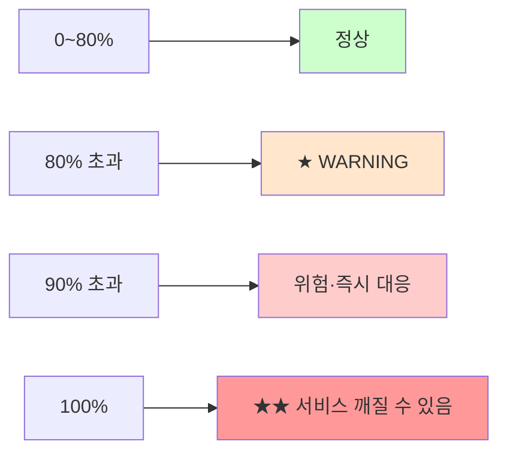

# 디스크 사용량 측정

> **한 줄로** · 컴퓨터의 디스크(저장공간)가 **얼마나 차 있는지를 %로 측정**하는 작업. B1-1은 monitor.sh가 **루트(`/`) 파티션의 사용률**을 측정해서 **80% 초과 시 `[WARNING]` 출력**하라고 요구. `df` 명령이 표준 도구.

---

## 과제 요구사항

### 이게 무슨 작업?

디스크는 컴퓨터의 **"창고"** 같은 곳. 파일을 영구 저장하는 공간이에요. 창고가 가득 차면 새 파일을 만들 수 없고, 시스템이 멈출 수도 있어요.

명세는 monitor.sh가 1분마다 디스크 사용률을 측정해서:
- 정상이면 그대로 기록
- **80%를 넘으면 `[WARNING]` 메시지를 출력**

### 명세 원문 (원본 그대로)

> **자원 수집**
> - CPU 사용률(%)
> - 메모리 사용률(%)
> - **디스크 사용률(Root partition, Used %)**
>
> **임계값 경고(경고만 출력)**
> - CPU > 20%: [WARNING]
> - MEM > 10%: [WARNING]
> - **DISK_USED > 80%: [WARNING]**

### 무엇을 측정하나

| 항목 | 값 |
|---|---|
| 측정 대상 | **루트(`/`) 파티션** Used % |
| 출력 형식 | 정수 % (`23%` 같이) |
| 임계값 | **80% 초과 시 `[WARNING]` 출력** |
| 측정 도구 | `df` (디스크 free의 약자) |

### 잘 됐는지 확인하기

```bash
# 루트 파티션의 사용 현황
df -h /
```

기대 결과:
```
Filesystem      Size  Used Avail Use% Mounted on
/dev/sda1        50G   23G   25G  48% /
                ↑전체  ↑사용  ↑남음 ↑사용률
```

`Use%` 컬럼이 80%를 넘으면 경고.

---

## 구현 방법

### Step 1 — `df` 명령으로 측정

```bash
DISK_USED=$(df / | awk 'NR==2 {gsub("%", ""); print $5}')
echo "디스크 사용률: ${DISK_USED}%"
```

각 부분의 의미:

| 부분 | 의미 |
|---|---|
| `df /` | 루트 파티션 정보만 |
| `awk 'NR==2'` | 두 번째 줄 (헤더 다음 데이터 줄) |
| `gsub("%", "")` | "%" 문자 제거 |
| `print $5` | 5번째 컬럼 (Use%) 출력 |

### Step 2 — 임계값 비교

```bash
THRESH_DISK=80

if [ "$DISK_USED" -gt "$THRESH_DISK" ]; then
    echo "[WARNING] DISK threshold exceeded (${DISK_USED}% > ${THRESH_DISK}%)"
fi
```

디스크 사용률은 항상 정수로 나오니 소수점 처리 X.

### Step 3 — 출력 형식

명세 예시:
```
DISK Used  : 23%
```

monitor.sh 코드:
```bash
printf "DISK Used : %s%%\n" "$DISK_USED"
```

전체 monitor.sh: [bin/monitor.sh](https://github.com/codewhite7777/codyssey_b1_1/blob/main/bin/monitor.sh)

---

## 개념

### `df` vs `du` — 비슷한 이름, 다른 의미

| 도구 | 무엇 측정? | 빠른지? |
|---|---|---|
| **`df`** | 파일시스템 전체 사용량 (블록 단위) | 즉시 (★ B1-1 사용) |
| `du` | 디렉토리 내 파일들의 크기 합산 | 느림 (모든 파일 확인) |

monitor.sh는 "이 파티션이 얼마나 찼나"가 필요하므로 **`df` 사용**.

### `df -h /`의 출력 해석

```
Filesystem      Size  Used Avail Use% Mounted on
/dev/sda1        50G   23G   25G  48% /
```

| 컬럼 | 의미 |
|---|---|
| Filesystem | 디스크 장치 이름 |
| Size | 전체 크기 |
| **Used** | 사용 중 |
| Avail | 남음 |
| **Use%** | 사용률 (← B1-1에서 사용) |
| Mounted on | 마운트 지점 (`/`이 루트) |

### Used + Avail이 Size보다 작을 수 있는 이유

`50G - 23G = 27G`인데 Avail은 `25G`. 차이 `2G`는 어디로?

리눅스의 ext4 파일시스템은 **root 사용자용 예약 공간** (기본 5%)을 별도로 둡니다. 일반 사용자에게 디스크가 가득 찬 것처럼 보여도 root는 작업할 수 있도록 안전장치.

→ 정상이니 걱정 X.

### 임계값 80%의 의미



실 운영에서:
- 80%부터 경고 (★ 명세)
- 90%부터 위험
- 100%에 도달하기 전에 정리

### inode 고갈 (참고)

용량은 안 찼는데 새 파일을 못 만드는 경우가 있어요. **inode**(파일 메타데이터를 저장하는 슬롯)가 고갈된 거예요.

확인 방법:
```bash
df -i /
```

monitor.sh는 디스크 용량만 보지만, 운영에서 둘 다 보면 좋습니다. 작은 파일이 매우 많은 환경(예: 메일 서버, 캐시)에서 흔히 발생.

---

## 참고

- `man df`, `man du`
- 관련 노트: [cpu-measurement.md](./cpu-measurement.md), [memory-measurement.md](./memory-measurement.md)

---
출처: B1-1 (Layer 3.3) · 학습일: 2026-05-12
