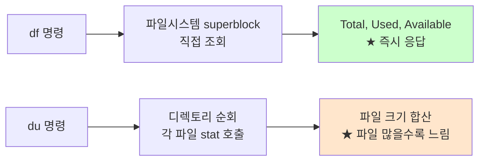

# 디스크 사용량 측정: df vs du

> **TLDR** · `df`는 **파일시스템 레벨**(블록 디바이스 메타데이터에서 직접), `du`는 **디렉토리 레벨**(파일 순회·합산). 둘이 다른 값을 보일 때는 (1) 삭제했지만 열린 파일, (2) 마운트로 가려진 파일, (3) sparse file 등이 원인. 디스크 용량은 남았는데 새 파일 못 만들면 **inode 고갈**(`df -i`로 확인).

## 개요

디스크 사용량 측정은 두 도구를 잘 알면 끝이지만, 둘의 의미 차이를 모르면 디버깅이 난해해진다. `df`(disk free)는 파일시스템 메타데이터에서 직접 가져오는 시스템 레벨 측정이고, `du`(disk usage)는 디렉토리를 순회하며 파일 크기를 합산하는 사용자 레벨 측정이다. 두 도구가 다른 값을 보고하는 경우가 흔하고, 그 차이가 디스크 누수의 단서가 된다.

이번 과제는 디스크 사용률(Root partition Used %)을 모니터링한다. 단순히 `df`로 충분하지만, 함정과 trade-off를 알아두면 trouble shooting에 도움된다.

## 왜 알아야 하나

운영에서 "디스크가 꽉 찼다" 알람을 받으면 가장 먼저 할 일은 (1) `df -h`로 어느 파일시스템인지, (2) `du -sh /*` 또는 `ncdu`로 어느 디렉토리가 큰지 찾는 것이다. 두 도구의 의미를 모르면 "df는 90%인데 du로 합산해도 50%밖에 안 되는데?" 하며 헤맨다.

또한 디스크 사용량 모니터링만 하면 inode 고갈을 놓친다. 작은 파일을 매우 많이 만드는 워크로드(메일 서버, 캐시, npm node_modules)에서는 용량은 남았는데 새 파일 생성이 실패하는 사고가 발생한다. monitor.sh는 디스크 용량만 보지만 운영자라면 둘 다 봐야 한다.

## df의 동작 — 파일시스템 메타데이터 직접 조회

`df`는 파일시스템에 내장된 메타데이터(superblock)에서 다음 정보를 가져온다. 디렉토리 순회 없이 즉시 응답하므로 빠르다.

```
$ df -h
Filesystem      Size  Used Avail Use% Mounted on
/dev/sda1        50G   23G   25G  48% /
tmpfs           3.9G  100M  3.8G   3% /dev/shm
/dev/sda2       100G   45G   50G  48% /var
overlay          50G   23G   25G  48% /var/lib/docker/overlay2/...
```

각 컬럼의 의미는 다음과 같다.

- **Size**: 파일시스템 총 용량
- **Used**: 사용된 블록 (메타데이터 포함)
- **Avail**: 사용 가능 블록 (★ 보통 Size - Used와 다름 — 예약 영역 때문)
- **Use%**: 사용률 (Used / (Used + Avail))
- **Mounted on**: 마운트 지점

`Avail`이 `Size - Used`보다 작은 이유는 ext4가 root 사용자용 예약 공간(기본 5%)을 별도로 두기 때문이다. 일반 사용자에게는 Use% 100%여도 root는 약간의 공간이 남아 시스템 복구가 가능하다.

## du의 동작 — 디렉토리 순회

`du`는 디렉토리 트리를 순회하며 각 파일의 크기를 합산한다. 많은 파일이 있으면 느려진다.

```
$ du -sh /var
8.5G    /var

$ du -h --max-depth=1 /var | sort -h
12K     /var/spool
89M     /var/lib/apt
123M    /var/cache
3.2G    /var/log
5.1G    /var/lib/docker
8.5G    /var
```

각 파일의 크기 측정은 `stat`이 보고하는 size를 합산하므로, 디스크에 실제로 할당된 블록 수와 다를 수 있다 (sparse file).



## 두 도구가 다른 값을 보이는 이유

가장 흔한 세 가지 시나리오:

**1. 삭제했지만 열린 파일.** 프로세스가 열고 있는 파일을 삭제하면 디렉토리 엔트리는 사라지지만 파일은 그 프로세스가 close할 때까지 디스크에 유지된다. `du`는 디렉토리에서 사라진 파일을 못 보지만 `df`는 여전히 used로 계산. 예: 큰 로그 파일을 `rm` 했는데 그 로그를 쓰는 프로세스가 살아있으면 디스크 공간이 회수 안 됨.

```bash
# 삭제됐지만 열린 파일 찾기
sudo lsof | grep '(deleted)'
```

해결: 그 프로세스 재시작 또는 `> /var/log/big.log`로 truncate (rm 대신).

**2. 마운트로 가려진 파일.** 디렉토리에 파일이 있는데 그 위에 다른 파일시스템을 마운트하면, 마운트 전의 파일들이 보이지 않지만 디스크 공간은 차지. `df`는 두 파일시스템 합쳐 보여주는데 `du`는 보이는 것만 본다. 마운트 해제 후 정리 가능.

**3. Sparse file.** logical size는 크지만 실제 디스크 할당은 작은 파일 (VM 디스크 이미지, DB 파일 등). `du --apparent-size`를 쓰면 logical size, 기본은 실제 할당 단위.

## 한 번 보자

```
$ df -h
Filesystem      Size  Used Avail Use% Mounted on
/dev/sda1        50G   23G   25G  48% /
tmpfs           3.9G  100M  3.8G   3% /dev/shm

$ df -h /
Filesystem      Size  Used Avail Use% Mounted on
/dev/sda1        50G   23G   25G  48% /

$ df -i /                       # inode 사용량 ★
Filesystem      Inodes  IUsed   IFree IUse% Mounted on
/dev/sda1      3276800 234567 3042233    7% /

$ df -hT                        # 파일시스템 종류 포함
Filesystem     Type     Size  Used Avail Use% Mounted on
/dev/sda1      ext4      50G   23G   25G  48% /
tmpfs          tmpfs    3.9G  100M  3.8G   3% /dev/shm
```

`du`로 큰 디렉토리 찾기:

```
$ du -sh /var
8.5G    /var

$ du -h --max-depth=1 /var | sort -h | tail -5
123M    /var/cache
234M    /var/spool
567M    /var/lib/apt
3.2G    /var/log
5.1G    /var/lib/docker

# 대화형 디스크 사용량 (별도 설치 권장)
$ ncdu /                        # 트리 탐색으로 큰 파일 빠르게 찾기
```

`du`는 대규모 디렉토리에서 느릴 수 있어 `du --max-depth=1`로 한 레벨만 보거나 `ncdu` 같은 도구가 효율적이다.

## 흔한 함정

> [!WARNING]
> **inode 고갈**: 작은 파일이 매우 많이 생기면 디스크 용량은 남았는데 새 파일 못 만듦. `df -i`로 inode 사용률 함께 확인. 메일 서버, 캐시 디렉토리, npm node_modules 등에서 흔히 발생.

디스크 측정에서 가장 흔한 사고는 inode 고갈이다. ext4 같은 파일시스템은 mkfs 시점에 inode 수가 고정되는데, 작은 파일이 많아지면 용량은 남았는데 inode가 다 떨어진다. `No space left on device` 에러가 나오는데 `df -h`는 정상이라 혼란스럽다. 항상 `df -i`도 함께 봐야 한다. mkfs 시 `-i 4096` 같은 옵션으로 inode 비율 조정 가능 (이미 만든 파일시스템은 변경 불가).

`df`와 `du`의 차이로 인한 혼란도 자주 만난다. 가장 흔한 시나리오는 "큰 로그 파일을 rm 했는데 디스크 안 비어요"다. 로그를 쓰던 프로세스가 살아있으면 그 파일이 디스크에 유지된다 (`lsof | grep deleted`로 확인). 해결책은 (1) 프로세스 재시작 또는 (2) `> /var/log/big.log`로 truncate (rm 대신).

root 예약 영역도 종종 함정이다. ext4는 기본 5%를 root용으로 예약하므로, `df`가 100% 사용이라고 보여도 root는 약간 더 쓸 수 있다. `tune2fs -m 1 /dev/sda1`으로 예약 비율을 1%로 줄일 수 있지만, 시스템 안정성을 위해 기본값을 유지하는 게 보통이다.

`/proc`, `/sys`, `/dev`는 가상 파일시스템이라 `df`에서 0 사용량으로 나오거나 표시되지 않는다. `tmpfs`(`/tmp`, `/run` 등)는 메모리 기반이라 디스크 측정과 별개로 잡힌다. `df -hT`로 종류를 함께 봐야 정확한 해석이 된다.

블록 크기 차이도 미묘한 함정이다. 1바이트 파일이 디스크에서는 4KB(블록 크기)를 차지하므로, `du --apparent-size`(logical) vs 기본(allocated)이 다르다. 작은 파일이 많을수록 차이가 커진다.

## B1-1 매핑

monitor.sh의 디스크 사용률 측정 패턴:

```bash
# Root 파티션의 사용률 (Used %)
DISK_USED=$(df / | awk 'NR==2 {gsub("%", ""); print $5}')

# 임계값 비교 (DISK_USED > 80%)
if [ "$DISK_USED" -gt 80 ]; then
    echo "[WARNING] DISK 사용률 ${DISK_USED}% > 80%"
fi
```

`df /`로 root 파티션의 정보를 가져오고, `awk 'NR==2'`로 두 번째 줄(헤더 다음)을 선택해 5번째 컬럼의 `%`를 제거한 값을 사용한다.

명세는 임계값 80%로 합리적이다. 실 운영에서도 디스크 80%부터는 경고, 90%부터는 위험으로 보는 게 표준이다. 가득 차기 전에 미리 대응할 시간을 주기 위함이다.

monitor.log가 누적되며 자체 디스크를 소비하므로, 명세가 요구하는 10MB/10파일 로그 보존 정책이 무한 증가를 막는 역할을 한다. logrotate나 직접 구현 둘 다 가능한데, Layer 5에서 다룬다.

monitor.log 포맷에 맞추려면 정수값으로 추출:

```bash
DISK_USED=$(df / | awk 'NR==2 {gsub("%", ""); print $5}')
printf "DISK_USED:%d%%\n" "$DISK_USED"
```

`df -P /`(POSIX 출력)를 사용하면 파일시스템 이름이 길어도 한 줄에 출력되므로 awk 파싱이 안정적이다.

## 인접 토픽

<details>
<summary><b>응용 토픽 — ncdu·duf·LVM·snapshot·monitoring (펼치기)</b></summary>

`ncdu`(NCurses Disk Usage)는 interactive 디스크 사용량 도구다. `du` 결과를 트리로 탐색하며 큰 디렉토리·파일을 빠르게 찾을 수 있다. `apt install ncdu` 또는 `brew install ncdu`로 설치. 운영 디버깅의 단골이다.

`duf`는 `df`의 modern 대체재로, 컬러 표시와 더 사용자 친화적 출력을 제공한다. Go로 작성되어 빠르고, 컨테이너·다중 마운트 환경에서 보기 쉽다.

LVM(Logical Volume Manager)은 디스크 관리의 추상화 레이어다. 물리 디스크를 묶어 가상 볼륨을 만들고 동적으로 크기 조정 가능. snapshot 기능으로 백업·복구를 빠르게 한다. 데이터센터·서버 운영에서 표준.

filesystem snapshot은 ZFS·btrfs의 핵심 기능이다. copy-on-write 방식으로 거의 즉시 snapshot을 만들 수 있어, 백업·rollback의 효율적 도구다. 컨테이너 이미지의 layered FS(overlayfs)도 비슷한 개념을 응용한 것.

운영 모니터링에서는 Prometheus의 `node_exporter`가 디스크 메트릭을 수집하는 표준이다. `node_filesystem_avail_bytes`, `node_filesystem_files_free` 같은 메트릭을 Grafana로 시각화하고 알람 설정한다. monitor.sh의 production 진화 버전이라고 볼 수 있다.

이외에 `iostat`(IOPS, throughput), `iotop`(프로세스별 I/O) 같은 도구가 디스크 성능 측정에 자주 쓰인다. `iowait`이 높은 시스템을 진단할 때 유용하다.

</details>

## 참고

- `man df`, `man du`, `man stat`
- `/proc/mounts` — 마운트 정보
- `man 5 ext4` — ext4 파일시스템 옵션
- [Linux Filesystem Hierarchy](https://refspecs.linuxfoundation.org/fhs.shtml)

---
출처: B1-1 (Layer 3.3) · 학습일: 2026-05-11
