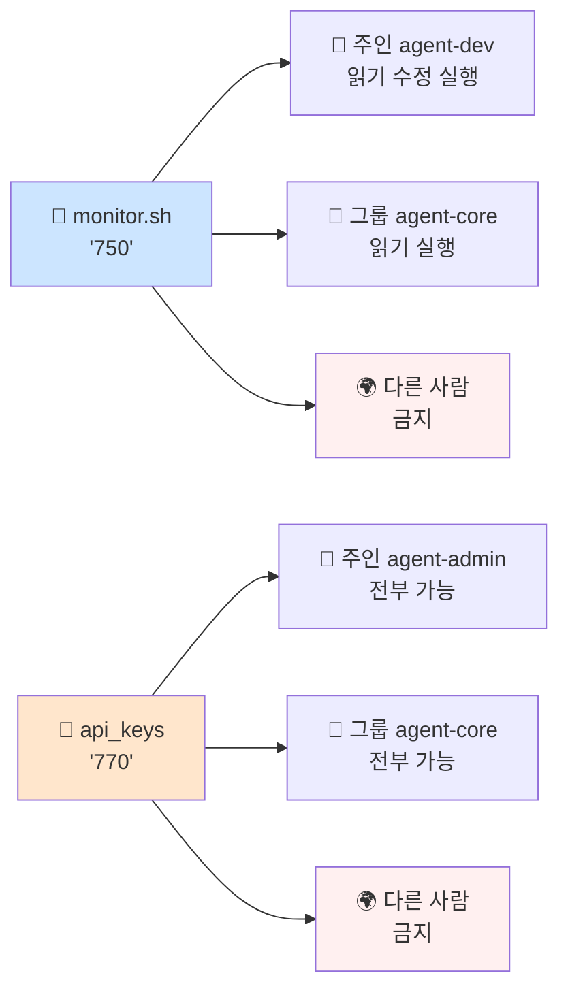
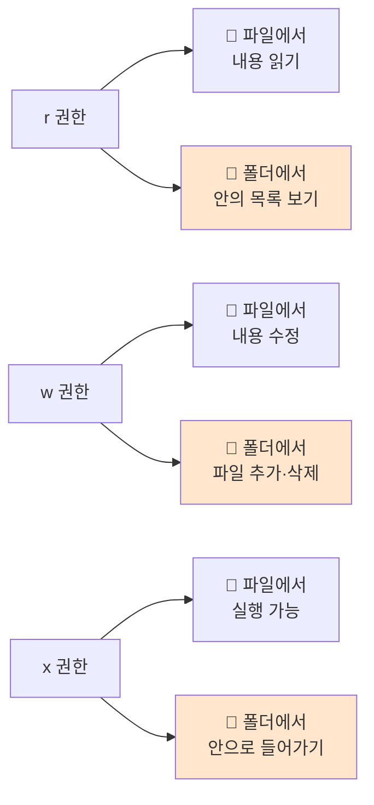
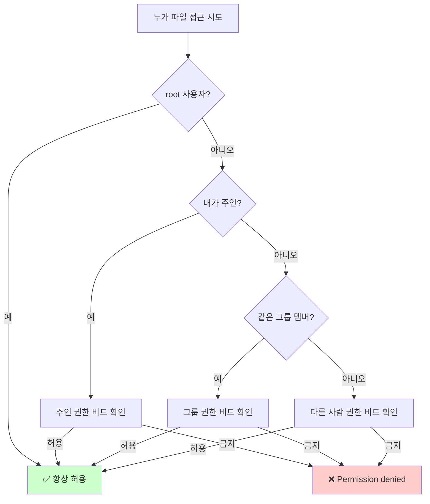

# 파일 권한

> **한 줄로** · 모든 파일·폴더에는 **"누가 들어와서 뭘 할 수 있는지" 적힌 출입 표찰**이 붙어 있다. B1-1은 monitor.sh를 운영팀만 실행하게, 비밀번호 폴더는 핵심 그룹만 들어가게 설정 요구. 표찰은 숫자 3개(예: `750`)로 표현.

---

## 과제 요구사항

### 출입 표찰 비유로 이해하기

리눅스의 파일·폴더는 회의실 문에 붙은 **출입 표찰**처럼 권한이 정해져 있습니다. 표찰은 세 칸으로 나뉘어 있어요.

```
🚪 monitor.sh 출입 표찰
┌──────────────────────────────────────────┐
│  👤 주인     │  👥 같은 그룹  │  🌍 다른 사람 │
│  ───────    │  ────────    │  ────────   │
│  보기·       │  보기·         │  ❌ 출입 금지  │
│  수정·       │  실행          │              │
│  실행        │              │              │
└──────────────────────────────────────────┘
```

표찰에 적힌 세 가지 행동은 알파벳 한 글자로 표시됩니다.

| 표시 | 영어 | 📄 파일에서 의미 | 📁 폴더에서 의미 |
|:---:|---|---|---|
| `r` | read | 내용 읽기 | 안에 뭐 있는지 목록 보기 |
| `w` | write | 내용 수정·저장 | 새 파일 만들기·지우기 |
| `x` | execute | 실행 (스크립트일 때) | 안으로 들어가기 |

그리고 세 종류의 사람이 있어요.

| 표시 | 누구 | 비유 |
|:---:|---|---|
| 👤 owner | 파일·폴더의 주인 | 그 방을 만든 사람 |
| 👥 group | 같은 그룹에 속한 사람들 | 같은 부서 동료 |
| 🌍 other | 그 외 모든 사람 | 외부인 |

### 명세가 요구하는 권한 설계

B1-1은 다음 네 가지 권한 구조를 요구합니다.

**📜 monitor.sh 스크립트** (운영팀이 자동으로 실행할 도구)

| 사람 | 보기 (r) | 수정 (w) | 실행 (x) |
|---|:---:|:---:|:---:|
| 👤 주인 (개발팀 = agent-dev) | ✅ | ✅ | ✅ |
| 👥 같은 그룹 (운영팀·개발팀 = agent-core) | ✅ | ❌ | ✅ |
| 🌍 다른 사람 (QA 등) | ❌ | ❌ | ❌ |

→ 개발팀이 작성·수정, 운영팀이 cron으로 실행, QA는 못 봄.

**🔑 비밀번호 폴더 (api_keys)** — 핵심 그룹(agent-core)만 들어갈 수 있음
**📁 공유 폴더 (upload_files)** — 공유 그룹(agent-common) 모두 쓸 수 있음
**📊 로그 폴더 (/var/log/agent-app)** — 핵심 그룹만 쓸 수 있음 + setgid (아래 설명)

### 권한 관계 그림



### 잘 됐는지 확인하는 방법

```bash
# 1. 파일·폴더 권한 보기
ls -l monitor.sh
# 기대: -rwxr-x--- 1 agent-dev agent-core ... monitor.sh

ls -ld api_keys
# 기대: drwxr-x--- agent-admin agent-core ... api_keys

# 2. QA 담당자가 비밀번호 폴더에 못 들어가는지 확인
sudo -u agent-test ls /home/agent-admin/agent-app/api_keys
# 기대: "Permission denied" (접근 거부)
```

---

## 구현 방법

### 표찰 숫자 읽는 법 — `750`이 뭔지

`750` 같은 세 자리 숫자가 권한을 의미합니다. 각 자리는 한 종류의 사람입니다.

```
   7         5         0
   │         │         │
   ▼         ▼         ▼
주인(rwx)  그룹(r-x)  다른사람(---)
```

각 자리의 숫자는 r·w·x를 더한 값입니다.

| 숫자 | 권한 | 의미 |
|:---:|:---:|---|
| 7 | rwx | 다 가능 (4+2+1) |
| 6 | rw- | 보기·수정 (4+2) |
| 5 | r-x | 보기·실행 (4+1) |
| 4 | r-- | 보기만 (4) |
| 0 | --- | 아무것도 (0) |

(보기 `r`=4, 수정 `w`=2, 실행 `x`=1)

### Step 1 — 권한 바꾸기 (`chmod`)

```bash
# 형식: sudo chmod 숫자 파일경로
sudo chmod 750 /home/agent-admin/agent-app/bin/monitor.sh
sudo chmod 770 /home/agent-admin/agent-app/api_keys
```

**확인**:
```
$ ls -l monitor.sh
-rwxr-x--- 1 ... monitor.sh
```

### Step 2 — 주인·그룹 정하기 (`chown`)

```bash
# 형식: sudo chown 주인:그룹 파일경로
sudo chown agent-dev:agent-core monitor.sh
sudo chown agent-admin:agent-core api_keys
```

### Step 3 — `setgid` (협업 폴더의 핵심)

여러 사람이 같이 쓰는 폴더는 특별한 비트를 추가해야 합니다.

```bash
# 폴더에 setgid 비트 추가 — 숫자 앞에 '2' 붙임
sudo chmod 2770 /var/log/agent-app
sudo chmod 2770 /home/agent-admin/agent-app/upload_files
```

> [!TIP]
> **왜 setgid가 필요?** agent-admin이 만든 파일은 기본적으로 agent-admin 그룹 소유가 됩니다. 그러면 agent-dev가 같이 작업할 때 권한 충돌 발생. setgid를 켜면 폴더 안에 만든 모든 파일이 자동으로 폴더의 그룹(agent-core)에 들어가서 누구든 함께 작업 가능.

### Step 4 — 검증

```
$ ls -ld /home/agent-admin/agent-app/api_keys /var/log/agent-app
drwxr-x---  agent-admin agent-core  /home/agent-admin/agent-app/api_keys
drwxrws---  agent-admin agent-core  /var/log/agent-app
        ^
        s = setgid 비트 켜져 있음

$ sudo -u agent-test ls /home/agent-admin/agent-app/api_keys
ls: cannot open directory ...: Permission denied   ← ✓ QA 차단 정상
```

전체 스크립트: [setup/04-directories.sh](https://github.com/codewhite7777/codyssey_b1_1/blob/main/setup/04-directories.sh)

---

## 개념

### 9개 비트의 구조

리눅스 파일의 권한은 정확히 **9개의 켜짐/꺼짐 스위치**로 구성되어 있습니다.

```
 주인      같은 그룹    다른 사람
┌───────┐ ┌───────┐  ┌───────┐
│r w x │ │r w x │  │r w x │
│✓ ✓ ✓│ │✓ - ✓│  │- - -│
└───────┘ └───────┘  └───────┘
   7         5          0
```

`750`이라는 숫자가 이 9개 스위치를 한 번에 표현하는 방식입니다.

### 파일 vs 폴더 — 같은 글자가 다른 뜻

`r·w·x`라는 같은 표시가 파일이냐 폴더냐에 따라 의미가 달라집니다. 이게 자주 헷갈리는 부분이에요.



> [!WARNING]
> **흔한 함정**: 폴더에 `r`만 있고 `x`가 없으면 "안에 뭐 있는지는 보이는데" 안의 파일에는 못 들어갑니다. 폴더의 `x`가 진짜 "들어가는 권한". `r`보다 `x`가 더 중요한 경우가 많아요.

### 컴퓨터는 어떻게 결정하나?

당신이 파일을 만지려고 하면 컴퓨터는 다음 순서로 확인합니다.



★ **중요**: 매칭된 **첫 단계**만 검사합니다. 내가 주인이면 그룹·다른사람 비트는 무시. 주인 비트가 `---`인데 그룹은 `rwx`여도, 주인은 여전히 못 함.

### umask — 새 파일의 자동 권한

새 파일을 만들면 어떤 권한이 자동으로 붙을까요? `umask`가 결정합니다.

| umask 값 | 새 파일 기본 권한 | 의미 |
|:---:|:---:|---|
| `022` (보통) | `644` (rw-r--r--) | 주인 보고 수정, 나머지 보기만 |
| `077` (보안 환경) | `600` (rw-------) | 주인만 보고 수정, 나머지 아무것도 |

`umask`는 거꾸로 작동합니다 — "**삭제할 권한**" 의미. 022면 그룹·다른사람의 쓰기 권한이 자동으로 빠짐.

---

## 인접 토픽 (선택)

<details>
<summary><b>고급 — ACL · MAC · capabilities · immutable bit (펼치기)</b></summary>

**POSIX ACL** — 9비트로 표현 불가능한 권한 요구("그룹 A는 RW, 그룹 B는 R") 처리하는 확장. `setfacl`/`getfacl` 명령. 다음 노트 [posix-acl.md](./posix-acl.md)에서 자세히.

**MAC (Mandatory Access Control)** — SELinux·AppArmor 같은 강제 정책 layer. 일반 권한(DAC) 위에 추가되며, root조차 우회 못 함. 보안 강화 환경의 표준.

**POSIX capabilities** — root 권한을 39+개 단위로 쪼갠 것. `cap_net_bind_service`(1024 미만 포트 바인딩만 허용) 같이 세밀한 부여. `setuid`의 안전한 대안.

**Immutable bit** (`chattr +i file`) — root조차 수정·삭제 못 함. 시스템 무결성 보호용. 일반 `chmod`로는 보이지 않아 디버깅 시 함정.

**Mount options** — `noexec`(파티션에서 실행 X), `nosuid`(setuid 무시), `nodev`(디바이스 노드 못 만듦). `/tmp`·외부 마운트에 자주 적용.

</details>

---

## 참고

- `man 1 chmod`, `man 1 chown`, `man 1 umask`
- `man 7 inode` — 권한 비트의 정식 정의
- `man 2 open`, `man 7 path_resolution` — 권한과 syscall
- 관련 노트: [users-and-groups.md](./users-and-groups.md) — 누가 어느 그룹에 속하는지
- 관련 노트: [posix-acl.md](./posix-acl.md) — 9비트 한계를 넘어서

---
출처: B1-1 (Layer 1.3) · 학습일: 2026-05-12
