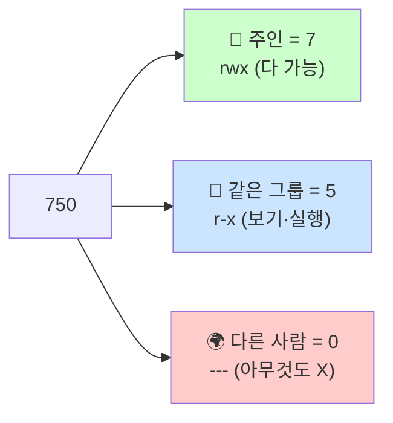
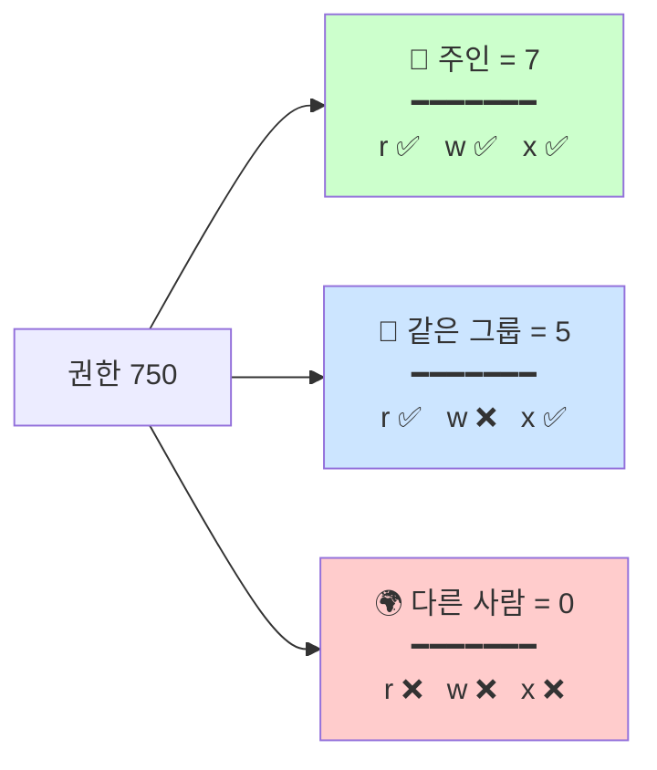
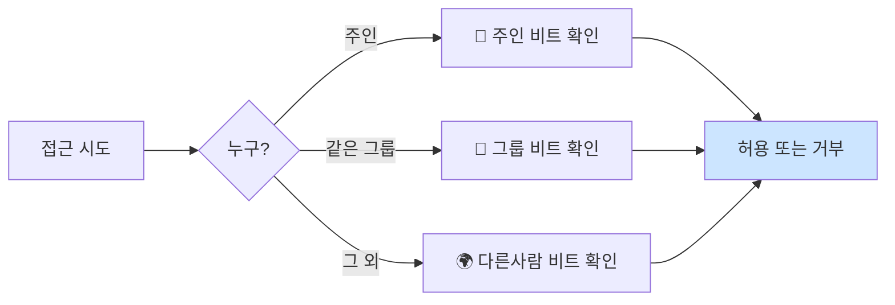

# 파일 권한

> **한 줄로** · 모든 파일·폴더에는 **"누가 들어와서 뭘 할 수 있는지" 적힌 출입 표찰**이 붙어 있다. B1-1 명세는 `monitor.sh` 권한 `750 (rwxr-x---)`, `upload_files`는 group=agent-common R/W 가능, `api_keys`와 `/var/log/agent-app`은 **group=agent-core ONLY** R/W 가능을 요구.

---

## 과제 요구사항

### 출입 표찰 비유로 이해하기

리눅스의 파일·폴더는 회의실 문에 붙은 **출입 표찰**처럼 권한이 정해져 있습니다. 표찰은 세 칸으로 나뉘어 있어요.

🚪 **monitor.sh 출입 표찰** 예시:

| 👤 주인 | 👥 같은 그룹 | 🌍 다른 사람 |
|:---:|:---:|:---:|
| 보기 ✅<br/>수정 ✅<br/>실행 ✅ | 보기 ✅<br/>수정 ❌<br/>실행 ✅ | ❌ 출입 금지 |

표찰에 적힌 세 가지 행동은 알파벳 한 글자로 표시됩니다.

| 표시 | 영어 | 📄 파일에서 의미 | 📁 폴더에서 의미 |
|:---:|---|---|---|
| `r` | read | 내용 읽기 | 안에 뭐 있는지 목록 보기 |
| `w` | write | 내용 수정·저장 | 새 파일 만들기·지우기 |
| `x` | execute | 실행 (스크립트일 때) | 안으로 들어가기 |

그리고 세 종류의 사람이 있어요.

| 표시 | 누구 | 비유 |
|:---:|---|---|
| 👤 owner | 파일·폴더의 주인 | 그 방을 만든 사람 |
| 👥 group | 같은 그룹에 속한 사람들 | 같은 부서 동료 |
| 🌍 other | 그 외 모든 사람 | 외부인 |

### 명세가 요구하는 권한 (verbatim)

명세 원문에서 권한 관련 요구사항:

> **monitor.sh** 파일 위치/권한 정책
> - 경로: `$AGENT_HOME/bin/monitor.sh`
> - 소유자: `agent-dev`
> - 그룹: `agent-core`
> - 권한: `750` (`rwxr-x---`)
>
> **디렉토리 접근 권한** (핵심 정책)
> - `upload_files`: group=agent-common, **R/W 가능**
> - `api_keys` 및 `/var/log/agent-app`: group=agent-core **ONLY**, **R/W 가능**

### 누가 무엇을 할 수 있나 (상세)

**📜 monitor.sh — `750` (rwxr-x---)**

| 사람 | r 보기 | w 수정 | x 실행 |
|---|:---:|:---:|:---:|
| 👤 주인 (`agent-dev`) | ✅ | ✅ | ✅ |
| 👥 그룹 (`agent-core`) | ✅ | ❌ | ✅ |
| 🌍 다른 사람 | ❌ | ❌ | ❌ |

→ 개발팀이 작성·수정, 운영팀이 cron으로 실행, QA는 접근 불가.

**🔑 `api_keys` 폴더 — agent-core ONLY R/W**

| 사람 | r 목록 보기 | w 파일 추가·삭제 | x 들어가기 |
|---|:---:|:---:|:---:|
| 👥 그룹 (`agent-core`) | ✅ | ✅ | ✅ |
| 🌍 다른 사람 (`agent-test` 포함) | ❌ | ❌ | ❌ |

**📁 `upload_files` 폴더 — agent-common R/W**

| 사람 | r 목록 보기 | w 파일 추가·삭제 | x 들어가기 |
|---|:---:|:---:|:---:|
| 👥 그룹 (`agent-common`, 셋 다 소속) | ✅ | ✅ | ✅ |
| 🌍 다른 사람 | ❌ | ❌ | ❌ |

**📊 `/var/log/agent-app` 폴더 — agent-core ONLY R/W + setgid**

api_keys와 동일 권한 + setgid 비트 (새 로그 파일도 자동으로 `agent-core` 그룹 상속).

### 잘 됐는지 확인하는 방법

```bash
# 1. 파일·폴더 권한 보기
ls -l monitor.sh
# 기대: -rwxr-x--- 1 agent-dev agent-core ... monitor.sh

ls -ld api_keys
# 기대: drwxr-x--- agent-admin agent-core ... api_keys

# 2. QA 담당자가 비밀번호 폴더에 못 들어가는지 확인
sudo -u agent-test ls /home/agent-admin/agent-app/api_keys
# 기대: "Permission denied" (접근 거부)
```

---

## 구현 방법

### 표찰 숫자 읽는 법 — `750`이 뭔지

`750` 같은 세 자리 숫자가 권한을 의미합니다. 각 자리는 한 종류의 사람을 가리켜요.



각 자리의 숫자는 r·w·x를 더한 값입니다.

| 숫자 | 권한 | 의미 |
|:---:|:---:|---|
| 7 | rwx | 다 가능 (4+2+1) |
| 6 | rw- | 보기·수정 (4+2) |
| 5 | r-x | 보기·실행 (4+1) |
| 4 | r-- | 보기만 (4) |
| 0 | --- | 아무것도 (0) |

(보기 `r`=4, 수정 `w`=2, 실행 `x`=1)

### Step 1 — 권한 바꾸기 (`chmod`)

```bash
# 형식: sudo chmod 숫자 파일경로
sudo chmod 750 /home/agent-admin/agent-app/bin/monitor.sh
sudo chmod 770 /home/agent-admin/agent-app/api_keys
```

**확인**:
```
$ ls -l monitor.sh
-rwxr-x--- 1 ... monitor.sh
```

### Step 2 — 주인·그룹 정하기 (`chown`)

```bash
# 형식: sudo chown 주인:그룹 파일경로
sudo chown agent-dev:agent-core monitor.sh
sudo chown agent-admin:agent-core api_keys
```

### Step 3 — `setgid` (협업 폴더의 핵심)

여러 사람이 같이 쓰는 폴더는 특별한 비트를 추가해야 합니다.

```bash
# 폴더에 setgid 비트 추가 — 숫자 앞에 '2' 붙임
sudo chmod 2770 /var/log/agent-app
sudo chmod 2770 /home/agent-admin/agent-app/upload_files
```

> [!TIP]
> **왜 setgid가 필요?** agent-admin이 만든 파일은 기본적으로 agent-admin 그룹 소유가 됩니다. 그러면 agent-dev가 같이 작업할 때 권한 충돌 발생. setgid를 켜면 폴더 안에 만든 모든 파일이 자동으로 폴더의 그룹(agent-core)에 들어가서 누구든 함께 작업 가능.

### Step 4 — 검증

```
$ ls -ld /home/agent-admin/agent-app/api_keys /var/log/agent-app
drwxr-x---  agent-admin agent-core  /home/agent-admin/agent-app/api_keys
drwxrws---  agent-admin agent-core  /var/log/agent-app
        ^
        s = setgid 비트 켜져 있음

$ sudo -u agent-test ls /home/agent-admin/agent-app/api_keys
ls: cannot open directory ...: Permission denied   ← ✓ QA 차단 정상
```

전체 스크립트: [setup/04-directories.sh](https://github.com/codewhite7777/codyssey_b1_1/blob/main/setup/04-directories.sh)

---

## 개념

### 9개 비트의 구조

리눅스 파일의 권한은 정확히 **9개의 켜짐/꺼짐 스위치**로 구성되어 있습니다.



자리별로 r·w·x가 켜졌는지 확인할 수 있고, 각 숫자는 켜진 스위치의 합입니다.

| 자리 | 누구 | r (보기) | w (수정) | x (실행) | 합계 |
|:---:|---|:---:|:---:|:---:|:---:|
| 첫째 | 👤 주인 | ✅ 4 | ✅ 2 | ✅ 1 | **7** |
| 둘째 | 👥 그룹 | ✅ 4 | ❌ 0 | ✅ 1 | **5** |
| 셋째 | 🌍 다른사람 | ❌ 0 | ❌ 0 | ❌ 0 | **0** |

`750`이라는 숫자가 이 9개 스위치를 한 번에 표현하는 방식입니다.

### 파일 vs 폴더 — 같은 글자가 다른 뜻

`r·w·x`라는 같은 표시가 파일이냐 폴더냐에 따라 의미가 달라집니다.

| 권한 | 📄 파일에서 | 📁 폴더에서 |
|:---:|---|---|
| **r** (read) | 내용 읽기 | 안의 파일 목록 보기 |
| **w** (write) | 내용 수정·저장 | 새 파일 추가·삭제 |
| **x** (execute) | 실행 (스크립트일 때) | 안으로 들어가기 (`cd`) |

> [!WARNING]
> **흔한 함정**: 폴더에 `r`만 있고 `x`가 없으면 "안에 뭐 있는지는 보이는데" 안의 파일에는 못 들어갑니다. 폴더의 `x`가 진짜 "들어가는 권한".

### 컴퓨터는 어떻게 결정하나?

접근 시도 → 누구냐에 따라 **하나의** 권한 비트만 확인하고 결정.



★ **핵심**: 매칭된 **첫 단계만 검사**. 주인이면 그룹·다른사람 비트는 무시. 즉 주인이 `---`인데 그룹이 `rwx`여도, 주인은 못 함.

### umask — 새 파일의 자동 권한

새 파일을 만들면 어떤 권한이 자동으로 붙을까요? `umask`가 결정합니다.

| umask 값 | 새 파일 기본 권한 | 의미 |
|:---:|:---:|---|
| `022` (보통) | `644` (rw-r--r--) | 주인 보고 수정, 나머지 보기만 |
| `077` (보안 환경) | `600` (rw-------) | 주인만 보고 수정, 나머지 아무것도 |

`umask`는 거꾸로 작동합니다 — "**삭제할 권한**" 의미. 022면 그룹·다른사람의 쓰기 권한이 자동으로 빠짐.

---

## 참고

- `man 1 chmod`, `man 1 chown`, `man 1 umask`
- `man 7 inode` — 권한 비트의 정식 정의
- `man 2 open`, `man 7 path_resolution` — 권한과 syscall
- 관련 노트: [users-and-groups.md](./users-and-groups.md) — 누가 어느 그룹에 속하는지
- 관련 노트: [posix-acl.md](./posix-acl.md) — 9비트 한계를 넘어서

---
출처: B1-1 (Layer 1.3) · 학습일: 2026-05-12
