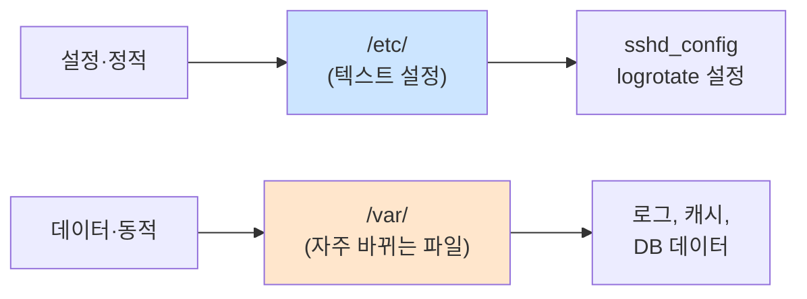

# Linux 파일시스템 구조

> **한 줄로** · Linux는 모든 파일을 **단일 루트(`/`) 아래의 큰 나무 구조**로 관리. 어떤 종류 파일이 어디에 있어야 하는지에 대한 약속이 **FHS**. B1-1은 설정은 `/etc`, 로그는 `/var/log`, 사용자 파일은 `/home`이라는 표준 위치에 맞추라고 요구.

---

## 과제 요구사항

### 이게 무슨 작업?

Linux는 Windows의 `C:\`, `D:\` 같은 드라이브 구분이 없어요. 모든 파일이 **하나의 큰 나무 구조** 안에 위치합니다.

회사 비유:
- 본부 빌딩 1동(`/`) = 모든 부서가 들어있는 큰 빌딩
- 각 층·방 = 디렉토리
- `/etc/` = **3층 설정 보관실** (모든 시스템 설정 파일)
- `/var/log/` = **5층 기록물 보관실** (모든 로그)
- `/home/` = **8층 직원 개인 자리** (사용자 홈)
- `/usr/bin/` = **2층 공구실** (모든 사용자가 쓰는 명령어)

어디에 무엇을 두는지 약속한 표준이 **FHS** (Filesystem Hierarchy Standard).

### 명세 원문 (원본 그대로)

> **디렉토리·환경 변수 정의**
> - `AGENT_HOME=/home/agent-admin/agent-app`
> - `AGENT_UPLOAD_DIR=$AGENT_HOME/upload_files`
> - `AGENT_KEY_PATH=$AGENT_HOME/api_keys/t_secret.key`
> - `AGENT_LOG_DIR=/var/log/agent-app`
>
> **로그 파일 경로**
> - **/var/log/agent-app/monitor.log**

### 무엇을 어디에 두나

| 항목 | 표준 위치 | 이유 |
|---|---|---|
| SSH 설정 | `/etc/ssh/sshd_config` | 시스템 설정은 모두 `/etc`에 |
| 사용자 앱 | `/home/agent-admin/agent-app` | 사용자 소유 파일은 그 홈에 |
| 로그 | `/var/log/agent-app/monitor.log` | 모든 로그는 `/var/log`에 |
| cron 설정 | `/etc/logrotate.d/agent-app` | 시스템 작업 설정 = `/etc` |
| 시스템 정보 | `/proc/cpuinfo` 등 | 커널이 즉석 생성 |

### 잘 됐는지 확인하기

```bash
# 1. 표준 디렉토리 확인
ls -la /etc/ssh/sshd_config
ls -la /var/log/agent-app/
ls -la /home/agent-admin/agent-app/

# 2. 마운트된 파일시스템 종류 확인
mount | head
```

---

## 구현 방법

### Step 1 — 표준 위치에 디렉토리 생성

명세가 요구하는 디렉토리를 표준 위치에 만들기.

```bash
# 사용자 홈 아래 (사용자 소유 파일)
sudo install -d -o agent-admin -g agent-common -m 0750 \
    /home/agent-admin/agent-app
sudo install -d -o agent-admin -g agent-common -m 0770 \
    /home/agent-admin/agent-app/upload_files
sudo install -d -o agent-admin -g agent-core   -m 0750 \
    /home/agent-admin/agent-app/api_keys

# 시스템 로그 (모든 시스템 로그는 /var/log)
sudo install -d -o agent-dev -g agent-core -m 2770 \
    /var/log/agent-app
```

`install -d`는 `mkdir + chown + chmod`을 한 번에 처리하는 도구.

### Step 2 — 표준 위치의 의미 따라 권한 다르게

위치마다 권한이 달라요.

| 위치 | 표준 권한 | 이유 |
|---|---|---|
| `/etc/*` | `0644` (root 소유) | 모두 읽기 가능, root만 변경 |
| `/home/<user>/` | `0750` 또는 `0700` | 사용자 본인이 소유 |
| `/var/log/*` | `2770` (setgid) | 같은 그룹원이 쓰기 가능 |
| `/usr/bin/*` | `0755` | 모두 실행 가능 |

자세한 권한 설명: [file-permissions.md](./file-permissions.md)

### Step 3 — 검증

```bash
# 표준 위치에 잘 있는지
tree -L 2 /home/agent-admin/agent-app 2>/dev/null || ls -la /home/agent-admin/agent-app

ls -la /var/log/agent-app/
ls -la /etc/ssh/sshd_config
```

전체 자동화: [setup/04-directories.sh](https://github.com/codewhite7777/codyssey_b1_1/blob/main/setup/04-directories.sh)

---

## 개념

### 주요 디렉토리 한눈에 보기

```
/
├── etc/        ← 시스템 설정 (텍스트 파일)
├── home/       ← 일반 사용자 홈
├── var/        ← 자주 바뀌는 데이터
│   ├── log/    ← 모든 로그
│   ├── lib/    ← 앱 데이터 (DB 등)
│   └── spool/  ← 처리 대기 작업 (메일, cron)
├── usr/        ← 사용자 영역 프로그램
│   ├── bin/    ← 일반 명령
│   ├── sbin/   ← 관리자 명령
│   └── local/  ← 수동 설치
├── proc/       ← ★ 가상 — 프로세스·커널 상태
├── sys/        ← ★ 가상 — 디바이스 정보
├── dev/        ← 디바이스 파일
├── tmp/        ← 임시 (재부팅 시 삭제)
└── root/       ← root 홈
```

### `/etc` vs `/var` — 변하는 것과 안 변하는 것



이 분리의 의도:
- `/etc`는 백업·버전 관리하기 좋음 (잘 안 변함)
- `/var`는 자주 비우거나 별도 파티션으로 분리 가능 (꽉 차도 시스템 안 깨짐)

### `/proc` — 디스크에 없는 가상 파일

`/proc/cpuinfo`를 cat하면 CPU 정보가 나와요. 하지만 이 파일은 디스크에 **실제로 존재하지 않습니다**.


read 명령이 들어오는 순간 커널이 현재 상태를 텍스트로 만들어 반환. 디스크 I/O 없음.

monitor.sh가 CPU·메모리 측정에 사용하는 도구들(`top`, `free`)도 결국 `/proc` 파일을 읽어서 정보를 모아요.

| 가상 파일 | 무엇 |
|---|---|
| `/proc/cpuinfo` | CPU 정보 |
| `/proc/meminfo` | 메모리 정보 (`free`의 출처) |
| `/proc/stat` | CPU 사용 시간 (`top`의 출처) |
| `/proc/PID/status` | 특정 프로세스 상태 |
| `/sys/class/net/eth0/` | 네트워크 인터페이스 정보 |

### `/tmp` vs `/var/tmp` (★ 함정)

이름은 비슷한데 영속성이 완전 달라요.

| 디렉토리 | 영속성 | 용도 |
|---|---|---|
| `/tmp` | 재부팅 시 **삭제** (보통 tmpfs = 메모리) | 정말 잠깐 쓰고 버릴 데이터 |
| `/var/tmp` | 재부팅 후에도 **유지** | 캐시 등 보존 필요한 임시 데이터 |

캐시를 `/tmp`에 두면 재부팅 후 cache miss 폭발 사고. 자주 일어남.

### B1-1의 표준 위치 매핑

| B1-1 요구 | 표준 위치 | FHS 의도 |
|---|---|---|
| sshd 설정 | `/etc/ssh/sshd_config` | 시스템 데몬 설정 = `/etc` |
| logrotate 설정 | `/etc/logrotate.d/agent-app` | 시스템 작업 설정 = `/etc` |
| 앱 홈 | `/home/agent-admin/agent-app` | 사용자 소유 앱 = 사용자 홈 |
| 로그 | `/var/log/agent-app/` | 모든 로그 = `/var/log` |
| 측정 데이터 출처 | `/proc/*` | 커널 상태 = procfs |

이 매핑이 자연스럽게 따라가면 logrotate·systemd·다른 운영 도구가 모두 "내 파일 어디 있는지" 자동으로 알아서 동작.

### inode 고갈 (참고)

용량은 안 찼는데 새 파일 못 만드는 경우. **inode**(파일 메타데이터 저장 슬롯)가 다 떨어진 거예요.

```bash
df -i /
```

작은 파일이 매우 많은 환경(메일 서버, 캐시)에서 흔히 발생.

---

## 참고

- `man 7 hier` — 표준 디렉토리 구조의 정식 매뉴얼
- 관련 노트: [file-permissions.md](./file-permissions.md) — 권한 설정
- 관련 노트: [cpu-measurement.md](./cpu-measurement.md) — `/proc` 활용

---
출처: B1-1 (Layer 1.1) · 학습일: 2026-05-12
