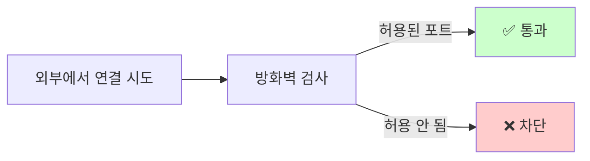

# 방화벽 설정

> **한 줄로** · 방화벽은 컴퓨터에 들어오는 모든 연결을 검사하는 **입구 보안 검색대**입니다. B1-1은 두 도구(`UFW` 또는 `firewalld`) 중 하나를 활성화하고, **20022(SSH)·15034(APP) 두 통로만 허용**, 나머지는 모두 차단을 요구.

---

## 과제 요구사항

### 이게 무슨 작업?

여러분의 컴퓨터를 회사 건물이라고 생각해 보세요. 외부에서 누군가 들어오려고 할 때마다 **1층 안내데스크**가 "이 사람 허락된 손님인가?"를 확인합니다. 이 안내데스크가 바로 **방화벽**이에요.

명세는 안내데스크에 다음 규칙을 알려주라고 요구해요.

- **들어오는 연결** (인바운드): 정해진 두 통로 외에는 모두 차단
- **나가는 연결** (아웃바운드): 모두 허용

허용할 두 통로:

| 통로 번호 | 용도 | 누가 사용? |
|:---:|---|---|
| **20022** | SSH | 관리자가 원격으로 들어올 때 |
| **15034** | APP | `agent_app.py`가 외부와 통신할 때 |

이 외의 모든 통로(예: 22번, 80번, 443번 등)는 모두 막힙니다.

### 명세 원문 (원본 그대로)

> **방화벽 설정 (택1)**
> - UFW 또는 firewalld 중 하나를 선택해 활성화한다.
> - 인바운드 허용 포트는 TCP 20022(SSH), TCP 15034(APP)만 허용한다.
>
> **확인 방법(예시)**
> - UFW 선택 시: `ufw status`
> - firewalld 선택 시: `firewall-cmd --list-all`

### 어느 도구를 쓸까? — UFW 권장

두 도구 모두 같은 일을 합니다(들어오고 나가는 연결 검사). 컴퓨터 환경에 따라 어느 쪽이 깔려 있는지 다릅니다.

| 도구 | 어울리는 환경 | 명령 스타일 |
|---|---|---|
| **UFW** | Ubuntu, Debian (기본 탑재) | `ufw allow 20022/tcp` — 단순 |
| **firewalld** | RHEL, Fedora (기본 탑재) | `firewall-cmd --add-port=...` — 복잡하지만 정밀 |

이번 과제는 Ubuntu 환경(OrbStack 등)을 가정하므로 **UFW로 진행**.

### 잘 됐는지 확인하기 (명세 워딩)

```bash
sudo ufw status verbose
```

기대 결과:
```
Status: active

Default: deny (incoming), allow (outgoing)

To                Action      From
20022/tcp         ALLOW IN    Anywhere
15034/tcp         ALLOW IN    Anywhere
```

`Status: active`가 보이고 두 포트가 `ALLOW IN`이면 OK.

---

## 구현 방법

> [!WARNING]
> **순서가 중요합니다.** 방화벽을 켜기 **전에 반드시 SSH 포트(20022)를 먼저 허용**하세요. 안 그러면 활성화 직후 본인 SSH 세션이 끊깁니다. 클라우드 서버라면 콘솔에 직접 들어가서 복구해야 해요.

### Step 1 — UFW 설치 확인

```bash
sudo apt-get install -y ufw
```

이미 깔려 있으면 "already installed" 메시지가 나옵니다.

### Step 2 — 기존 규칙 초기화 (멱등)

```bash
sudo ufw --force reset
```

기존에 다른 규칙이 있으면 모두 제거합니다. `--force`는 "정말 할 거냐?" 질문을 건너뛰는 옵션이에요.

### Step 3 — 기본 정책 설정

```bash
sudo ufw default deny incoming
sudo ufw default allow outgoing
```

- `deny incoming` — 들어오는 연결은 **기본 거부**
- `allow outgoing` — 나가는 연결은 **기본 허용**

즉 "허용된 것 외에는 모두 막는다" 정책.

### Step 4 — 두 포트만 허용

```bash
sudo ufw allow 20022/tcp comment 'SSH'
sudo ufw allow 15034/tcp comment 'agent-app'
```

`comment`는 나중에 규칙 목록을 볼 때 "이게 왜 있지?" 헷갈리지 않게 적어두는 메모예요.

### Step 5 — 방화벽 켜기

```bash
sudo ufw --force enable
```

이제부터 위 두 포트 외의 모든 연결이 차단됩니다.

### Step 6 — 검증

```bash
sudo ufw status verbose
```

`Status: active` + 두 포트가 `ALLOW IN`으로 보이면 성공.

전체 자동화 스크립트: [setup/02-firewall.sh](https://github.com/codewhite7777/codyssey_b1_1/blob/main/setup/02-firewall.sh)

### 안전한 방화벽 활성화 순서


---

## 개념

### 방화벽이 하는 일

방화벽은 컴퓨터에 들어오고 나가는 **모든 네트워크 통신을 검사**합니다.



운영체제 안에서 동작하므로, 우리 컴퓨터로 오는 모든 연결은 이 검사를 거칩니다.

### "기본 거부 + 명시적 허용" 원칙

방화벽 정책은 두 가지 접근이 있어요.

| 접근 | 의미 | 보안 |
|---|---|---|
| 기본 허용 | "막을 것만 적어두기" | ❌ 약함 — 모르는 새 위협에 다 노출 |
| **기본 거부** | "허용할 것만 적어두기" | ✅ 강함 — 적지 않은 건 다 차단 |

명세는 **기본 거부**를 채택했어요. 이건 보안이 중요한 환경의 표준 패턴입니다. "혹시 모를 새 서비스가 의도하지 않게 외부에 노출되는 것"을 막아줍니다.

### 왜 두 포트만 허용?

- `agent_app.py`는 15034번 통로로 외부와 통신해야 합니다
- 관리자는 20022번 통로로 원격 접속해야 하고요
- 이 둘 외에는 어떤 외부 통신도 필요 없으므로 모두 차단

이게 **공격 가능한 표면 최소화** 원칙입니다. 열린 통로가 적을수록 공격받을 수 있는 곳이 작아져요.

### 활성화 전 SSH 포트 허용이 중요한 이유

이 사고가 자주 일어나요:


순서를 지키면 안전합니다.

1. SSH 포트(20022) 먼저 허용 (`ufw allow 20022/tcp`)
2. 다른 터미널에서 새 SSH 접속 미리 열어두기 (★ 보험)
3. 그 다음에 `enable`

---

## 참고

- `man ufw` — UFW 사용법
- `man firewall-cmd` — firewalld 사용법
- 관련 노트: [sshd-config.md](./sshd-config.md) — 같은 "미리 새 세션 열기" 원칙
- 관련 노트: [ports-and-listening.md](./ports-and-listening.md) — 포트가 뭔지

---
출처: B1-1 (Layer 2.4) · 학습일: 2026-05-12
