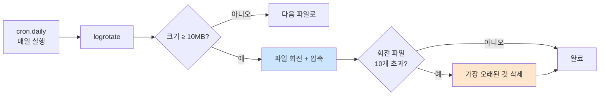

# 로그 보존 정책 — `logrotate`

> **한 줄로** · 로그 파일은 그대로 두면 **무한히 커져서 디스크가 가득 참**. B1-1은 "monitor.log가 커지면 **최대 10MB / 10개 파일** 유지"를 요구. 방법은 자유 — `logrotate` 도구 사용 또는 직접 스크립트 구현 둘 다 OK.

---

## 과제 요구사항

### 이게 무슨 작업?

monitor.sh가 매분 한 줄씩 monitor.log에 적습니다. 1년이면 50만 줄 이상. 그대로 두면 파일이 거대해져서 결국 **디스크 가득 참 → 시스템 멈춤** 사고가 나요.

해결책은 **회전(rotation)** — 공책에 적다가 가득 차면 새 공책으로 바꾸고, 옛 공책은 한쪽에 보관하는 방식. 보관 공책이 너무 많아지면 가장 오래된 것부터 버립니다.

```
monitor.log         ← 지금 적고 있는 공책 (10MB 채워지면 회전)
monitor.log.1       ← 1세대 옛 공책
monitor.log.2.gz    ← 2세대 옛 공책 (압축)
monitor.log.3.gz    ← 3세대 옛 공책 (압축)
...
monitor.log.10.gz   ← 10세대 (이거 채워지면 가장 오래된 게 삭제)
```

### 명세 원문 (원본 그대로)

> **로그 파일 용량 관리**
> - monitor.log가 커지면 최대 **10MB/10개 파일** 유지
> - 방법 자유: **logrotate 사용 또는 스크립트 로직 구현**

### 무엇을 보장해야 하나

| 항목 | 값 |
|---|---|
| 회전 기준 | 파일 크기 **10MB** 도달 |
| 유지 파일 수 | **10개** (그 이상 되면 가장 오래된 것 삭제) |
| 압축 | logrotate에서 자동 지원 |
| 구현 방법 | logrotate 또는 직접 Bash 구현 (선택) |

### 어느 방법을 쓸까?

| 방법 | 장점 | 단점 |
|---|---|---|
| **logrotate** | 표준·견고·기능 풍부 | 별도 설정 파일 필요 |
| 직접 구현 | 외부 의존 없음 | 엣지 케이스 처리 부담 |

**`logrotate` 권장** — 거의 모든 리눅스에 기본 설치되어 있고, 매일 cron으로 자동 실행됨.

### 잘 됐는지 확인하기

```bash
# 1. 설정 파일 존재 확인
ls /etc/logrotate.d/agent-app

# 2. 설정 문법 검증 (실제 회전 X, 시뮬레이션만)
sudo logrotate -d /etc/logrotate.d/agent-app

# 3. 강제 회전 테스트 (-f)
sudo logrotate -f /etc/logrotate.d/agent-app

# 4. 회전된 파일 확인
ls -lh /var/log/agent-app/
```

기대 결과:
```
monitor.log
monitor.log.1
monitor.log.2.gz
...
```

---

## 구현 방법

### Step 1 — logrotate 설정 파일 작성

`/etc/logrotate.d/agent-app`라는 파일에 정책을 적습니다.

```bash
sudo tee /etc/logrotate.d/agent-app >/dev/null <<'EOF'
/var/log/agent-app/monitor.log {
    size 10M
    rotate 10
    compress
    delaycompress
    missingok
    notifempty
    copytruncate
    create 0640 agent-dev agent-core
}
EOF
```

각 옵션의 의미:

| 옵션 | 의미 |
|---|---|
| `size 10M` | 파일이 10MB 넘으면 회전 |
| `rotate 10` | 회전된 파일을 10개까지 유지 (그 이상은 삭제) |
| `compress` | 옛 파일을 gzip으로 압축 |
| `delaycompress` | 가장 최근 회전 파일은 압축 안 함 (다음 회전 때 압축) |
| `missingok` | 로그 파일이 없어도 에러 X |
| `notifempty` | 빈 파일은 회전 안 함 |
| `copytruncate` | 회전 시 파일을 복사 후 원본 비우기 (★ 중요) |
| `create 0640 agent-dev agent-core` | 새 로그 파일을 이 권한·소유로 생성 |

### Step 2 — 문법 검증

```bash
sudo logrotate -d /etc/logrotate.d/agent-app
```

`-d` 옵션은 dry-run — 실제 회전은 안 하고 어떻게 동작할지 시뮬레이션만. 출력에 `rotating pattern...` 같은 라인이 보이면 OK.

### Step 3 — 강제 회전 테스트

평소 logrotate는 매일 한 번 실행됩니다. 테스트로 즉시 실행하려면:

```bash
sudo logrotate -f /etc/logrotate.d/agent-app
```

`-f` (force)로 크기 조건을 무시하고 강제 회전. 회전된 파일이 생기는지 확인.

### Step 4 — 검증

```bash
ls -lh /var/log/agent-app/
```

`monitor.log` 외에 `monitor.log.1` 같은 회전된 파일이 보이면 정상.

전체 자동화 스크립트: [setup/06-cron.sh](https://github.com/codewhite7777/codyssey_b1_1/blob/main/setup/06-cron.sh) (cron 등록과 함께 처리)

---

## 개념

### logrotate가 동작하는 흐름

매일 새벽 `cron.daily`가 logrotate를 실행. logrotate는 `/etc/logrotate.d/`의 모든 설정 파일을 검사하고 조건을 만족하는 파일만 회전합니다.



### `copytruncate`가 왜 중요한가

로그를 쓰고 있는 프로세스가 살아 있을 때 회전 방식이 두 가지:

| 방식 | 동작 | 문제 |
|---|---|---|
| 기본 (rename) | `monitor.log` → `monitor.log.1`로 이름 바꾸고 새 파일 만듦 | ★ 프로세스가 옛 파일에 계속 씀 |
| **copytruncate** | 파일을 복사 후 원본을 비움 (같은 파일을 유지) | 약간의 로그 손실 가능 (드뭄) |

monitor.sh는 매번 새로 열고 쓰므로 둘 다 OK. 하지만 안전을 위해 `copytruncate` 권장.

### 직접 구현 (대안)

logrotate 안 쓰고 monitor.sh 안에서 직접 회전하는 방법:

```bash
LOG_FILE="/var/log/agent-app/monitor.log"
MAX_SIZE=$((10 * 1024 * 1024))   # 10MB
MAX_ROTATE=10

rotate_log() {
    [ ! -f "$LOG_FILE" ] && return 0
    local size=$(stat -c %s "$LOG_FILE")
    [ "$size" -lt "$MAX_SIZE" ] && return 0

    # 가장 오래된 archive 삭제 + 시프트
    [ -f "${LOG_FILE}.${MAX_ROTATE}" ] && rm -f "${LOG_FILE}.${MAX_ROTATE}"
    for i in $(seq $((MAX_ROTATE - 1)) -1 1); do
        [ -f "${LOG_FILE}.${i}" ] && mv "${LOG_FILE}.${i}" "${LOG_FILE}.$((i+1))"
    done

    mv "$LOG_FILE" "${LOG_FILE}.1"
    touch "$LOG_FILE"
}

# monitor.sh 안에서 매 측정 전에
rotate_log
```

장점: 외부 의존 X. 단점: 동시 실행·race condition 등 처리 부담. logrotate 권장.

---

## 참고

- `man logrotate`, `man 5 logrotate.conf`
- `/etc/logrotate.d/*` — 시스템 기본 정책 참고
- 관련 노트: [cron-fundamentals.md](./cron-fundamentals.md) — `cron.daily`가 어떻게 실행되는지

---
출처: B1-1 (Layer 5.3) · 학습일: 2026-05-12
