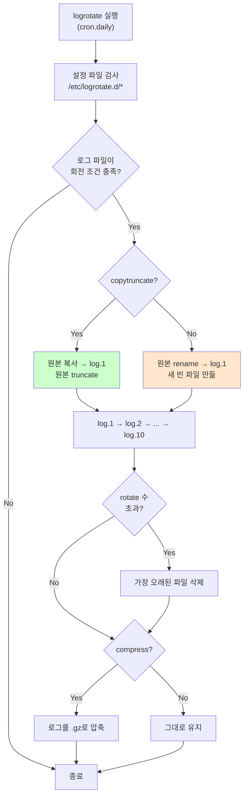

# 로그 보존 정책: logrotate vs 직접 구현

> **TLDR** · 로그 파일은 무한 증가하면 디스크 고갈로 시스템 깨짐. **logrotate**가 표준 도구 — `/etc/logrotate.d/<app>`에 정책 정의(크기/시간/회전 수). 직접 Bash로 구현도 가능(`find -mtime`, `mv`, `gzip`)하지만 logrotate가 더 견고. B1-1은 10MB/10파일 — 명세는 둘 다 허용.

## 개요

장기 실행 시스템의 로그 파일은 끊임없이 자란다. monitor.sh가 매분 한 줄씩 추가하면 하루 1440줄, 한 달 약 4만 줄. 줄당 100바이트면 한 달 4MB, 1년 50MB. 작아 보이지만 여러 서비스가 누적되면 디스크 고갈로 시스템 hang을 일으킨다.

로그 회전(rotation)은 이를 막는 표준 운영 패턴 — 일정 크기·시간이 되면 현재 로그를 archive로 옮기고 새 로그 시작. 보통 일정 회전 수가 넘으면 오래된 archive 삭제.

## 왜 알아야 하나

디스크 가득 참 사고의 절반이 로그 누수에서 비롯된다. nginx access log, 애플리케이션 로그, 시스템 로그, audit log가 각각 GB 단위로 자라다가 어느 날 갑자기 디스크 100% → 서비스 중단. logrotate를 정확히 설정하지 않으면 발생하는 사고다.

이번 과제 명세는 monitor.log를 "최대 10MB/10개 파일 유지"라고 명시한다. 즉 약 100MB 상한으로 무한 증가 방지. 구현 방법은 logrotate 사용 또는 스크립트 로직 둘 다 허용.

## logrotate — 표준 도구

logrotate는 Linux의 표준 로그 회전 도구로, 거의 모든 배포판에 기본 설치되어 있다. `/etc/logrotate.d/`에 앱별 설정 파일을 두면 cron이 매일 자정에 실행해 검사·회전을 수행한다.

설정 파일의 기본 구조:

```
# /etc/logrotate.d/agent-app
/var/log/agent-app/monitor.log {
    size 10M
    rotate 10
    compress
    delaycompress
    missingok
    notifempty
    copytruncate
}
```

각 옵션의 의미:

| 옵션 | 효과 |
|---|---|
| `size 10M` | 10MB 도달 시 회전 (시간 기반 `daily`도 가능) |
| `rotate 10` | 회전된 파일 10개까지 유지, 이후 삭제 |
| `compress` | 회전된 파일을 gzip 압축 (`.gz`) |
| `delaycompress` | 가장 최근 회전 파일은 압축 안 함 (다음 회전 때 압축) |
| `missingok` | 로그 파일 없어도 에러 안 냄 |
| `notifempty` | 빈 로그는 회전 안 함 |
| `copytruncate` | 로그 파일을 복사 후 원본 truncate (★ 중요) |

## logrotate의 회전 흐름



`copytruncate` vs rename의 차이가 중요하다. 일반 rename 방식은 로그를 쓰는 프로세스가 이전 inode를 계속 열고 있어서 새 빈 파일에 안 쓰는 문제가 있다. monitor.sh처럼 매번 새로 열고 쓰면 괜찮지만, daemon 프로세스는 보통 시작 시 한 번 open하므로 `copytruncate`가 안전하다. 단 truncate 직전 짧은 시간에 들어온 로그 일부 손실 가능성.

## 직접 구현 (Bash)

logrotate를 안 쓰고 monitor.sh 자체에서 회전하는 패턴:

```bash
#!/usr/bin/env bash
set -euo pipefail

LOG_FILE="/var/log/agent-app/monitor.log"
MAX_SIZE=$((10 * 1024 * 1024))   # 10MB
MAX_ROTATE=10

rotate_log() {
    [ -f "$LOG_FILE" ] || return 0
    local size
    size=$(stat -c %s "$LOG_FILE")
    [ "$size" -lt "$MAX_SIZE" ] && return 0

    # 가장 오래된 archive 삭제 + 시프트
    [ -f "${LOG_FILE}.${MAX_ROTATE}" ] && rm -f "${LOG_FILE}.${MAX_ROTATE}"
    for i in $(seq $((MAX_ROTATE - 1)) -1 1); do
        [ -f "${LOG_FILE}.${i}" ] && mv "${LOG_FILE}.${i}" "${LOG_FILE}.$((i+1))"
    done

    # 현재 로그를 .1로 옮기고 새 파일 시작
    mv "$LOG_FILE" "${LOG_FILE}.1"
    touch "$LOG_FILE"
}

# 매 측정 전에 회전 검사
rotate_log

# 새 측정 추가
echo "[$(date '+%Y-%m-%d %H:%M:%S')] PID:$PID CPU:..." >> "$LOG_FILE"
```

장점: 외부 의존 X, 한 스크립트로 완결. 단점: edge case가 많아 logrotate보다 깨지기 쉽다 (race condition, concurrent write 등).

## 시간 기반 보존 (보너스 과제)

명세의 보너스 과제는 시간 기반 보존 — 7일 경과 로그 압축, 30일 경과 archive 삭제.

```bash
#!/usr/bin/env bash
# log-archive.sh — 시간 기반 로그 보존

set -euo pipefail

LOG_DIR="/var/log/agent-app"
ARCHIVE_DIR="/var/log/monitor/agent-app/archive"

mkdir -p "$ARCHIVE_DIR"

# 7일 경과 .log 파일을 gzip + archive로 이동
find "$LOG_DIR" -name "*.log" -type f -mtime +7 | while read -r log; do
    gzip "$log"
    mv "${log}.gz" "$ARCHIVE_DIR/"
done

# 30일 경과 archive 삭제
find "$ARCHIVE_DIR" -name "*.gz" -type f -mtime +30 -delete

echo "[OK] log archive done"
```

`find -mtime +N`은 N일 이전 수정된 파일 (정확히는 N*24시간 전). `-mtime -N`은 N일 이내.

## 한 번 보자

logrotate 사용:

```bash
# 설정 파일 작성
sudo tee /etc/logrotate.d/agent-app <<'EOF'
/var/log/agent-app/monitor.log {
    size 10M
    rotate 10
    compress
    delaycompress
    missingok
    notifempty
    copytruncate
}
EOF

# 문법 검증 (dry-run)
sudo logrotate -d /etc/logrotate.d/agent-app

# 즉시 강제 실행 (테스트)
sudo logrotate -f /etc/logrotate.d/agent-app

# 상태 확인
sudo cat /var/lib/logrotate/status | grep monitor
ls -la /var/log/agent-app/
```

```
$ ls -la /var/log/agent-app/
total 1234
-rw-r----- 1 agent-dev agent-core    523 May 11 14:30 monitor.log
-rw-r----- 1 agent-dev agent-core 10485760 May 11 14:00 monitor.log.1
-rw-r----- 1 agent-dev agent-core   234567 May 10 14:00 monitor.log.2.gz
-rw-r----- 1 agent-dev agent-core   234890 May  9 14:00 monitor.log.3.gz
...
```

## 흔한 함정

> [!WARNING]
> **`copytruncate` vs rename**: daemon 프로세스가 로그를 계속 열고 있는 경우 rename 방식은 옛 inode에 계속 씀(새 파일에 안 씀). 보통 `copytruncate` 권장. 단 truncate 시 직전 짧은 시간에 들어온 로그 약간 손실 가능성.

logrotate 함정의 절반이 `copytruncate` 미사용이다. nginx, mysql 같은 daemon은 시작 시 로그 파일을 open해서 file descriptor를 유지하는데, logrotate가 rename(`monitor.log` → `monitor.log.1`)하면 daemon은 여전히 옛 inode에 쓰므로 새 파일이 영원히 비어 있는다. 해결: `copytruncate` 또는 daemon에 `SIGUSR1`·`SIGHUP` 보내 로그 재오픈. nginx의 `nginx -s reopen`이 후자 패턴.

monitor.sh는 매번 새로 open하므로 이 문제는 없다. 다만 `copytruncate`가 보편적으로 안전하므로 명시 권장.

`size`와 `daily`의 조합도 미묘하다. logrotate는 cron으로 매일 한 번 실행되므로, `daily`는 매일 회전하지만 `size`만 지정하면 그 크기 도달 후 다음 logrotate 실행 시점까지 회전 안 됨. 즉 size 10M인데 한 시간에 1GB가 쌓이면 회전 전에 디스크 가득 참 가능. 빠르게 자라는 로그는 `hourly` + size 조합.

권한 보존 함정도 있다. 새로 만들어진 로그 파일이 원본과 다른 권한으로 생성되어 daemon이 못 쓰는 경우. `create 0640 user group` 옵션으로 명시.

```
/var/log/agent-app/monitor.log {
    size 10M
    rotate 10
    compress
    create 0640 agent-dev agent-core
}
```

`postrotate`/`prerotate` script도 종종 함정이다. daemon 재로드를 위해 `postrotate kill -HUP $(cat /var/run/nginx.pid)` 같은 줄을 쓰는데, 잘못된 스크립트가 logrotate 전체를 깨뜨릴 수 있다. `dry-run`(`-d`)으로 검증 필수.

`/etc/logrotate.conf`의 글로벌 설정이 개별 파일의 설정을 override하기도 한다. `rotate 4`가 글로벌이고 개별 파일에 명시 안 했으면 4가 적용. 명시적으로 모든 옵션 적기 권장.

## B1-1 매핑

명세는 "monitor.log 최대 10MB/10개 파일 유지". logrotate 사용이 가장 간단하고 표준적.

```bash
# setup/06-cron.sh (또는 별도 스크립트)에서

sudo tee /etc/logrotate.d/agent-app >/dev/null <<'EOF'
/var/log/agent-app/monitor.log {
    size 10M
    rotate 10
    compress
    delaycompress
    missingok
    notifempty
    copytruncate
    create 0640 agent-dev agent-core
}
EOF

# 문법 검증
sudo logrotate -d /etc/logrotate.d/agent-app

# 즉시 실행 (테스트)
sudo logrotate -f /etc/logrotate.d/agent-app

echo "[OK] logrotate configured"
```

명세의 사용자/그룹 정책 (`agent-dev:agent-core`)에 맞춰 `create` 옵션 추가.

검증:

```bash
# 설정 파일 존재
ls /etc/logrotate.d/agent-app

# 강제 회전 후 archive 생성 확인
sudo logrotate -f /etc/logrotate.d/agent-app
ls /var/log/agent-app/
```

monitor.sh 자체에서 직접 회전을 구현해도 명세 충족. 위에서 본 `rotate_log()` 함수를 monitor.sh에 통합.

보너스 과제 (시간 기반 보존)는 별도 스크립트로 처리:

```bash
# bin/archive.sh — 매일 실행되는 archive 스크립트
# crontab: 0 3 * * * /home/agent-admin/agent-app/bin/archive.sh

ARCHIVE_DIR="/var/log/monitor/agent-app/archive"
mkdir -p "$ARCHIVE_DIR"

# 7일 경과 회전된 로그를 archive로
find /var/log/agent-app -name "monitor.log.*" -type f -mtime +7 \
    -exec mv {} "$ARCHIVE_DIR/" \;

# 30일 경과 archive 삭제
find "$ARCHIVE_DIR" -name "*.gz" -type f -mtime +30 -delete
```

## 인접 토픽

<details>
<summary><b>응용 토픽 — journald·systemd·외부 로그 수집·log aggregation (펼치기)</b></summary>

systemd journal은 systemd 시스템의 통합 로깅 backend다. 모든 systemd service의 stdout/stderr이 journald로 수집되며, `journalctl`로 조회. 회전·압축이 내장되어 별도 logrotate 불필요. `SystemMaxUse=1G` 같은 옵션으로 크기 제한.

```bash
journalctl -u my.service              # 특정 service
journalctl -u my.service --since "1 hour ago"
journalctl -u my.service -f           # follow
```

운영 환경에서는 로그 aggregation 도구가 표준이다. 호스트의 로그를 Loki, Elasticsearch, Splunk, Datadog 같은 중앙 시스템으로 forward해서 검색·분석·알람. fluentd, filebeat, promtail 등이 forwarder.

structured logging (JSON)이 현대 표준이다. plain text 로그는 grep으로 충분하지만, 구조화된 JSON 로그는 쿼리·집계가 가능하다. monitor.sh 진화 버전이면 JSON 출력 고려.

```json
{"ts":"2026-05-11T14:30:00Z","level":"info","pid":1234,"cpu":2.3,"mem":5.2,"disk":48}
```

로그 보존 정책의 법적·규제 측면도 있다. GDPR, PCI-DSS, HIPAA 같은 규제는 특정 로그를 일정 기간 보존하거나 삭제하도록 요구한다. 운영 정책 설계 시 고려.

audit log (`auditd`)는 보안 감사용 특수 로그로, 별도 회전 정책을 가진다. `/var/log/audit/audit.log`. 일반 로그와 분리해 관리.

</details>

## 참고

- `man logrotate`, `man 5 logrotate.conf`
- `man find` — `-mtime`, `-exec` 옵션
- `/etc/logrotate.d/*` — 시스템의 기존 정책 참고
- [12-Factor App: Logs](https://12factor.net/logs) — 현대적 로그 처리 철학

---
출처: B1-1 (Layer 5.3) · 학습일: 2026-05-11
