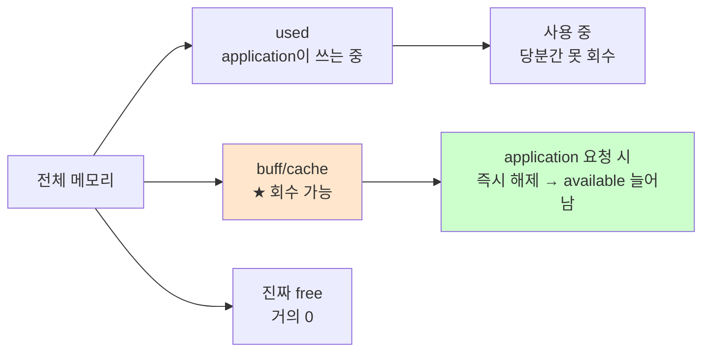

# 메모리 사용률 측정

> **한 줄로** · 컴퓨터의 메모리(RAM)가 **얼마나 차 있는지를 %로 측정**하는 작업. B1-1은 monitor.sh가 메모리 사용률을 측정해서 **10% 초과 시 `[WARNING]` 출력**하라고 요구. `free` 명령이 표준 도구.

---

## 과제 요구사항

### 이게 무슨 작업?

메모리(RAM)는 컴퓨터의 **"작업대"** 같은 곳. 프로그램이 실행되려면 일단 작업대 위에 올라와야 합니다. 작업대가 가득 차면 새 프로그램을 못 올리거나 느려져요.

명세는 monitor.sh가 1분마다 메모리 사용률을 측정해서:
- 정상이면 그대로 기록
- **10%를 넘으면 `[WARNING]` 메시지를 출력**

### 명세 원문 (원본 그대로)

> **자원 수집**
> - CPU 사용률(%)
> - **메모리 사용률(%)**
> - 디스크 사용률(Root partition, Used %)
>
> **임계값 경고(경고만 출력)**
> - CPU > 20%: [WARNING]
> - **MEM > 10%: [WARNING]**
> - DISK_USED > 80%: [WARNING]

### 무엇을 측정하나

| 항목 | 값 |
|---|---|
| 측정 대상 | 시스템 전체 메모리 사용률 |
| 출력 형식 | 소수 % (`5.2%` 같이) |
| 임계값 | **10% 초과 시 `[WARNING]` 출력** |
| 측정 도구 | `free` |

### 잘 됐는지 확인하기

```bash
# 현재 메모리 사용 현황
free -h
```

기대 결과:
```
               total        used        free      shared  buff/cache   available
Mem:           7.7Gi       3.4Gi       2.3Gi       100Mi       2.0Gi       4.0Gi
                          ↑사용 중   ↑남음            ↑캐시      ↑실제 여유
Swap:          2.0Gi          0B       2.0Gi
```

---

## 구현 방법

### Step 1 — `free` 명령으로 측정

```bash
MEM_USED=$(free | awk '/^Mem:/ {printf "%.1f", $3/$2 * 100}')
echo "메모리 사용률: ${MEM_USED}%"
```

각 부분의 의미:

| 부분 | 의미 |
|---|---|
| `free` | 메모리 정보 출력 |
| `awk '/^Mem:/'` | "Mem:"으로 시작하는 줄만 |
| `$3/$2` | (사용 중) / (전체) |
| `* 100` | 백분율로 |
| `printf "%.1f"` | 소수점 1자리 |

### Step 2 — 임계값 비교

```bash
THRESH_MEM=10
MEM_USED_INT="${MEM_USED%.*}"   # 소수점 제거
[ -z "$MEM_USED_INT" ] && MEM_USED_INT=0

if [ "$MEM_USED_INT" -gt "$THRESH_MEM" ]; then
    echo "[WARNING] MEM threshold exceeded (${MEM_USED}% > ${THRESH_MEM}%)"
fi
```

### Step 3 — 출력 형식

명세 예시:
```
MEM Usage : 5.2%
```

monitor.sh 코드:
```bash
printf "MEM Usage : %s%%\n" "$MEM_USED"
```

전체 monitor.sh: [bin/monitor.sh](https://github.com/codewhite7777/codyssey_b1_1/blob/main/bin/monitor.sh)

---

## 개념

### `free` 출력의 각 컬럼

```
               total        used        free      shared  buff/cache   available
Mem:           7.7Gi       3.4Gi       2.3Gi       100Mi       2.0Gi       4.0Gi
```

| 컬럼 | 의미 |
|---|---|
| **total** | 전체 메모리 크기 |
| **used** | 사용 중 (이번 과제에서 계산 기준) |
| free | 어디에도 안 쓰이는 진짜 free (보통 작음) |
| shared | tmpfs, 공유 메모리 |
| buff/cache | 페이지 캐시·버퍼 — **회수 가능** |
| **available** | application이 즉시 사용 가능한 메모리 |

### `used`와 `available`의 차이 (★ 중요)

리눅스는 빈 메모리를 그대로 두지 않고 **buff/cache로 적극 활용**합니다. 자주 쓰는 파일·데이터를 미리 메모리에 올려두면 다음 접근이 빨라지니까요.

그래서 `free` 컬럼은 보통 매우 작아 보입니다. 하지만 **buff/cache는 application이 메모리를 요청하면 즉시 해제**되어 사용 가능. 진짜 여유 메모리는 `available` 컬럼.



→ 실 운영에서는 **available 기준** 사용률이 더 정확.

### 명세는 어떤 기준?

명세는 단순히 "메모리 사용률"이라고만 했어요. 두 가지 해석 가능:

**해석 1 — `used / total` (단순)**
- `free | awk '$3/$2 * 100'`
- buff/cache 포함이라 보통 80% 이상 나옴
- 단순하지만 정확하지 않음

**해석 2 — `(1 - available/total) * 100` (정확)**
- 실제 application이 차지하는 비율
- 운영적으로 의미 있음

이번 과제 임계값 10%는 매우 낮아서 어느 해석으로도 거의 항상 경고 나옴. 명세는 "경고 출력 동작 확인"이 목적이라 단순 해석 사용해도 무방.

### `RSS` vs `VSZ` (참고)

특정 프로세스의 메모리는 `ps`로 확인:
```
$ ps -p 1234 -o pid,vsz,rss,pmem,cmd
  PID    VSZ   RSS %MEM CMD
 1234 567890 145632  1.8 python agent_app.py
```

| 컬럼 | 의미 |
|---|---|
| **VSZ** | 가상 메모리 (매핑된 모든 영역, 실제 사용 안 한 부분 포함) |
| **RSS** | 실제 사용 중인 물리 메모리 |
| %MEM | RSS / total × 100 |

→ "이 프로세스가 진짜 차지하는 메모리"는 **RSS**.

---

## 참고

- `man free`
- `man 5 proc` — `/proc/meminfo` 형식
- 관련 노트: [cpu-measurement.md](./cpu-measurement.md), [disk-usage-df-vs-du.md](./disk-usage-df-vs-du.md)

---
출처: B1-1 (Layer 3.2) · 학습일: 2026-05-12
