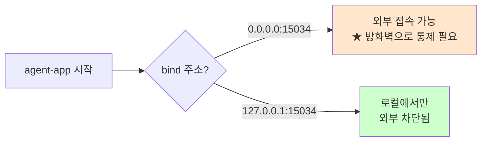
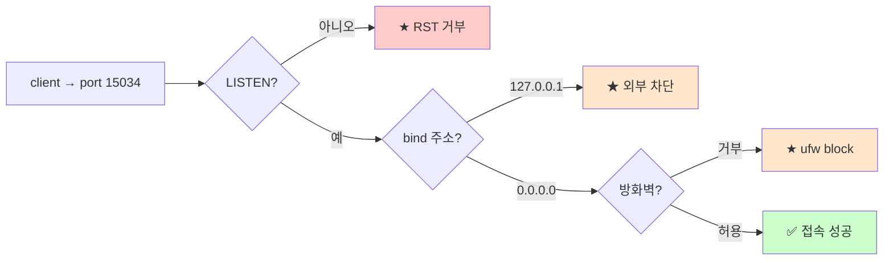

# 포트와 LISTEN 상태

> **한 줄로** · 포트는 **한 컴퓨터의 여러 서비스를 구분하는 번호** (0~65535). LISTEN 상태는 "이 포트로 접속을 받을 준비됨"의 신호 — LISTEN 안 되어 있으면 모든 접속이 즉시 거부됨. B1-1은 sshd(20022)와 agent-app(15034)가 **LISTEN 상태**로 떠 있음을 확인해야 함.

---

## 과제 요구사항

### 이게 무슨 작업?

회사 비유:
- IP 주소 = **건물 주소**
- 포트 번호 = **건물 안의 호수**
- 한 건물(IP)에는 수많은 호실이 있고, 각 호실(포트)이 다른 부서·서비스
- 22호 = SSH 부서, 80호 = 웹 부서, 15034호 = agent-app 부서

방문객(클라이언트)이 "○○동 △△호로 가주세요"라고 하면 그 호실로 안내. 호실 문이 닫혀 있으면(LISTEN 안 함) 들어갈 수 없어요.

### 명세 원문 (원본 그대로)

> **SSH 보안 설정**
> - SSH 포트 변경: 기본 22 → **20022**
>
> **방화벽 설정**
> - **20022(SSH)** 와 **15034(서비스)** 허용
>
> **헬스 체크**
> - agent-app 프로세스 존재 여부 확인
> - **포트 LISTEN 확인(필요시)**

### 무엇을 확인하나

| 포트 | 용도 | 상태 |
|---|---|---|
| **20022** | 새 SSH | LISTEN (0.0.0.0 또는 ::) |
| **15034** | agent-app 서비스 | LISTEN |
| 22 | 옛 SSH | LISTEN 안 함 |

### 잘 됐는지 확인하기

```bash
# 1. 전체 LISTEN 포트 (현재 어떤 서비스가 어디서 듣는지)
sudo ss -ltnp

# 2. 특정 포트만
sudo ss -ltn | grep -E ':20022|:15034'

# 3. 옛 SSH 포트는 닫혔는지
sudo ss -ltn | grep ':22 ' && echo "★ 아직 열림" || echo "✅ 닫힘"
```

기대 결과:
```
State    Local Address:Port    Process
LISTEN   0.0.0.0:20022         users:(("sshd",pid=...))
LISTEN   0.0.0.0:15034         users:(("agent-app",pid=...))
```

---

## 구현 방법

### Step 1 — `ss` 명령으로 LISTEN 확인

```bash
ss -ltnp
```

각 옵션의 의미:

| 옵션 | 의미 |
|---|---|
| `-l` | LISTEN 상태만 |
| `-t` | TCP만 (UDP 제외) |
| `-n` | 포트를 숫자로 (DNS 조회 안 함, 빠름) |
| `-p` | 프로세스 정보 함께 (sudo 필요) |

### Step 2 — monitor.sh의 health check

지정된 포트가 LISTEN인지 확인하는 함수.

```bash
SERVICE_PORT=15034

check_listen() {
    local port="$1"
    if ss -ltn | awk -v p=":$port" '$4 ~ p {f=1} END {exit !f}'; then
        echo "[OK] port $port listening"
        return 0
    else
        echo "[WARNING] port $port not listening"
        return 1
    fi
}

check_listen "$SERVICE_PORT"
```

`awk`로 4번째 컬럼(Local Address:Port)에 지정 포트가 포함되면 `f=1`, END에서 exit code 0 or 1.

### Step 3 — `nc`로 실제 접속 가능성 확인 (대안)

```bash
# nc(netcat)로 5초 안에 연결되는지
if nc -z -w 5 127.0.0.1 15034; then
    echo "[OK] port 15034 reachable"
fi
```

`ss`는 "LISTEN 상태이긴 한가" 정적 확인, `nc`는 "실제로 connect 되는가" 동적 확인. 둘 다 가능.

### Step 4 — `ufw status`로 방화벽 확인

LISTEN이 되어도 방화벽이 막으면 외부에서 못 들어옴.

```bash
sudo ufw status
```

기대:
```
Status: active
20022/tcp ALLOW Anywhere
15034/tcp ALLOW Anywhere
```

전체 구현: [bin/monitor.sh](https://github.com/codewhite7777/codyssey_b1_1/blob/main/bin/monitor.sh) · [setup/02-firewall.sh](https://github.com/codewhite7777/codyssey_b1_1/blob/main/setup/02-firewall.sh)

---

## 개념

### 포트의 범위와 분류

포트는 16비트(0~65535)로 표현, 3가지 영역으로 나뉨.

| 범위 | 분류 | 누가 사용 |
|---|---|---|
| 0~1023 | Well-known | 표준 서비스 (SSH=22, HTTP=80, HTTPS=443). bind에 **root 권한 필요** |
| 1024~49151 | Registered | 일반 서비스 (PostgreSQL=5432, MySQL=3306). 일반 유저도 bind 가능 |
| 49152~65535 | Dynamic/Ephemeral | 임시 — 클라이언트가 connect할 때 임시로 할당 |

B1-1의 20022·15034는 모두 Registered 범위 → 일반 사용자로 bind 가능.

### LISTEN 상태란?

TCP 소켓은 여러 상태를 거쳐요. LISTEN은 "**서버 측이 접속을 받을 준비됨**" 상태.


LISTEN 안 된 포트에 접속하면 → **TCP RST 패킷**(즉시 거부) → 클라이언트는 "Connection refused" 에러.

### `0.0.0.0` vs `127.0.0.1` (★ 매우 중요)

LISTEN 주소가 외부 노출 여부를 결정.

| Local Address | 의미 | 외부 접속 가능? |
|---|---|---|
| `0.0.0.0:15034` | 모든 네트워크 인터페이스에서 듣기 | ✅ 외부에서 가능 |
| `127.0.0.1:15034` | 로컬 (loopback)에서만 | ❌ 같은 머신에서만 |
| `::` (IPv6) | 모든 인터페이스 (v6) | ✅ |
| `::1` | 로컬 (v6) | ❌ |



서비스 의도에 맞게 bind:
- 외부 API → `0.0.0.0` + 방화벽으로 통제
- 내부 전용 → `127.0.0.1`로 안전하게 격리

### `ss`와 `netstat`의 차이

옛날엔 `netstat`을 썼는데, 지금은 `ss`(socket statistics)가 표준.

| 도구 | 속도 | 권장 |
|---|---|---|
| `ss` | 빠름 (커널 netlink 사용) | ✅ |
| `netstat` | 느림 (`/proc/net/*` 파싱) | △ deprecated |

B1-1·운영 모두 `ss` 사용.

### 포트가 LISTEN인데 외부에서 안 보임 → 4가지 함정



진단 순서:
1. `ss -ltn` — LISTEN인가?
2. `ss -ltn`의 주소 — `0.0.0.0`인가 `127.0.0.1`인가?
3. `ufw status` — 방화벽 허용인가?
4. `ping` — 네트워크 자체가 닿는가?

### Privileged vs Unprivileged 포트

1024 미만은 **root 권한**으로만 bind 가능.

| 시나리오 | 결과 |
|---|---|
| 일반 사용자가 `bind(80)` | ❌ EACCES 에러 |
| root이 `bind(80)` | ✅ |
| 일반 사용자가 `bind(15034)` | ✅ |

→ B1-1의 agent-app은 15034로 충분 (root 필요 없음).

### 한 포트에 여러 서비스?

**불가능**. 같은 IP+포트 조합은 하나의 LISTEN 소켓만 가능 (예외: `SO_REUSEPORT` 옵션 — 고급).

해결: 다른 포트 사용 또는 reverse proxy(nginx) 앞단 둠.

### TIME_WAIT와 재시작 함정 (참고)

서비스를 죽이고 즉시 재시작하면 "Address already in use"가 나올 수 있어요. TCP가 종료된 소켓을 잠깐 보존(`TIME_WAIT` 상태)하기 때문.

해결:
- 잠깐 기다리기 (보통 30~60초)
- 코드에서 `SO_REUSEADDR` 옵션 사용
- `systemd`의 자동 재시작 정책 활용

---

## 참고

- `man ss`, `man ip`
- `/etc/services` — well-known 포트 표준 정의
- 관련 노트: [firewall-ufw-vs-firewalld.md](./firewall-ufw-vs-firewalld.md) — 방화벽 통제
- 관련 노트: [process-and-signals.md](./process-and-signals.md) — health check 종합

---
출처: B1-1 (Layer 2.3) · 학습일: 2026-05-12
