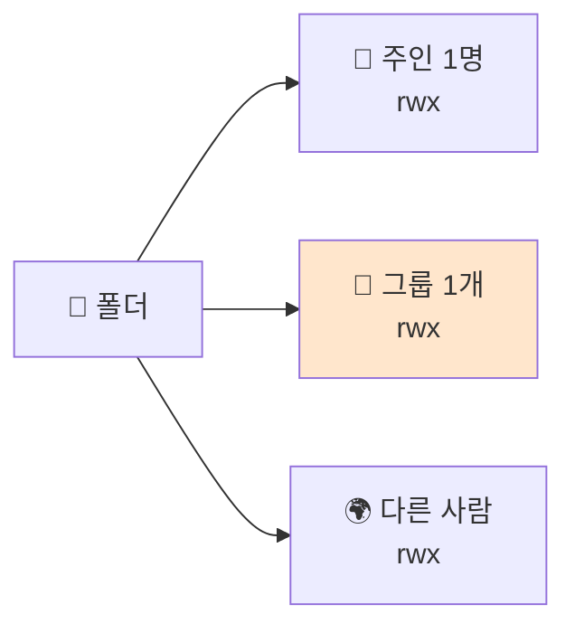
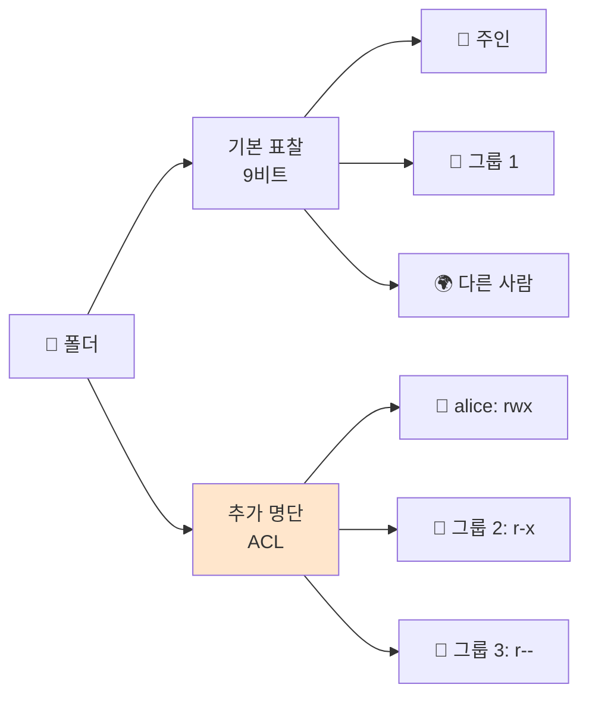
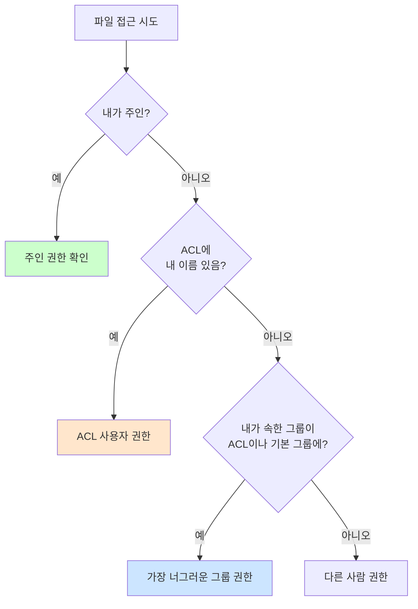

# 디렉토리 ACL — 추가 출입 명단

> **한 줄로** · 기본 출입 표찰(9비트 권한)은 한 폴더에 **한 그룹만** 권한 부여 가능. **여러 그룹에 서로 다른 권한**이 필요하면 ACL이라는 "추가 출입 명단"을 사용. B1-1은 9비트만으로 충분하지만, "(사용 시) `getfacl`로 확인"이 명세에 명시되어 있어 알아둘 가치 있음.

---

## 과제 요구사항

### 이게 무슨 작업?

지난 노트([파일 권한](./file-permissions.md))에서 본 출입 표찰은 **칸이 딱 세 개**입니다 — 주인 / 같은 그룹 / 다른 사람.

```
👤 주인  |  👥 같은 그룹  |  🌍 다른 사람
```

문제는 "**같은 그룹**" 칸이 정확히 **한 그룹**만 가리킨다는 점이에요. 만약 두 그룹에 서로 다른 권한이 필요하면?

예를 들어 어떤 폴더에 다음 요구를 둔다면 — 기본 표찰로는 표현 불가능.

| 그룹 | 원하는 권한 |
|---|---|
| `agent-core` | 읽기·쓰기 가능 |
| `agent-common` | 읽기만 |

이때 등장하는 게 **ACL** (Access Control List, "추가 출입 명단"). 기본 표찰 외에 별도 명단을 붙여 세밀한 권한 부여가 가능해져요.

### 명세 원문 (원본 그대로)

> **접근 권한(핵심 정책)**
> - upload_files: group=agent-common, R/W 가능
> - api_keys 및 /var/log/agent-app: group=agent-core **ONLY**, R/W 가능
>
> **확인 방법(예시)**
> - id agent-admin / id agent-dev / id agent-test
> - ls -l 및 **`getfacl`(사용 시)**로 소유/권한 확인

→ 명세는 ACL을 **선택 사항**으로 명시. B1-1은 9비트로 충분하지만 ACL을 사용해도 됨.

### B1-1은 9비트로 충분 (ACL 불필요)

명세 요구를 분석해 보면 각 폴더에 한 그룹만 권한 부여하므로 기본 표찰로 표현 가능.

| 폴더 | 그룹 | 권한 | 9비트 표현 |
|---|---|---|---|
| `upload_files` | agent-common | R/W | `drwxrwx---` agent-admin:agent-common |
| `api_keys` | agent-core ONLY | R/W | `drwxrwx---` agent-admin:agent-core |
| `/var/log/agent-app` | agent-core ONLY | R/W | `drwxrwx---` agent-admin:agent-core |

각 폴더마다 한 그룹씩 — **여러 그룹 권한 분리 안 필요** → ACL 안 써도 됨.

### 그래도 ACL을 알아둬야 하는 이유

- 명세가 "(사용 시) `getfacl`로 확인"을 명시했으므로 검증 시 만날 수 있음
- 실무에서는 자주 만나는 패턴 (한 폴더에 여러 그룹 다른 권한)
- ACL이 적용된 파일은 `ls -l`에서 끝에 `+`가 붙어 구분됨

### 잘 됐는지 확인하기 (명세 워딩)

```bash
# 9비트 권한 + ACL 모두 한 번에 확인
getfacl /home/agent-admin/agent-app/api_keys
```

기대 결과 (ACL 미사용 시):
```
# file: home/agent-admin/agent-app/api_keys
# owner: agent-admin
# group: agent-core
user::rwx
group::rwx
other::---
```

ACL이 있으면 추가 라인이 보입니다 (`user:alice:rwx` 같은).

---

## 구현 방법

> [!NOTE]
> B1-1은 ACL 없이 9비트만으로 명세 요구 충족 가능. 이 섹션은 **만약 ACL을 사용한다면** 어떻게 하는지 보여줍니다.

### Step 1 — ACL 도구 설치 확인

```bash
sudo apt-get install -y acl
```

대부분 시스템에 이미 설치되어 있어요.

### Step 2 — 기본 ACL 조회

```bash
getfacl /home/agent-admin/agent-app/upload_files
```

ACL이 없으면 기본 9비트 권한만 표시됩니다 (위 예시 참고).

### Step 3 — 특정 사용자/그룹에 권한 추가 (필요 시)

만약 명세가 "agent-common 그룹에 추가로 R 권한"을 요구했다면:

```bash
# 특정 그룹에 권한 부여
sudo setfacl -m g:agent-common:r-x /home/agent-admin/agent-app/api_keys

# 특정 사용자에게 권한 부여
sudo setfacl -m u:alice:rwx /home/agent-admin/agent-app/upload_files
```

`-m`은 "수정"(modify) 의미. `g:`는 그룹, `u:`는 사용자.

### Step 4 — Default ACL (새 파일이 자동 상속)

폴더에 default ACL을 걸면, 그 안에 만드는 새 파일·폴더가 자동으로 같은 ACL을 상속합니다.

```bash
# 디렉토리에 default 권한 적용 (-d 옵션)
sudo setfacl -d -m g:agent-core:rwx /var/log/agent-app
```

> [!TIP]
> 비슷한 효과를 **setgid 비트**로도 얻을 수 있어요. setgid는 그룹 owner만 상속하지만 ACL은 더 세밀한 권한 상속 가능. B1-1은 setgid로 충분.

### Step 5 — 검증

```bash
getfacl /home/agent-admin/agent-app/api_keys
```

ACL 항목이 추가되었다면 `user:`·`group:`·`mask:`·`default:` 같은 라인이 더 보입니다.

또한 `ls -l` 결과에서 권한 끝에 `+`가 붙어 ACL 존재를 표시:
```
drwxrwx---+ agent-admin agent-core ... api_keys
        ↑
        ACL이 추가로 적용됨을 알리는 표시
```

---

## 개념

### 9비트 권한의 근본 한계

기본 표찰은 **딱 한 그룹**에만 권한을 줄 수 있어요.



만약 "그룹 A는 RW, 그룹 B는 R만"처럼 두 그룹에 서로 다른 권한이 필요하면 표현 불가.

### ACL은 이 한계를 어떻게 풀까

ACL은 기본 표찰에 **추가 명단**을 붙입니다. 누구든 원하는 만큼 추가 가능.



### 권한 검사 순서

ACL이 있을 때 컴퓨터의 권한 검사:



핵심: ACL 사용자 항목이 있으면 그룹 검사보다 우선. 기본 9비트 규칙(주인 > 그룹 > 다른 사람)을 ACL 항목이 확장한 형태.

### `mask` — ACL의 상한선

ACL 항목 중에 `mask`라는 특수 항목이 있어요. 이건 **모든 ACL 사용자·그룹 권한의 상한선** 역할을 합니다.

```
group:agent-core:rwx     ← 부여한 권한
mask::r-x                ← 실제 가능한 상한
                          → 실제 효과: r-x (rwx ∩ r-x)
```

`mask`가 좁으면 ACL 항목이 아무리 너그러워도 실제 효과는 mask까지만. 이게 ACL의 미묘한 점.

### ACL 함정 주의

- **`cp`는 기본적으로 ACL 안 복사** — `cp -p`(권한 보존)나 `cp --preserve=all` 필수
- **`ls -l` 끝의 `+`가 유일한 ACL 표시** — `+` 없으면 ACL 없음, 있으면 `getfacl`로 확인
- **white listing 잊지 말기** — ACL 추가만 하고 9비트 권한도 조정 안 하면 의도와 다를 수 있음

---

## 참고

- `man setfacl`, `man getfacl`
- `man 5 acl` — ACL 정식 정의
- 관련 노트: [file-permissions.md](./file-permissions.md) — 기본 9비트 권한
- 관련 노트: [users-and-groups.md](./users-and-groups.md) — 그룹 모델

---
출처: B1-1 (Layer 2.5) · 학습일: 2026-05-12
