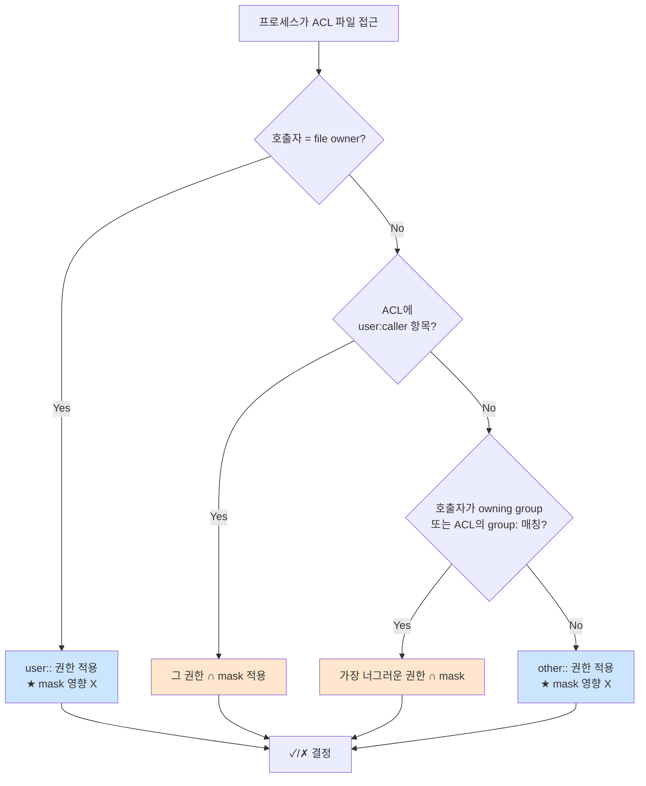

# POSIX ACL — 9비트 권한의 한계 돌파

> **TLDR** · 9비트 권한은 한 파일에 한 그룹만 표현 가능. ACL은 임의 다중 사용자·그룹에 세밀한 권한 부여. `mask`가 named entries의 effective 권한 상한선이고, `ls -l`에서 끝의 `+`가 ACL의 유일한 가시 신호다. `cp`는 기본적으로 ACL 안 복사하므로 `cp -p` 필수.

## 개요

POSIX ACL(Access Control List)은 전통적 9비트 권한 모델(owner/group/other × rwx)로 표현할 수 없는 권한 요구를 다루는 확장 메커니즘이다. 1993년 POSIX 1003.1e 초안에서 정의되었고, 현재 ext4·XFS·btrfs 등 대부분의 현대 Linux 파일시스템이 지원한다. 기본 권한 시스템 위에 추가된 layer로 작동하므로, ACL이 설정된 파일은 9비트 권한과 ACL 항목 둘 다 가지고 있고 둘이 함께 권한 검사에 참여한다.

이번 과제에서 ACL이 등장하는 이유는 명세의 권한 요구가 9비트만으로는 부족할 가능성이 있기 때문이다. "agent-common 그룹은 RW, agent-core 그룹은 R" 같은 패턴은 9비트로 표현 불가능한데, 정확한 요구를 분석해 보면 9비트로 충분한 경우와 ACL이 필요한 경우가 갈린다.

## 왜 알아야 하나

9비트 권한 모델은 단순함의 강점이 있지만, 한 파일에 영향을 주는 그룹이 하나뿐이라는 근본적 한계를 가진다. 둘 이상의 그룹에 다른 권한을 주려면 ACL이 필요하다. 또한 새 파일이 디렉토리의 ACL을 자동으로 상속받게 하는 default ACL 기능은 협업 디렉토리에서 거의 필수다 — 누가 파일을 만들든 일관된 권한이 적용되도록 보장한다.

운영자 입장에서 ACL은 양날의 검이다. 표현력은 강력하지만 가시성이 떨어진다 — `ls -l`만으로는 ACL이 있는지 보이지 않고, 끝에 `+` 표시 하나만 더 나온다(`-rwxr-x---+`). 이 미묘한 표시를 놓치면 "내가 분명히 권한 줬는데 왜 이 사용자가 접근 못하지" 하며 디버깅이 어려워진다. ACL의 동작을 정확히 이해해야 9비트 권한과 ACL이 어떻게 결합되는지 추적할 수 있다.

## ACL 항목의 구조

ACL은 여러 항목(entry)의 집합이며, 각 항목은 다음 종류 중 하나다.

```
user::rwx              owner의 권한 (9비트의 owner와 동일)
user:alice:rw-         특정 사용자(alice)에게 부여된 권한
group::r-x             owning group의 권한 (9비트의 group과 동일)
group:devs:rw-         특정 그룹(devs)에게 부여된 권한
mask::rwx              ★ 효과적 권한의 상한선 (mask)
other::---             other의 권한 (9비트의 other와 동일)
```

`user::`, `group::`, `other::`는 9비트 권한과 1:1로 매핑되어 호환성을 유지한다. 핵심 추가는 `user:<name>`, `group:<name>` 항목이며, 이를 통해 임의 사용자·그룹에 권한을 부여할 수 있다.

mask 항목은 처음 보면 혼란스럽지만 매우 중요하다. mask는 "owner를 제외한 모든 named user/group/group entries의 효과적 권한 상한"으로 작용한다. 예를 들어 ACL에 `group:devs:rwx`가 있고 `mask::r-x`이면, devs의 효과적 권한은 `r-x`(rwx ∩ r-x)다. 9비트의 group 비트 위치에 표시되는 값이 사실은 이 mask 값이라는 점이 미묘하다.

## 권한 검사의 결합 알고리즘

ACL이 있는 파일에 접근할 때 커널은 다음 순서로 권한을 결정한다.



핵심은 mask가 named entries에만 적용되고 owner와 other는 mask를 거치지 않는다는 점이다. 이 비대칭이 ACL의 미묘한 동작을 만든다.

`getfacl`로 출력된 항목 중 mask보다 큰 권한을 가진 named entry는 effective 권한이 함께 표시된다.

```
user:alice:rwx                  #effective:r-x
group:devs:rw-                  #effective:r--
mask::r-x
```

위 예에서 alice의 ACL 항목은 rwx지만 mask가 r-x라서 effective 권한은 r-x다. mask를 변경하면 모든 named entries의 effective 권한이 동시에 바뀐다.

## default ACL — 디렉토리에서의 상속

default ACL은 디렉토리에만 적용되는 특수한 ACL로, 그 디렉토리 안에 새로 생성되는 파일·디렉토리의 초기 ACL을 결정한다. 협업 디렉토리에서 새 파일이 일관된 권한을 가지도록 보장하는 핵심 도구다.

```
# 일반 access ACL (이 디렉토리 자체에 누가 접근 가능한지)
user::rwx
group:devs:rwx
mask::rwx
other::---

# default ACL (이 안에 만들어지는 파일의 초기 ACL)
default:user::rwx
default:user:alice:rwx
default:group::r-x
default:group:devs:rwx
default:mask::rwx
default:other::---
```

default ACL은 setgid 디렉토리의 더 강력한 버전이라고 볼 수 있다. setgid는 group owner만 상속하지만 default ACL은 임의 ACL을 상속하므로, "이 디렉토리 안의 모든 파일은 alice에게 rwx, devs에게 r-x"같은 정책을 강제할 수 있다.

새 파일이 만들어질 때 default ACL은 다음과 같이 적용된다 — default의 access entries가 그대로 새 파일의 access ACL이 되고, 디렉토리라면 default ACL도 함께 상속된다(중첩 디렉토리도 일관된 권한 유지).

## 한 번 보자

ACL을 직접 다루는 두 명령은 `setfacl`(설정)과 `getfacl`(조회)이다. 대부분 시스템에 기본 설치되어 있지만, 일부 환경에서는 `acl` 패키지 설치가 필요하다.

```bash
# 패키지 확인 (없으면 설치)
which getfacl || sudo apt install -y acl

# 현재 ACL 조회
ls -l /var/log/agent-app/    # 끝에 + 표시면 ACL 있음
getfacl /var/log/agent-app/

# 출력 예
# # file: var/log/agent-app/
# # owner: agent-admin
# # group: agent-core
# user::rwx
# group::rwx
# other::---
```

ACL 추가·변경의 일반적 형태는 다음과 같다. `-m`(modify)으로 추가·변경, `-x`(remove)로 특정 항목 삭제, `-b`(remove all)로 모든 ACL 제거다.

```bash
# 특정 사용자에게 권한 부여
sudo setfacl -m u:alice:rw- /var/log/agent-app/

# 특정 그룹에게 권한 부여
sudo setfacl -m g:agent-common:r-- /var/log/agent-app/

# 디렉토리에 default ACL 설정 (재귀 X — 신규 파일에만 적용됨)
sudo setfacl -d -m g:agent-core:rwx /var/log/agent-app/

# 기존 파일 + 디렉토리 모두에 적용 (재귀)
sudo setfacl -R -m u:alice:rw- /var/log/agent-app/

# 특정 항목 제거
sudo setfacl -x u:alice /var/log/agent-app/

# 모든 ACL 제거 (9비트 권한만 남음)
sudo setfacl -b /var/log/agent-app/
```

ACL 검증 패턴은 `sudo -u`로 다른 사용자를 시뮬레이션하는 것이 정석이다.

```bash
sudo -u agent-test cat /var/log/agent-app/monitor.log     # 차단 기대
sudo -u agent-admin tail /var/log/agent-app/monitor.log   # 허용 기대
```

## 흔한 함정

> [!WARNING]
> **ACL 손실 사고**: `cp`는 기본적으로 ACL 안 복사 — `cp -p` 또는 `cp --preserve=all` 명시 필요. `tar`도 `--acls` 옵션 명시해야 보존. 백업·복구 후 권한이 망가져 있는 경우 거의 항상 이 함정. `ls -l`의 끝 `+` 표시가 ACL의 유일한 가시 신호.

ACL 운영에서 자주 부딪히는 함정은 가시성·mask·복사·백업의 네 영역에 분포한다.

가장 흔한 첫 함정은 ACL의 존재를 잊는 것이다. `ls -l`로 권한을 확인할 때 끝에 `+` 표시(예: `-rwxr-x---+`)가 ACL의 존재를 알리는 유일한 신호인데, 이를 놓치면 "분명 권한 줬는데 왜 안 되지" 같은 디버깅에서 ACL 항목을 의심하지 못한다. 권한 디버깅 시 항상 `getfacl`을 함께 보는 습관이 필요하다.

mask와 effective 권한의 비대칭도 미묘한 함정이다. 9비트 권한의 group 비트를 변경하면 ACL의 mask가 함께 바뀌어 모든 named entries의 effective 권한이 영향을 받는다. 예를 들어 ACL에 `user:alice:rwx`를 추가하고 `chmod g-w file`을 실행하면 mask가 r-x로 줄어들면서 alice의 effective 권한도 r-x로 떨어진다 — chmod가 직접적으로 ACL을 건드리지 않았는데도 effective 권한이 바뀌는 현상이다. ACL을 사용하는 시스템에서는 chmod 사용에 신중해야 한다.

복사·이동의 ACL 보존도 자주 만나는 함정이다. `cp`는 기본적으로 ACL을 복사하지 않으므로 `cp -p` 또는 `cp --preserve=all`을 명시해야 보존된다. `mv`는 같은 파일시스템 내 이동이면 ACL이 유지되지만 파일시스템 경계를 넘으면(예: 다른 마운트로 이동) 복사가 일어나면서 ACL이 소실될 수 있다. `tar`도 기본적으로 ACL을 처리 안 하므로 `--acls` 옵션 명시가 필요하다.

백업·아카이브 시 ACL 손실은 운영 사고의 단골이다. rsync는 `-A` 옵션으로 ACL을 전송하고, tar는 `--acls`, scp는 ACL을 아예 지원하지 않는다. 따라서 백업·복구 시 ACL이 살아있는지 검증하는 절차가 필요하며, 그렇지 않으면 복구 후 권한이 망가진 상태로 남는다.

마지막으로 default ACL은 기존 파일에 적용되지 않는다는 점도 함정이다. `setfacl -d`로 default ACL을 디렉토리에 설정해도, 그 디렉토리 안에 이미 있던 파일들의 ACL은 변하지 않는다. default는 "앞으로 만들어지는 파일에 적용"되므로, 기존 파일까지 일관된 권한을 적용하려면 `-R` 재귀 옵션으로 기존 access ACL도 함께 변경해야 한다.

## B1-1 매핑

이번 과제의 권한 요구를 9비트 권한과 ACL의 관점에서 분석해 보자.

명세는 다음과 같이 요구한다 — `upload_files`는 group=agent-common이 R/W, `api_keys`와 `/var/log/agent-app`은 group=agent-core ONLY R/W. 이 요구는 전형적인 9비트 권한 패턴이다.

```
upload_files/  =  drwxrwx---  agent-admin:agent-common
   group(agent-common) rwx — common 멤버(전원) read/write
   other --- — 외부 차단

api_keys/  =  drwxr-x---  agent-admin:agent-core
   group(agent-core) r-x — core 멤버만 traverse + 목록
   other --- — 외부 차단

/var/log/agent-app/  =  drwxrwx---  agent-admin:agent-core
   group(agent-core) rwx — core 멤버 read/write
   other --- — 외부 차단
```

이 요구는 9비트로 표현 가능하다 — 한 디렉토리당 한 그룹에만 권한을 주면 되기 때문이다. ACL이 강제로 필요한 시나리오는 아니다.

다만 ACL이 가치를 더하는 영역은 다음과 같다. 첫째, default ACL을 사용하면 새 파일이 만들어질 때 일관된 권한이 자동 부여된다. setgid 비트와 default ACL의 차이는, setgid는 group owner만 상속하지만 default ACL은 임의 ACL을 상속할 수 있다는 점이다. 둘째, 만약 명세가 확장되어 "agent-common은 read-only로 upload_files 접근, agent-core는 read-write" 같은 요구가 추가된다면 그때는 ACL이 필수가 된다.

명세 의도가 9비트로 충분하다고 판단되면 단순히 9비트 권한과 setgid 비트로 처리하고, ACL 사용은 보너스 학습으로 두는 게 적절하다. 다음은 두 가지 모두 가능한 setup 패턴이다.

```bash
# 9비트 + setgid (이번 과제 요구만 충족)
chown agent-admin:agent-core /var/log/agent-app/
chmod 2770 /var/log/agent-app/   # 2 = setgid, 770 = rwxrwx---

# ACL 추가 — agent-common에게도 read 권한 부여 (선택적)
sudo setfacl -m g:agent-common:r-x /var/log/agent-app/
sudo setfacl -d -m g:agent-common:r-x /var/log/agent-app/   # default 상속
```

verify 스크립트에서 ACL을 확인하려면 `getfacl`을 사용한다.

```bash
getfacl --absolute-names /var/log/agent-app/ | grep -E '^(user|group|mask|default)'
```

## 인접 토픽

<details>
<summary><b>응용 토픽 — NFSv4 ACL·Windows ACL·MAC·클라우드 ACL (펼치기)</b></summary>

ACL의 응용은 더 풍부한 권한 모델·교차 운영·통합 보안의 세 갈래로 정리해 볼 수 있다.

더 풍부한 권한 모델로는 NFSv4 ACL이 있다. POSIX ACL이 9비트 권한의 단순 확장에 가깝다면, NFSv4 ACL은 Windows ACL과 비슷한 모델로 더 세밀한 권한 비트(append-only, write-attributes 등)와 inherit flags를 지원한다. ZFS, NFSv4 마운트에서 사용된다.

교차 운영 측면에서는 Windows·macOS와의 권한 매핑이 흥미롭다. Samba는 POSIX ACL을 Windows의 NT ACL로 매핑해서 SMB 클라이언트에게 노출하고, macOS는 자체적으로 더 풍부한 ACL 모델을 사용해 POSIX 위에 쌓인다. 이종 시스템 간 파일 공유에서 권한 차이를 어떻게 정렬할지가 운영 과제다.

통합 보안 측면에서는 ACL이 다른 보안 메커니즘과 어떻게 결합되는지가 중요하다. SELinux와 AppArmor 같은 MAC은 DAC(POSIX 권한 + ACL) 위에 추가 layer로 작동하므로, MAC 정책이 차단하면 ACL이 허용해도 접근 불가다. 반대로 capabilities는 root의 ACL 우회 능력(CAP_DAC_OVERRIDE)을 분리한 것으로, 일부 데몬이 root setuid 없이 ACL을 우회할 수 있게 한다.

마지막으로 클라우드 객체 스토리지의 ACL은 POSIX ACL의 후예이지만 다른 모델이다. AWS S3의 객체 ACL, GCP Cloud Storage의 IAM 정책 등은 다중 사용자·다중 그룹에 세밀한 권한을 주지만, 파일시스템 ACL과 의미가 다르다. 클라우드 운영에서는 두 모델의 차이를 명확히 인식해야 한다.

</details>

## 참고

- `man setfacl`, `man getfacl` — 명령어 매뉴얼
- `man 5 acl` — POSIX ACL 모델
- POSIX 1003.1e Draft Standard — 원본 표준
- [Linux ACL Documentation](https://www.kernel.org/doc/html/latest/filesystems/ext4/acl.html) — 커널 문서
- `setfacl --help` — 자주 쓰는 옵션 빠른 참조

---
출처: B1-1 (Layer 2.5) · 학습일: 2026-05-09
