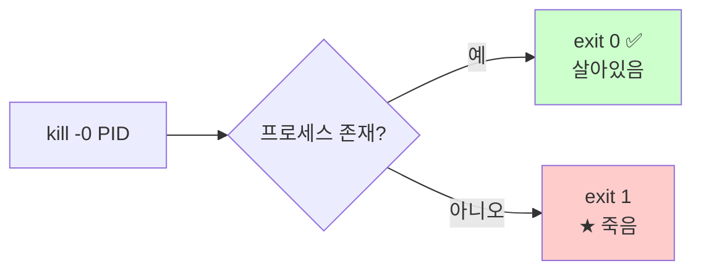
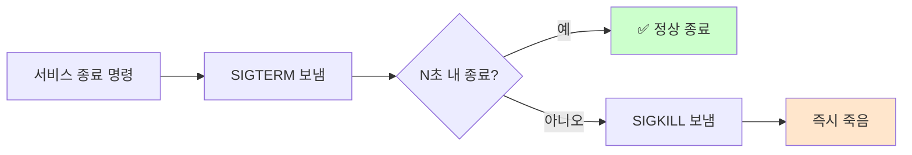

# 프로세스와 시그널

> **한 줄로** · 프로세스는 컴퓨터에서 **실행 중인 프로그램 하나**(PID라는 번호로 식별), 시그널은 OS가 프로세스에 보내는 **짧은 알림 메모**. B1-1 monitor.sh의 health check는 "지정된 PID가 살아있고 정상 상태인가"를 확인해야 함 → **PID 존재 + 상태 정상 + 포트 LISTEN** 3가지 모두 만족할 때만 OK.

---

## 과제 요구사항

### 이게 무슨 작업?

monitor.sh는 매분 실행되면서 "**서비스가 살아있나?**"를 확인해야 해요. 단순히 PID 파일이 있는지만 봐서는 부족합니다. 실제로:
- 프로세스가 **죽어있는데 PID 파일만 남아있는 경우**
- 프로세스는 살아있지만 **좀비 상태**라 일을 못 하는 경우
- 프로세스는 떠 있지만 **포트를 안 열어서 외부에서 접속 못 하는 경우**

회사 비유:
- 프로세스 = **직원 한 명**
- PID = 직원의 **사번**
- 살아있다 = **출근해서 자리에 앉음**
- 좀비 = **출근은 했는데 의식이 없음** (일 못 함)
- LISTEN = **상담 창구를 열어 둠** (전화 받을 준비)

### 명세 원문 (원본 그대로)

> **헬스 체크(상태 점검)**
> - agent-app 프로세스(PID 파일 기반) **존재 여부 확인**
> - 미실행 시 `[ALERT] agent-app 미실행` 출력 (재시작 동작은 선택)
> - 포트 LISTEN 확인(필요시)

### 무엇을 확인하나

| 확인 항목 | 방법 | 통과 조건 |
|---|---|---|
| PID 파일 존재 | `[ -f $PID_FILE ]` | 파일이 있어야 함 |
| 프로세스 살아있음 | `kill -0 $PID` | exit code 0 |
| 좀비 상태 아님 | `ps -p $PID -o stat=` | `Z`가 아님 |
| 포트 LISTEN | `ss -ltn` | 지정 포트가 LISTEN |

### 잘 됐는지 확인하기

```bash
# 1. PID 파일과 프로세스 일치 확인
PID=$(cat /run/agent-app.pid)
kill -0 "$PID" && echo "alive"

# 2. 상태 확인 (R=실행, S=대기, Z=좀비, D=I/O wait)
ps -p "$PID" -o pid,stat,cmd

# 3. LISTEN 확인
ss -ltn | grep ":15034 "
```

---

## 구현 방법

### Step 1 — PID 파일 검증

```bash
PID_FILE="/run/agent-app.pid"

if [ ! -f "$PID_FILE" ]; then
    echo "[ALERT] agent-app 미실행 (PID 파일 없음)"
    exit 1
fi

PID=$(cat "$PID_FILE")
```

### Step 2 — 프로세스 살아있는지 확인

`kill -0`은 시그널을 보내지 **않고** 신호 보낼 권한·존재만 확인하는 트릭이에요.

```bash
if ! kill -0 "$PID" 2>/dev/null; then
    echo "[ALERT] agent-app 미실행 (PID=$PID 죽음)"
    exit 1
fi
```

### Step 3 — 좀비·정상 상태 구분

```bash
STATE=$(ps -p "$PID" -o stat= 2>/dev/null | head -c1)

case "$STATE" in
    R|S|D)
        echo "[OK] agent-app 정상 (state=$STATE)"
        ;;
    Z)
        echo "[ALERT] agent-app 좀비 (state=Z)"
        ;;
    *)
        echo "[WARNING] agent-app 알 수 없는 상태 (state=$STATE)"
        ;;
esac
```

### Step 4 — 포트 LISTEN 확인 (선택)

명세는 "필요시"라고 했지만 강력 권장.

```bash
SERVICE_PORT=15034
if ss -ltn | awk -v p=":$SERVICE_PORT" '$4 ~ p {f=1} END {exit !f}'; then
    echo "[OK] port $SERVICE_PORT listening"
else
    echo "[WARNING] port $SERVICE_PORT not listening"
fi
```

전체 health check: [bin/monitor.sh](https://github.com/codewhite7777/codyssey_b1_1/blob/main/bin/monitor.sh)

---

## 개념

### 프로세스 상태 (ps의 STAT 컬럼)

| 글자 | 의미 | health check |
|---|---|---|
| **R** | Running — 현재 CPU에서 실행 중 | ✅ OK |
| **S** | Sleeping — 이벤트 대기 중 (정상) | ✅ OK |
| **D** | Uninterruptible — I/O 대기 (정상이지만 길면 문제) | ⚠ 잠시면 OK |
| **T** | Stopped — 일시 정지됨 | ⚠ 문제 |
| **Z** | Zombie — 종료됐는데 부모가 reap 안 함 | ❌ 문제 |

### `kill -0`의 진짜 의미 (★ 함정)

`kill -0 $PID`는 시그널을 보내는 게 **아니에요**. 0번 시그널은 "신호 전달 가능 여부만 검사"하는 가짜 시그널.



→ 권한이 부족하면 살아있어도 1이 나올 수 있음. monitor.sh는 root나 같은 사용자로 실행되므로 보통 문제 X.

### 시그널의 종류 (대표)

OS는 프로세스에 "메모"를 보내요. 메모마다 의미가 다릅니다.

| 시그널 | 번호 | 의미 | 받은 프로세스의 기본 동작 |
|---|---|---|---|
| `SIGTERM` | 15 | "정리하고 끝내라" (정중한 종료 요청) | 종료 (catch 가능) |
| `SIGKILL` | 9 | "지금 즉시 죽어라" (강제) | 무조건 종료 (catch 불가) |
| `SIGHUP` | 1 | "설정 다시 읽어라" | 종료 (catch 가능) |
| `SIGINT` | 2 | Ctrl+C | 종료 (catch 가능) |
| `SIGUSR1/2` | 10/12 | 사용자 정의 | 무시 (catch 가능) |

### Graceful shutdown 패턴

서비스를 안전하게 종료하려면 SIGTERM → 대기 → SIGKILL 패턴 사용.



이번 과제는 시그널 직접 다루진 않지만, **trap**으로 SIGTERM 처리를 익혀두면 좋아요. → [bash-trap.md](./bash-trap.md)

### PID 재사용 함정 (★ 중요)

PID는 한정된 숫자(보통 32768까지)라 시스템이 오래 돌면 **재사용**됩니다.

```
시점 1: agent-app 실행, PID=12345 → /run/agent-app.pid에 12345 기록
시점 2: agent-app 죽음
시점 3: 다른 프로세스가 새로 PID=12345 받음 (★ 재사용)
시점 4: monitor.sh가 kill -0 12345 → 살아있다고 잘못 판정
```

방어 방법:
```bash
if [ "$(ps -p $PID -o comm= 2>/dev/null)" = "agent-app" ]; then
    echo "정말 agent-app이 맞음"
fi
```

운영 환경에서는 PID + 명령 이름 둘 다 확인 권장.

### fork와 exec — 새 프로세스가 어떻게 만들어지나


- **fork** — 자기 자신을 복제 (부모와 동일한 자식)
- **exec** — 자식의 메모리를 새 프로그램으로 교체
- 끝나면 exit code를 부모가 회수 (reap)
- 부모가 reap 안 하면 → **좀비**

---

## 참고

- `man 7 signal`, `man kill`
- `man ps` — STAT 컬럼 정의
- 관련 노트: [bash-trap.md](./bash-trap.md) — 시그널 catch 패턴
- 관련 노트: [ports-and-listening.md](./ports-and-listening.md) — LISTEN 검증

---
출처: B1-1 (Layer 3.4) · 학습일: 2026-05-12
