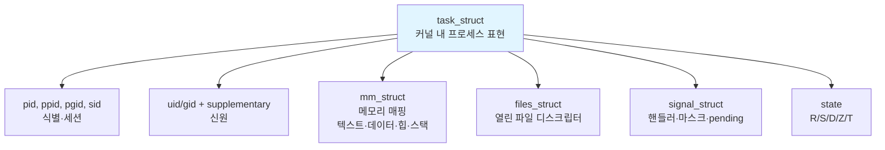
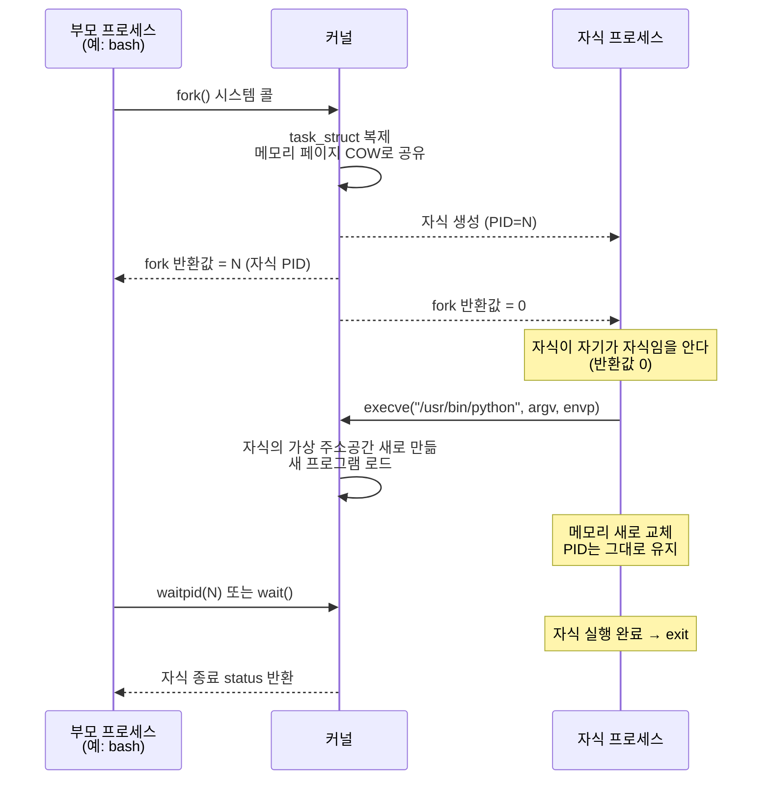
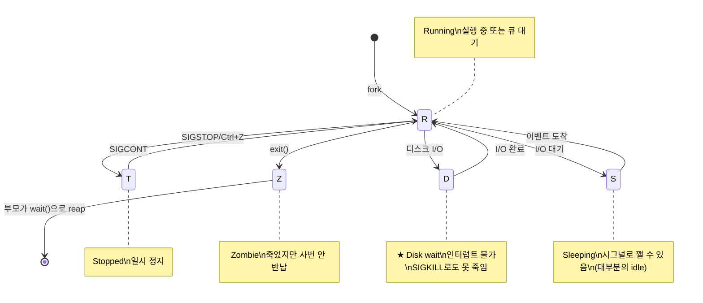
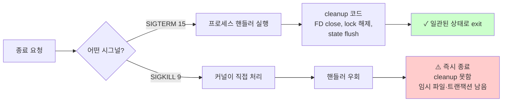
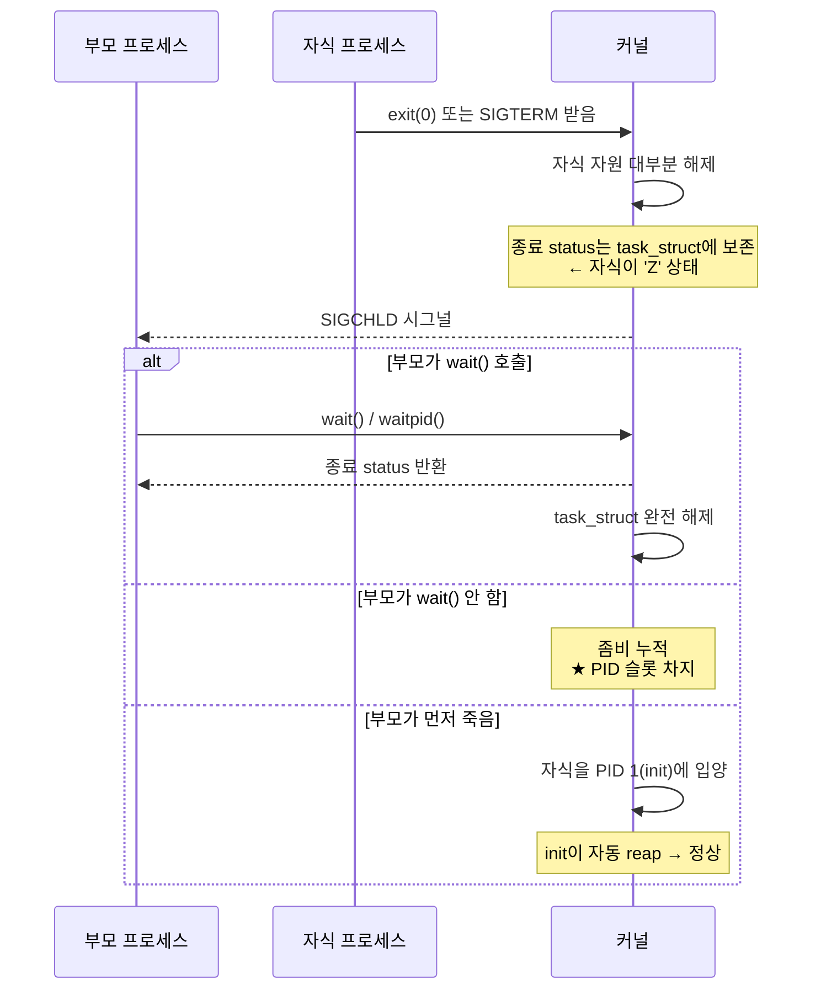

# 프로세스 모델과 시그널

> **TLDR** · 프로세스 = 실행 중인 프로그램(PID로 식별), 시그널 = OS가 프로세스에 보내는 비동기 알림. monitor.sh의 health check는 *PID 존재 + 상태(R/S vs Z/D) + LISTEN*의 3중 검증이어야 정확하다. graceful shutdown의 핵심은 SIGTERM(정중) → 대기 → SIGKILL(강제) 패턴.

## 개요

Linux의 프로세스는 PID로 식별되는 실행 컨텍스트로, 운영체제의 가장 기본적인 추상화 단위다. 모든 명령, 모든 데몬, 모든 컨테이너가 결국은 하나 이상의 프로세스로 실행된다. 새 프로세스는 `fork()` 시스템 콜로 기존 프로세스를 복제하고 `execve()`로 메모리를 다른 프로그램으로 교체하는 방식으로 만들어진다 — 이 fork-exec 패턴이 UNIX 계열 OS의 독특한 특징이며, Windows의 CreateProcess와는 다른 설계 철학이다.

**시그널**은 OS가 프로세스에 비동기 알림을 전달하는 메커니즘이다. 종료 요청, 자식 프로세스 사망 알림, 잘못된 메모리 접근 등 외부에서 프로세스의 흐름에 개입해야 하는 모든 이벤트가 시그널로 표현된다. 일부 시그널은 프로세스가 핸들러로 잡아 다르게 처리할 수 있지만, SIGKILL이나 SIGSTOP 같은 일부는 잡을 수 없어 강제 정책 도구로 사용된다.

## 왜 알아야 하나

monitor.sh의 health check는 프로세스 식별과 상태 분류에 의존한다. "agent_app.py가 살아있는지" 판단하려면 단순히 PID 조회뿐 아니라 그 프로세스가 어떤 상태(R/S/D/Z 등)에 있는지도 봐야 정확하다. 좀비가 된 프로세스는 PID는 있지만 실제로는 죽은 상태고, D 상태 프로세스는 살아있지만 응답하지 않는다. 이 차이를 구분하지 못하면 잘못된 진단이 된다.

B1-2 트러블슈팅 과제에서 다룰 OOM·CPU 과점유·deadlock 분석도 모두 프로세스 상태 해석에 기반한다. 메모리 누수로 죽은 프로세스, watchdog에 의해 종료된 프로세스, deadlock으로 멈춘 프로세스를 시그널과 상태 정보로 구분해 진단한다.

## 프로세스의 정체

> [!NOTE]
> **TLDR**: 프로세스 = (PID, 메모리 매핑, 파일 디스크립터, 신원, 상태). PID 1은 init/systemd로 모든 프로세스의 시조.

커널 내부에서 프로세스 하나는 `task_struct`라는 거대한 구조체로 표현된다. 이 구조체는 프로세스의 모든 상태를 담는다.



PID 1은 init/systemd로, 부팅 후 가장 먼저 실행되는 프로세스다. 모든 다른 프로세스는 직간접적으로 PID 1의 자손이며, PID 1은 또한 부모를 잃은 모든 고아 프로세스를 입양해 reap하는 역할도 한다 — 이 역할이 컨테이너 환경에서 중요한 디자인 이슈가 된다.

## fork-exec 모델

> [!TIP]
> **핵심**: fork는 *복제*, exec는 *변신*. 셸이 명령을 실행할 때마다 fork+exec가 일어난다. 환경 변수는 fork 시점에 자식에게 복사되므로 export가 필요한 이유가 여기 있다.

UNIX의 프로세스 생성은 두 단계의 시스템 콜로 이루어진다 — 먼저 `fork()`로 부모 프로세스를 복제한 자식을 만들고, 그 자식이 `execve()`로 자기 메모리를 다른 프로그램으로 교체한다. 이 분리된 두 단계는 Windows의 단일 `CreateProcess`보다 더 유연하다.



**Copy-on-write**는 fork의 핵심 최적화다. fork가 부모의 메모리를 통째로 복사하면 매우 비싸지만, 실제로는 메모리 페이지의 사본을 만들지 않고 부모와 자식이 같은 페이지를 read-only로 공유한다. 어느 한쪽이 write를 시도하면 그때 비로소 그 페이지만 복사된다. 그래서 fork 직후 곧바로 exec하는 패턴(셸이 명령을 실행하는 일반적 패턴)에서는 거의 메모리 복사가 일어나지 않는다.

Linux는 사실 `fork()` 외에 `clone()`이 진짜 시스템 콜이다. `clone()`은 어떤 자원을 부모와 공유할지 플래그로 지정할 수 있어서, fork보다 더 일반적이다. `pthread_create`로 만드는 스레드도 내부적으로 `clone()`에 메모리·파일 디스크립터·시그널 핸들러를 공유하라는 플래그를 주어 만들어진다. 즉, Linux에서 스레드와 프로세스의 차이는 단지 자원 공유 정도의 차이다.

## 프로세스 상태 머신

> [!IMPORTANT]
> **운영 디버깅의 가장 자주 만나는 지점**: `D` 상태(uninterruptible sleep)는 SIGKILL로도 못 죽인다. NFS 끊김·dying disk가 흔한 원인.

프로세스는 자기 생애 동안 여러 상태를 오간다. `ps`의 STAT 컬럼이나 `/proc/PID/status`에서 이 상태를 확인할 수 있다.



대부분의 시간 동안 프로세스는 `S` 상태에 있다. 이벤트(키보드 입력, 네트워크 패킷, 타이머 등)를 기다리고 있다는 뜻이다. CPU를 실제로 사용하는 프로세스는 R 상태에 있다. `D` 상태는 특별히 주의해야 하는데, 이 상태의 프로세스는 SIGKILL로도 죽일 수 없다 — 디스크나 네트워크 응답을 기다리는 동안 인터럽트를 받지 않도록 일부러 막혀 있기 때문이다. 정상 상황에서는 잠깐만 D 상태에 있다가 빠져나오지만, NFS 서버가 끊기거나 디스크가 죽기 시작하면 프로세스가 D 상태에 영원히 갇혀서 시스템 hang의 주범이 된다.

`Z` (좀비) 상태는 프로세스가 exit했지만 부모가 종료 status를 회수하지 않은 상태다. 메모리 자원은 거의 없지만 PID 슬롯을 차지하며, 누적되면 PID 공간 고갈로 새 프로세스를 못 만드는 상황이 생긴다.

## 시그널: 비동기 알림

> [!WARNING]
> `kill -9 PID`(SIGKILL)는 프로세스의 cleanup을 못 하게 한다 → DB 트랜잭션 깨짐, 임시 파일 남음 등의 위험. **항상 SIGTERM 먼저, 안 되면 SIGKILL**.

시그널은 OS가 프로세스에 보내는 비동기 알림이다. 표준 시그널은 1번부터 31번까지, realtime 시그널은 32번부터 64번까지다. 가장 자주 만나는 시그널들은 다음과 같다.

| # | 이름 | 기본 동작 | 잡기 | 메모 |
|---|---|---|---|---|
| 1 | SIGHUP | Term | ✅ | 터미널 종료 / 데몬 reload 관습 |
| 2 | SIGINT | Term | ✅ | Ctrl+C |
| 9 | **SIGKILL** | Term | ❌ | 잡거나 무시 못함, 즉시 종료 |
| 11 | SIGSEGV | Core | ✅ | 잘못된 메모리 접근 |
| 13 | SIGPIPE | Term | ✅ | 닫힌 파이프에 write |
| 15 | **SIGTERM** | Term | ✅ | 정중한 종료 요청 (default) |
| 17 | SIGCHLD | Ign | ✅ | 자식 상태 변화 |
| 19 | SIGSTOP | Stop | ❌ | 일시정지, 잡을 수 없음 |

### SIGTERM vs SIGKILL — graceful shutdown의 핵심

SIGTERM과 SIGKILL의 차이는 프로세스 운영의 가장 중요한 디테일 중 하나다. 둘 다 프로세스를 종료시키지만 메커니즘이 완전히 다르다.



운영 패턴: SIGTERM 후 grace period(보통 30s) → 안 끝나면 SIGKILL. systemd의 `KillMode`/`TimeoutStopSec`, K8s의 `terminationGracePeriodSeconds`가 이 모델이다.

### 좀비와 reaping

자식 프로세스가 exit하면 OS는 그 프로세스의 자원 대부분을 즉시 해제한다. 하지만 종료 status (exit code, 사망 원인 등)는 부모가 회수할 때까지 보존된다.



이 메커니즘이 컨테이너 환경에서 흥미로운 문제를 만든다 — 컨테이너의 첫 프로세스(PID 1)가 init이 아닌 일반 앱이면 그 앱은 자식 reap을 안 한다. 결과적으로 컨테이너 안에서 좀비가 누적되어 결국 컨테이너가 깨질 수 있다. 이를 해결하기 위해 `tini`, `dumb-init` 같은 minimal init 프로그램을 컨테이너의 PID 1로 두는 패턴이 표준이 되었다. Docker의 `--init` 플래그가 이를 자동화한다.

## 한 번 보자

프로세스 관련 명령은 매우 다양하다. 가장 자주 쓰는 것부터 시작하자.

```
$ ps aux | head -5
USER  PID %CPU %MEM    VSZ   RSS TTY   STAT START   TIME COMMAND
root    1  0.0  0.1 169152  9220 ?     Ss   May01   0:14 /sbin/init
root    2  0.0  0.0      0     0 ?     S    May01   0:00 [kthreadd]
alice 1234 0.5  1.2 234567 49204 pts/0 S+   09:30   0:01 -bash
alice 5678 5.2  3.4 567890 145632 ?    S    09:31   0:23 python agent_app.py
```

`ps aux`의 컬럼 의미는 알아둘 가치가 있다. `USER`는 프로세스 소유자, `PID`는 프로세스 ID, `%CPU`는 시작 후 누적 평균(★ 순간값 X), `%MEM`은 물리 메모리 비율, `VSZ`는 가상 메모리 크기(매핑된 모든 메모리), `RSS`는 실제 사용 중인 물리 메모리(Resident Set Size), `STAT`는 위에서 본 상태(R/S/D/Z/T), `COMMAND`는 실행 명령이다.

PID를 찾는 다양한 방법이 있다.

```
$ pgrep -lf agent_app
5678 python agent_app.py

$ pidof bash
1234

$ pstree -p 1234
bash(1234)─┬─python(5678)
           └─sshd(9012)─┬─bash(9013)
                        └─ps(9014)
```

상세한 프로세스 정보는 `/proc/PID/`에서 가져온다.

```
$ cat /proc/5678/status | head -10
Name:   python
State:  S (sleeping)
Tgid:   5678
Pid:    5678
PPid:   1
Uid:    1001    1001    1001    1001
Gid:    1001    1001    1001    1001
FDSize: 64
Groups: 1001 1002 1003
NStgid: 5678
```

시그널 보내는 명령. 자기 컴퓨터의 중요 프로세스에 함부로 보내지 말 것 — 시스템이 깨질 수 있다.

```bash
kill 1234           # SIGTERM (default) — 정중한 요청
kill -TERM 1234     # 명시적 SIGTERM
kill -9 1234        # SIGKILL — 강제 (위험)
kill -HUP 1234      # SIGHUP — 보통 재로드
```

```
$ kill -l           # 모든 시그널 목록
 1) SIGHUP     2) SIGINT     3) SIGQUIT    4) SIGILL     5) SIGTRAP
 6) SIGABRT    7) SIGBUS     8) SIGFPE     9) SIGKILL   10) SIGUSR1
11) SIGSEGV   12) SIGUSR2   13) SIGPIPE   14) SIGALRM   15) SIGTERM
...
```

<details>
<summary><b>심화 도구 — strace, lsof, /proc 추적 (펼치기)</b></summary>

```bash
strace -p PID                # syscall trace (live, 무거움)
ltrace -p PID                # library call trace
ls -l /proc/PID/fd/          # 열린 파일 디스크립터들
cat /proc/PID/maps           # 가상 메모리 매핑
cat /proc/PID/wchan          # 커널에서 무엇을 기다리는지 (D 상태 디버깅)
cat /proc/PID/limits         # rlimit 값 (open files, memory 등)
```

`strace`는 디버깅의 강력한 도구다. 프로세스가 어떤 시스템 콜을 호출하는지 실시간으로 보여주므로, "왜 이 프로그램이 멈췄지" 같은 질문에 즉시 답을 준다. 단, 매우 무거우므로 production에서는 신중히 사용해야 한다.

</details>

## 흔한 함정

> [!WARNING]
> **PID 재사용 함정**: exit한 PID는 곧 재사용. 오래된 PID 캐시로 `kill` 보내면 의도하지 않은 프로세스를 죽일 수 있음. `pgrep -f`로 명령줄도 함께 검증.

프로세스와 시그널 모델은 매우 풍부한 함정을 가지고 있다. 운영에서 실제로 부딪히는 종류만 정리한다.

먼저 측정·식별 단계에서의 함정이 있다. `ps`의 %CPU는 누적 평균이라는 점이 자주 오해되는데, 시작 후 (CPU 사용 시간 / 경과 시간)이라서 오래 살아있는 프로세스는 실제로 지금은 idle해도 평균이 높을 수 있다. 순간 부하를 보려면 `top` 또는 `pidstat 1`을 써야 한다. 더 미묘한 함정으로 PID 재사용이 있는데, exit한 프로세스의 PID는 곧 재사용되므로 오래된 PID를 캐시했다가 그걸로 `kill`을 보내면 의도한 프로세스가 아니라 같은 PID를 받은 다른 프로세스를 죽일 수 있다.

종료·신호 처리에서의 함정 중 가장 큰 것이 `kill -9`로 인한 데이터 손상이다. DB 트랜잭션 중간이거나 파일 write 중간에 SIGKILL을 받으면 일관성이 깨진 상태로 남으므로, SIGTERM → 대기 → SIGKILL 패턴을 항상 준수해야 한다. 한편 D 상태 프로세스에 SIGKILL이 안 통한다는 점도 알아둘 가치가 있다 — 디스크 응답을 기다리는 동안 인터럽트를 받지 않도록 일부러 막혀 있어, NFS 끊김이나 dying disk가 흔한 원인이고 재부팅 외에 해결 방법이 없는 경우가 많다.

<details>
<summary><b>심화 함정 — 시그널 핸들러·fork bomb·wait race·daemon 패턴 (펼치기)</b></summary>

시그널 핸들러 안에서 안전하지 않은 함수를 호출하는 것도 시그널 프로그래밍의 미묘한 함정이다 — 핸들러는 main 흐름을 인터럽트하므로 비-reentrant 함수(`printf`, `malloc` 등)를 호출하면 정의되지 않은 동작이 일어나며, `man 7 signal-safety`에 사용 가능한 함수 목록이 있는데 매우 짧다.

자식 프로세스 관리의 함정도 있다. 가장 위험한 것이 fork bomb으로, `:(){ :|:& };:` 같은 재귀 fork는 시스템의 PID 공간과 메모리를 빠르게 고갈시키므로 cgroup의 `pids.max`로 PID 수를 제한해 방어한다. 자식 reap에서는 wait()의 race가 시그널 프로그래밍의 단골 함정인데, `SIGCHLD` 핸들러에서 `waitpid(-1, ...)`를 한 번 호출하면 한 자식만 reap되므로, 한 번에 여러 자식이 죽어 SIGCHLD가 합쳐지면 reap 안 된 자식이 좀비로 남는다 — 핸들러 안에서 loop으로 모든 자식을 reap해야 안전하다.

관측 도구의 표시 함정도 있다. `top`의 %CPU가 100%를 초과하는 것은 멀티코어 환경에서 정상으로, 단일 프로세스가 N개 코어를 점유하면 N×100%까지 가능하다. `Shift+I`로 Irix mode를 토글하면 단일 코어 기준 백분율로 전환된다.

마지막으로 데몬 운영 패턴 두 가지가 알아둘 가치가 있다. double fork 패턴은 데몬화의 전통적 패턴으로 첫 fork로 자식을 만들고 그 자식이 다시 fork해서 손자를 만들고 자식이 죽으면 손자가 init에 입양되는 구조이며 systemd의 `Type=forking`이 이 패턴을 처리한다. 또 SIGPIPE는 네트워크 서버에서 중요한데, 파이프라인의 receiver가 죽으면 sender가 SIGPIPE로 종료되므로 네트워크 서버는 보통 `SIG_IGN`으로 SIGPIPE를 무시하고 EPIPE 에러를 직접 처리한다 — 그래야 한 클라이언트가 끊겼다고 서버 전체가 죽지 않는다.

</details>

## B1-1 매핑

monitor.sh의 health check는 위 개념의 직접 응용이다. 단순 PID 존재 확인만으로 부족한 이유와, 상태 검증을 함께 해야 진정한 health check가 되는 이유를 다음 코드가 보여준다.

```bash
# 1. 프로세스 살아있는지 (PID 존재)
PID=$(pgrep -f 'agent_app\.py' | head -1)
if [ -z "$PID" ]; then
    log "[ERROR] agent_app.py not running"
    exit 1
fi

# 2. 상태 검증 — Z(좀비)나 D(uninterruptible) 식별
state=$(ps -o state= -p "$PID")
case "$state" in
    [RS])  log "[OK] PID=$PID state=$state" ;;
    D)     log "[WARN] PID=$PID in uninterruptible sleep" ;;
    Z)     log "[ERROR] PID=$PID is zombie" ; exit 1 ;;
    *)     log "[WARN] PID=$PID unexpected state=$state" ;;
esac

# 3. 자원 측정
ps -p "$PID" -o %cpu=,%mem= --no-headers
```

이 스크립트의 핵심 통찰은 PID 존재만 확인하면 좀비도 "살아있다"고 판단한다는 점이다. 좀비 상태인 프로세스는 PID가 있지만 실제로는 죽은 상태이므로, 상태를 함께 검증해야 정확한 health check가 된다.

cron이 monitor.sh를 매분 실행한다는 건 fork-exec의 직접 응용이다. cron 데몬이 fork해서 자식을 만들고, 자식이 `/bin/sh`로 exec하고, 셸이 다시 fork해서 monitor.sh를 exec한다. monitor.sh가 끝나면 셸과 cron의 자식이 차례로 exit하고, cron이 wait()으로 reap한다.

## 인접 토픽

<details>
<summary><b>응용 토픽 — namespace, cgroups, eBPF, OOM killer (펼치기)</b></summary>

프로세스 모델의 응용은 격리·관측·관리의 세 축으로 정리해 볼 수 있으며, 컨테이너·systemd 시대에 와서 모두 표준 운영의 핵심이 된다.

가장 기초적인 응용은 process group, session, controlling terminal로, 잡 컨트롤(job control)의 기반이다. `setpgid`, `setsid` 같은 시스템 콜로 프로세스 그룹을 만들고 셸이 Ctrl+Z(SIGTSTP)나 Ctrl+C(SIGINT)를 어디로 보낼지를 결정한다. 더 세밀한 프로세스 속성 제어는 `prctl(2)` 시스템 콜로 가능한데, `PR_SET_NAME`(프로세스 이름 변경), `PR_SET_PDEATHSIG`(부모가 죽으면 자식에게 시그널), `PR_SET_NO_NEW_PRIVS`(privilege escalation 차단) 같은 다양한 기능을 제공한다.

격리·제한 영역의 핵심은 cgroups와 namespace다. cgroups는 리소스 격리·제한·계측의 핵심 메커니즘으로, CPU·메모리·IO·PID 등을 그룹 단위로 제한할 수 있으며 systemd, Docker, Kubernetes가 모두 이 위에 쌓여 있다. cgroups v2는 v1의 여러 한계를 해결한 새 버전이며 현재 표준이다. 한편 namespace는 프로세스의 view를 격리하는 메커니즘으로, PID·network·mount·user 등 다양한 namespace의 조합으로 컨테이너 격리가 만들어진다.

관측 측면에서는 eBPF + tracing이 현대적 도구로 자리잡았다. `bpftrace`, `bcc`, `perf` 같은 도구로 syscall, schedule, cache miss 등을 매우 낮은 오버헤드로 추적할 수 있어 production 디버깅의 게임체인저로 평가받는다. 운영 관리에서는 systemd가 service unit으로 프로세스 lifecycle을 관리하는 init system으로 표준화되었으며, `Type=`, `Restart=`, `KillSignal=`, `TimeoutStopSec=` 같은 옵션으로 graceful shutdown·재시작 정책·의존성을 선언적으로 표현한다.

마지막으로 메모리 압박과 직결되는 OOM killer를 알아둘 가치가 있다. 메모리가 부족할 때 OS가 프로세스를 골라 SIGKILL하는 메커니즘으로, `oom_score`라는 휴리스틱으로 어떤 프로세스를 죽일지 결정하며 `/proc/PID/oom_score_adj`로 가중치를 조정할 수 있다. B1-2 OOM 트러블슈팅에서 자세히 다룬다.

</details>

## 참고

- `man 7 signal`, `man 7 signal-safety`
- `man 2 fork`, `man 2 execve`, `man 2 clone`, `man 2 wait`
- `man 5 proc` — `/proc/PID/*` 파일들의 의미

---
출처: B1-1 (Layer 1.5) · 학습일: 2026-05-09
