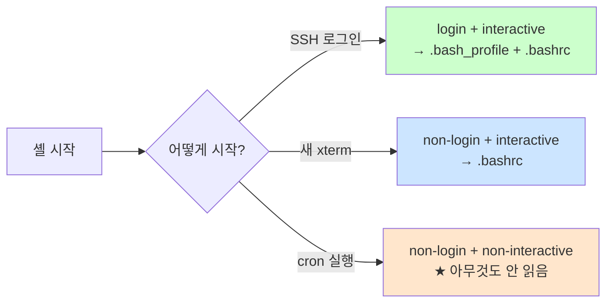
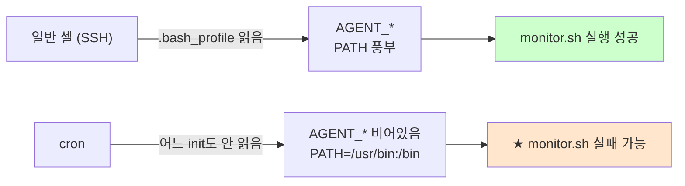

# 셸 환경과 초기화 파일

> **한 줄로** · 셸은 시작할 때 **종류에 따라 다른 초기화 파일**(`.bash_profile`·`.bashrc`)을 읽어요. SSH 로그인은 `.bash_profile`, 새 터미널은 `.bashrc`, cron은 **아무것도 안 읽음**. B1-1은 `.bash_profile`에 AGENT_* 환경 변수를 set하라고 요구.

---

## 과제 요구사항

### 이게 무슨 작업?

환경 변수는 **셸 안에서 항상 쓸 수 있는 약속한 값**이에요. 예를 들어 `$HOME`은 자기 홈 디렉토리. B1-1은 agent-app이 사용할 변수(`AGENT_HOME`, `AGENT_LOG_DIR` 등)를 한 번 set해두면 쉘 어디서나 쓸 수 있게 하라고 요구.

회사 비유:
- 출근 첫날 받는 **안내문**(.bash_profile) — 사번, 부서, 도구 위치 등 한 번에 안내
- 매일 자리 가면 보는 **메모**(.bashrc) — alias, 단축키
- cron 비서는 **빈손 출근** → 어느 안내문도 안 봄

### 명세 원문 (원본 그대로)

> **환경 변수**
> - `.bash_profile`에 다음 환경 변수를 정의한다:
>   - `AGENT_HOME=/home/agent-admin/agent-app`
>   - `AGENT_LOG_DIR=/var/log/agent-app`
>   - `AGENT_KEY_FILE=/home/agent-admin/.agent-keys/agent.key`
> - 환경 변수가 SSH 로그인 시 즉시 사용 가능해야 한다.

### 무엇을 set하나

| 변수 | 값 | 용도 |
|---|---|---|
| `AGENT_HOME` | `/home/agent-admin/agent-app` | 서비스 설치 위치 |
| `AGENT_LOG_DIR` | `/var/log/agent-app` | 로그 디렉토리 |
| `AGENT_KEY_FILE` | `/home/agent-admin/.agent-keys/agent.key` | API 키 파일 |

### 잘 됐는지 확인하기

```bash
# 1. SSH 로그아웃 후 다시 로그인
exit
ssh -p 20022 agent-admin@<서버>

# 2. 환경 변수 즉시 확인 (★ 명세 요구)
echo "$AGENT_HOME"
echo "$AGENT_LOG_DIR"
echo "$AGENT_KEY_FILE"
```

기대 결과 — 각 줄이 값으로 출력되어야 함 (빈 줄이면 실패).

---

## 구현 방법

### Step 1 — `.bash_profile` 작성

agent-admin 홈에 멱등하게 추가.

```bash
PROFILE=/home/agent-admin/.bash_profile

# 기존 AGENT_* 라인 제거 (멱등)
sudo -u agent-admin sed -i '/^export AGENT_/d' "$PROFILE" 2>/dev/null || true

# 새 라인 추가
sudo tee -a "$PROFILE" <<'EOF' >/dev/null
export AGENT_HOME=/home/agent-admin/agent-app
export AGENT_LOG_DIR=/var/log/agent-app
export AGENT_KEY_FILE=/home/agent-admin/.agent-keys/agent.key
EOF

# 소유 정리
sudo chown agent-admin:agent-common "$PROFILE"
sudo chmod 0644 "$PROFILE"
```

`export`로 set해야 자식 프로세스(monitor.sh 등)도 변수를 상속받아요. `export` 없이 `AGENT_HOME=...`만 하면 현재 셸에서만 유효.

### Step 2 — `.bash_profile`이 `.bashrc`도 읽도록

Ubuntu 기본 `.bash_profile`은 보통 `.bashrc`를 불러옵니다. 없으면 추가:

```bash
PROFILE=/home/agent-admin/.bash_profile

if ! sudo grep -q '\.bashrc' "$PROFILE" 2>/dev/null; then
    sudo tee -a "$PROFILE" <<'EOF' >/dev/null

# .bashrc 함께 읽기 (login + interactive에서 alias 등 사용)
if [ -f "$HOME/.bashrc" ]; then
    . "$HOME/.bashrc"
fi
EOF
fi
```

### Step 3 — 즉시 검증

```bash
# 새 SSH 세션 시뮬레이션
sudo -u agent-admin bash --login -c 'env | grep AGENT_'
```

기대:
```
AGENT_HOME=/home/agent-admin/agent-app
AGENT_LOG_DIR=/var/log/agent-app
AGENT_KEY_FILE=/home/agent-admin/.agent-keys/agent.key
```

전체 구현: [setup/05-environment.sh](https://github.com/codewhite7777/codyssey_b1_1/blob/main/setup/05-environment.sh)

---

## 개념

### 셸 4-cell 매트릭스 (★ 핵심)

셸은 두 가지 축으로 분류 — 어떻게 시작했나(login), 사용자와 상호작용하나(interactive). 4가지 조합 모두 읽는 파일이 달라요.

|  | **interactive** (사용자 입력 받음) | **non-interactive** (스크립트만) |
|---|---|---|
| **login** | SSH 로그인 → `/etc/profile` + `.bash_profile` → `.bashrc` | `bash --login script.sh` → `.bash_profile` |
| **non-login** | 새 터미널 창 → `.bashrc` | **cron, systemd** → **아무것도 안 읽음** |



### 어느 파일이 어디서 읽히나

| 파일 | 위치 | 언제 읽힘 |
|---|---|---|
| `/etc/profile` | 시스템 전체 | login 셸 |
| `/etc/profile.d/*.sh` | 시스템 전체 | login 셸 (분할 관리용) |
| `~/.bash_profile` | 사용자별 | login 셸 (있으면 `.profile` 무시) |
| `~/.profile` | 사용자별 | login 셸 (`.bash_profile` 없을 때) |
| `~/.bashrc` | 사용자별 | non-login interactive 셸 |
| `/etc/bash.bashrc` | 시스템 전체 | non-login interactive 셸 |

### `.bash_profile` vs `.bashrc` — 무엇을 어디에?

원칙:
- **환경 변수·PATH·umask** → `.bash_profile` (한 번만 set하면 됨)
- **alias·함수·프롬프트** → `.bashrc` (모든 인터랙티브 셸에서 다시 set 필요)

이유: 환경 변수는 자식 프로세스에 상속(export)되니까 한 번만 set해도 모든 자식이 받음. 하지만 alias는 상속 안 됨 → 매 셸마다 다시 set 필요.

### B1-1이 `.bash_profile`을 선택한 이유


명세는 "**SSH 로그인 시 즉시 사용 가능**"을 요구 → SSH = login 셸 → `.bash_profile`이 정확.

### `export`의 의미 (★ 중요)

```bash
# export 없이
A=hello
echo $A          # hello (현재 셸)
bash -c 'echo $A'   # 빈 줄 (★ 자식 셸은 못 받음)

# export 사용
export B=world
echo $B          # world
bash -c 'echo $B'   # world ✅
```

`export`는 "이 변수를 환경(environment)에 등록 → 자식 프로세스 상속"의 의미. monitor.sh를 자식으로 실행할 때 AGENT_*가 살아있으려면 **export 필수**.

### `source` (또는 `.`) 명령 — 같은 셸에서 파일 실행

```bash
# 변경 후 즉시 적용 (로그아웃 안 하고)
source ~/.bash_profile
# 또는
. ~/.bash_profile
```

`bash ~/.bash_profile`은 자식 셸에서 실행 → 부모(현재 셸)에 영향 없음. `source`는 현재 셸 안에서 직접 읽어들임.

### Cron의 환경 함정 다시 보기



해결: monitor.sh 자체가 환경 변수를 set하거나 crontab 상단에 명시. → [cron-environment-gotchas.md](./cron-environment-gotchas.md)

### 환경 변수의 라이프타임

- **현재 셸**: `A=hello` (export 없이)
- **현재 셸 + 자식**: `export A=hello` (자식 프로세스 상속)
- **세션 전체**: `.bash_profile`/`.bashrc`에 적음 (모든 새 셸에서 set됨)
- **재부팅 후에도**: 위 파일에 적은 것은 유지

`unset A`로 변수 삭제.

### 시스템 전체 환경 (대안)

특정 사용자만이 아니라 시스템 전체에 환경 변수 set하고 싶다면:

| 위치 | 효과 |
|---|---|
| `/etc/environment` | 모든 사용자, 모든 셸·non-셸 프로세스 (단순 KEY=VAL 형식) |
| `/etc/profile.d/agent-app.sh` | 모든 사용자의 login 셸 |

B1-1은 사용자별이라 `~/.bash_profile`이 맞아요.

---

## 참고

- `man bash` — INVOCATION 섹션이 핵심
- 관련 노트: [cron-environment-gotchas.md](./cron-environment-gotchas.md) — cron의 셸 함정
- 관련 노트: [bash-fundamentals.md](./bash-fundamentals.md) — bash 기본

---
출처: B1-1 (Layer 4.0) · 학습일: 2026-05-12
