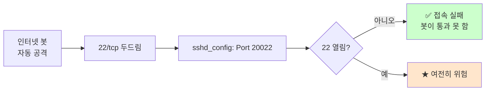

# SSH의 동작 원리

> **한 줄로** · SSH는 신뢰할 수 없는 인터넷 위에 **암호화된 안전한 통로**를 만들어 원격 접속을 가능하게 하는 프로토콜. B1-1은 "**포트 20022로 변경 + root 로그인 차단**"을 요구 — 둘 다 핵심 의도는 **자동 brute-force 공격 표면 축소**.

---

## 과제 요구사항

### 이게 무슨 작업?

평소 SSH는 22번 포트로 동작해요. 인터넷에 떠 있는 모든 SSH 서버는 매일 수천 번의 자동 공격을 받습니다 — "혹시 비밀번호가 `123456`?", "혹시 `password`?" 식으로.

방어 두 가지:
1. **포트를 22가 아닌 다른 번호로 옮김** → 공격자가 22만 두드리면 헛수고
2. **root 계정 직접 로그인 차단** → root는 모든 권한 → 뚫리면 끝 → 일반 계정만 허용

회사 비유:
- 본사 ↔ 지사 비밀 통신선 (SSH)
- 22번 = **가장 잘 알려진 통신선** (해커가 가장 먼저 두드림)
- 20022번으로 옮김 = **새 통신선 개설** (해커가 모름)
- root 차단 = **사장 직접 통화 금지** (대리인을 거쳐서만)

### 명세 원문 (원본 그대로)

> **SSH 보안 설정**
> - SSH 포트 변경: 기본 22 → **20022**
> - root 직접 로그인 차단 (PermitRootLogin no)
> - 설정 후 sshd 재시작, 신규 포트로 접속 가능해야 함
> - 기존 22 포트 연결은 더 이상 받지 않음

### 무엇을 바꾸나

| 항목 | 변경 전 | 변경 후 |
|---|---|---|
| 포트 | 22 | **20022** |
| root 로그인 | `prohibit-password` (key 가능) | **`no`** |
| 설정 파일 | `/etc/ssh/sshd_config` | (편집) |
| 적용 명령 | — | `systemctl restart ssh` |

### 잘 됐는지 확인하기

```bash
# 1. sshd가 20022에서 LISTEN
sudo ss -ltnp | grep sshd

# 2. 22번 포트는 LISTEN 안 함
sudo ss -ltn | grep ":22 " && echo "★ 아직 22 열림" || echo "✅ 22 닫힘"

# 3. root 로그인 차단 확인
sudo sshd -T | grep -i permitrootlogin
# 기대: permitrootlogin no

# 4. 외부에서 새 포트로 접속 시도
ssh -p 20022 agent-admin@<서버>
```

---

## 구현 방법

### Step 1 — sshd_config 편집

`/etc/ssh/sshd_config`에 두 줄을 바꿉니다. 멱등하게 처리하려면 기존 줄을 깨끗이 제거 후 새 줄 추가.

```bash
SSHD_CONFIG=/etc/ssh/sshd_config

# 백업
sudo cp -a "$SSHD_CONFIG" "${SSHD_CONFIG}.bak.$(date +%Y%m%d-%H%M%S)"

# Port 변경 (멱등)
if sudo grep -qE '^Port 20022' "$SSHD_CONFIG"; then
    echo "이미 적용됨"
else
    sudo sed -i '/^Port /d; /^#Port /d' "$SSHD_CONFIG"
    echo "Port 20022" | sudo tee -a "$SSHD_CONFIG" >/dev/null
fi

# PermitRootLogin no
if sudo grep -qE '^PermitRootLogin no' "$SSHD_CONFIG"; then
    echo "이미 적용됨"
else
    sudo sed -i '/^PermitRootLogin /d; /^#PermitRootLogin /d' "$SSHD_CONFIG"
    echo "PermitRootLogin no" | sudo tee -a "$SSHD_CONFIG" >/dev/null
fi
```

`sed -i '/^pattern/d'`는 "해당 줄 삭제" — 기존 설정을 깨끗이 제거 후 새로 추가.

### Step 2 — 설정 문법 검증 (★ 매우 중요)

```bash
sudo sshd -t
```

`-t`(test) 옵션은 설정 파일을 **실제로 적용하지 않고 문법만 검사**. 오타가 있으면 출력. 검증 안 하고 재시작하면 SSH가 깨져서 원격 접속 끊김 → 위험.

### Step 3 — sshd 재시작

```bash
sudo systemctl restart ssh    # Ubuntu/Debian
# 또는
sudo systemctl restart sshd   # RHEL 계열
```

OrbStack Ubuntu라면 `ssh`.

### Step 4 — 방화벽 함께 갱신

포트만 바꾸면 방화벽에서 20022가 막혀서 못 들어와요. 반드시 같이 처리.

```bash
sudo ufw allow 20022/tcp
sudo ufw deny  22/tcp    # 옵션: 22를 명시적으로 차단
```

자세한 내용: [firewall-ufw-vs-firewalld.md](./firewall-ufw-vs-firewalld.md)

### Step 5 — 검증

```bash
# 새 포트로 접속 시도
ssh -p 20022 agent-admin@<서버주소>

# root 시도가 차단되는지 확인
ssh -p 20022 root@<서버주소>
# 기대: Permission denied
```

전체 구현: [setup/01-ssh.sh](https://github.com/codewhite7777/codyssey_b1_1/blob/main/setup/01-ssh.sh)

---

## 개념

### SSH 접속의 3단계

SSH 한 번의 접속은 내부적으로 3단계를 거쳐요.


1. **암호 채널 수립** — 클라이언트·서버가 임시 키를 교환해서 암호화 통로를 만듦 (이후 모든 데이터 암호화)
2. **서버 신원 확인** — 서버가 host key로 자기 증명, 클라이언트는 `~/.ssh/known_hosts`에 저장된 이전 키와 비교
3. **사용자 인증** — 비밀번호 또는 공개키로 사용자 신원 증명

### `PermitRootLogin` 옵션 종류

`/etc/ssh/sshd_config`에서 root 로그인 정책 4가지.

| 값 | 의미 | 안전성 |
|---|---|---|
| `yes` | root 모든 방식 허용 | ❌ 위험 |
| `prohibit-password` | root는 key만 허용 (Ubuntu 기본) | ⚠ 중간 |
| `forced-commands-only` | 미리 정한 명령만 실행 가능 | △ 특수용 |
| **`no`** | root 직접 로그인 완전 차단 (B1-1) | ✅ 안전 |

`no`라도 root **권한이 사라지는 게 아니에요**. `agent-admin`으로 SSH 접속 후 `sudo`로 root 작업 가능 → "누가 언제 root 권한 썼는지" 감사 로그 남음.

### 포트 변경의 효과



> [!IMPORTANT]
> 포트 변경은 **보안의 핵심**이 아닙니다. 진짜 보안은 강력한 비밀번호·공개키·다중 인증·방화벽이에요. 포트 변경은 보너스(자동 공격 표면 축소)일 뿐.

### sshd_config 외 다른 보안 옵션 (참고)

운영에서 추가로 자주 set하는 옵션.

| 옵션 | 권장 값 | 효과 |
|---|---|---|
| `PasswordAuthentication` | `no` | 비밀번호 차단, 공개키만 |
| `MaxAuthTries` | `3` | 비번 시도 3회 제한 |
| `LoginGraceTime` | `30` | 로그인 30초 안 끝나면 차단 |
| `AllowUsers` | `agent-admin` | 지정 사용자만 허용 |
| `ClientAliveInterval` | `300` | 5분마다 살아있음 확인 |

B1-1은 포트·root만 요구하지만, 실 운영은 위를 함께 set.

### 호스트 키 (host key)란?

서버가 자기를 증명하는 데 쓰는 **고정 키**. 첫 접속 시 클라이언트가 묻습니다.

```
The authenticity of host '[server]:20022' can't be established.
ED25519 key fingerprint is SHA256:abc123...
Are you sure you want to continue connecting (yes/no)?
```

`yes` 하면 `~/.ssh/known_hosts`에 저장. 이후 접속 때 같은 키인지 자동 확인.

→ 누군가 중간에서 다른 키로 응답하면 **경고 알람** (man-in-the-middle 공격 탐지).

### 22번 포트를 명시적으로 차단해야 하나?

ufw에서 22를 deny 안 해도 sshd가 22에서 LISTEN 안 하면 어차피 막혀요. 하지만 명시 차단의 이점:

- 다른 서비스가 실수로 22에서 LISTEN 해도 외부 접속 차단
- 방화벽 로그가 명확
- 보안 감사 시 "의도적으로 22 차단" 증거

### sshd_config 우선순위

같은 옵션이 여러 번 나오면 **첫 번째 줄이 우선**이에요.

```
# sshd_config — 첫 번째 줄 우선
Port 20022
Port 22       ← 이건 무시됨
```

→ 안전을 위해 옛 줄은 깨끗이 삭제 후 새로 작성 권장.

---

## 참고

- `man sshd_config` — 모든 옵션 정식 정의
- `man sshd` — sshd 데몬 옵션 (`-t` 등)
- 관련 노트: [sshd-config.md](./sshd-config.md) — 설정 파일 자체에 집중
- 관련 노트: [firewall-ufw-vs-firewalld.md](./firewall-ufw-vs-firewalld.md) — 방화벽 연동

---
출처: B1-1 (Layer 2.1) · 학습일: 2026-05-12
