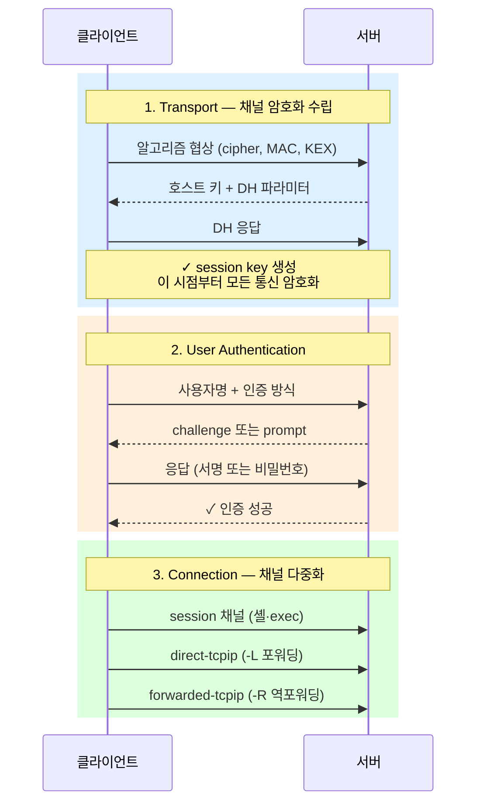
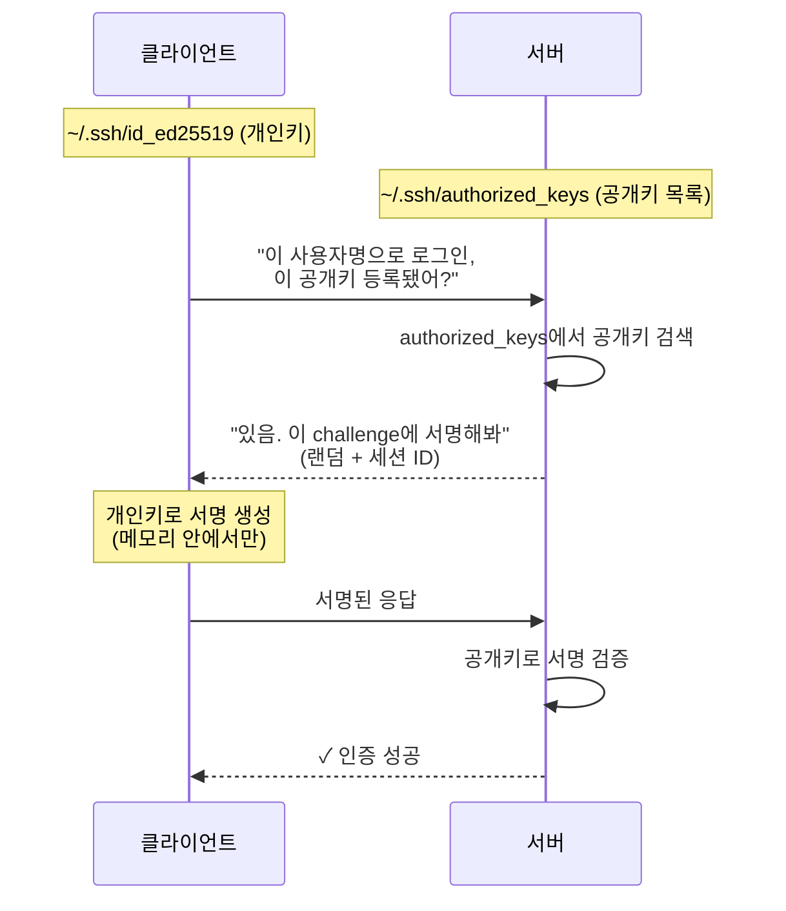
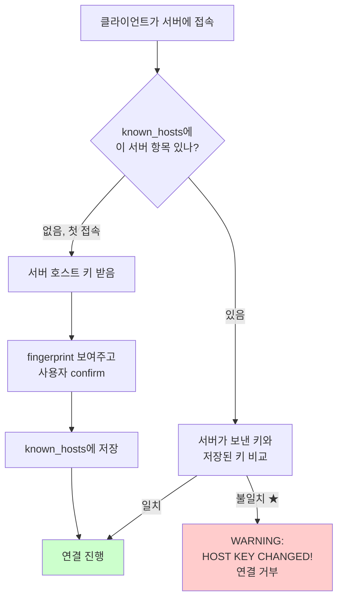

# SSH의 동작 원리

> **TLDR** · SSH는 신뢰할 수 없는 네트워크 위에 (1) 암호화 채널 → (2) 사용자 인증 → (3) 작업 채널 다중화의 3단계로 안전한 원격 접속을 제공한다. 이번 과제의 포트 변경·root 차단의 핵심 의도는 자동화된 brute-force 공격의 표적 면적 줄이기.

## 개요

SSH(Secure Shell)는 신뢰할 수 없는 네트워크 위에서 두 시스템 사이에 암호화된 양방향 채널을 만들고, 그 위에서 셸 접속·파일 전송·포트 포워딩·리모트 명령 실행 등을 수행하는 프로토콜이다. 1995년 텔넷·rsh 같은 평문 프로토콜의 보안 문제를 해결하기 위해 만들어졌고, 현재는 거의 모든 서버 운영의 기본 입출구다. RFC 4251~4256으로 표준화되어 있으며, OpenSSH가 사실상의 reference 구현이다.

이번 과제에서 SSH 포트를 22 → 20022로 변경하고 root 원격 접속을 차단하는 것은 단순한 설정 변경처럼 보이지만, 그 이유와 실제 동작을 정확히 이해해야 명세의 *왜*에 답할 수 있다.

## 왜 알아야 하나

서버 운영의 첫 단계가 SSH 보안인 이유는, 인터넷에 노출된 SSH 데몬이 끊임없는 brute-force 공격의 대상이기 때문이다. AWS·GCP에 EC2 인스턴스 하나를 띄우고 22 포트를 열어두면 분 단위로 random IP에서 root·admin·user 같은 일반 사용자명으로 비밀번호 시도가 들어온다.

```
$ sudo grep "Failed password" /var/log/auth.log | head -5
May  7 03:14:01 host sshd[1234]: Failed password for root from 91.x.x.x port 60294
May  7 03:14:03 host sshd[1235]: Failed password for admin from 188.x.x.x port 41020
May  7 03:14:08 host sshd[1236]: Failed password for ubuntu from 45.x.x.x port 38502
May  7 03:14:12 host sshd[1237]: Invalid user oracle from 103.x.x.x
May  7 03:14:15 host sshd[1238]: Failed password for postgres from 92.x.x.x port 51234
```

위는 typical한 22 포트 노출 서버의 로그다. SSH의 정확한 동작 모델을 이해해야 하는 두 번째 이유는 디버깅이다. "키가 안 먹는다", "Permission denied (publickey)", "Connection closed by remote host" 같은 흔한 에러는 SSH 핸드셰이크의 어느 단계에서 실패하는지를 모르면 추측 디버깅으로 빠진다.

## SSH의 3단계 핸드셰이크

> [!NOTE]
> **핵심**: 1단계에서 채널이 *먼저* 암호화되고, 그 다음 2단계에서 인증이 일어난다. 텔넷·FTP가 평문으로 비밀번호 보내던 시대의 사고를 SSH가 막은 핵심이 이 순서.

SSH 연결은 크게 세 단계로 구성된다.



이 구조의 핵심 통찰은 **암호화 채널이 인증보다 먼저 수립된다**는 점이다. 클라이언트가 비밀번호를 보낼 때는 이미 채널이 암호화되어 있어 평문이 네트워크에 노출되지 않는다. 텔넷·FTP가 평문으로 인증 정보를 보내던 시대를 생각하면 큰 발전이다.

`ssh -vv user@host`로 직접 추적하면 이 흐름이 디버그 출력에 그대로 보인다.

## 키 기반 인증의 실제 동작

> [!TIP]
> **TLDR**: 개인키는 *절대* 네트워크에 안 나간다. 서버는 공개키로 challenge 서명을 검증할 뿐이고, 서명 생성은 개인키 보유자(클라이언트)만 가능하다.

SSH의 가장 큰 가치 중 하나가 키 기반 인증이다. 비밀번호 없이도 안전하게 접속할 수 있고, 자동화 스크립트(CI/CD, Ansible 등)의 기반이 된다.



핵심 보안 속성은 **개인키가 네트워크에 절대 전송되지 않는다**는 점이다. 서버는 공개키만 가지고 있고, 클라이언트는 개인키로 challenge에 서명해서 보낸다. 서명 검증은 공개키로 가능하지만 서명 생성은 개인키로만 가능하므로, 공격자가 채널을 도청해도 키를 훔칠 수 없다.

키 알고리즘은 시대에 따라 달라졌다. 과거에는 RSA가 표준이었지만, 현재는 Ed25519가 권장된다 — 더 작은 키 크기(256비트)로 RSA 4096비트 이상의 보안 강도를 제공하며 서명 생성·검증도 빠르다. `ssh-keygen -t ed25519`로 생성하는 게 현대적 default다.

## 호스트 키와 known_hosts

서버 인증은 또 다른 방향에서 이루어진다. 클라이언트가 서버를 신뢰한다는 보장이 필요한데, 이는 서버의 호스트 키와 클라이언트의 `~/.ssh/known_hosts`로 처리된다.



서버는 자기 호스트 키 쌍을 `/etc/ssh/ssh_host_*_key`(개인)와 `/etc/ssh/ssh_host_*_key.pub`(공개)에 가지고 있다. 클라이언트가 처음 접속할 때 서버는 자기 공개 호스트 키를 보내고, 클라이언트는 이걸 `~/.ssh/known_hosts`에 저장한다. 두 번째 접속부터는 받은 호스트 키가 known_hosts와 일치하는지 검증해서, 일치하지 않으면 다음과 같은 경고가 나온다.

```
$ ssh user@example.com
@@@@@@@@@@@@@@@@@@@@@@@@@@@@@@@@@@@@@@@@@@@@@@@@@@@
@    WARNING: REMOTE HOST IDENTIFICATION HAS CHANGED!     @
@@@@@@@@@@@@@@@@@@@@@@@@@@@@@@@@@@@@@@@@@@@@@@@@@@@
IT IS POSSIBLE THAT SOMEONE IS DOING SOMETHING NASTY!
Someone could be eavesdropping on you right now (man-in-the-middle attack)!
```

이 경고는 두 가지 상황에서 발생한다 — (1) 진짜 MITM 공격, (2) 서버 재설치 등으로 호스트 키가 정당하게 바뀐 경우. 후자가 훨씬 흔하지만 전자의 가능성이 있어 SSH는 항상 경고한다. 정당한 변경이라면 `ssh-keygen -R hostname`으로 known_hosts에서 해당 항목을 제거 후 재접속한다.

## 한 번 보자

SSH의 동작을 직접 관찰하려면 `-v` 플래그가 강력하다. 핸드셰이크 단계마다 어떤 정보를 주고받는지 보여주므로, 거의 모든 SSH 디버깅의 첫 번째 도구다.

```
$ ssh -v alice@example.com
OpenSSH_8.9p1 Ubuntu-3ubuntu0.4, OpenSSL 3.0.2 15 Mar 2022
debug1: Reading configuration data /etc/ssh/ssh_config
debug1: Connecting to example.com port 22.
debug1: Connection established.
debug1: identity file /home/alice/.ssh/id_ed25519 type 3
debug1: kex: algorithm: curve25519-sha256              ← 1단계 (transport)
debug1: Host 'example.com' is known and matches the ED25519 host key.
debug1: Authenticating to example.com:22 as 'alice'    ← 2단계 (auth)
debug1: Authentications that can continue: publickey,password
debug1: Offering public key: /home/alice/.ssh/id_ed25519
debug1: Server accepts key: /home/alice/.ssh/id_ed25519
Authenticated to example.com:22 using "publickey".     ← 인증 성공
```

각 라인이 위 시퀀스 다이어그램과 어떻게 매칭되는지 보면 모델이 명확해진다.

키 생성과 등록의 표준 흐름은 다음과 같다.

```
$ ssh-keygen -t ed25519 -C "alice@example.com"
Generating public/private ed25519 key pair.
Enter file in which to save the key (/home/alice/.ssh/id_ed25519):
Enter passphrase (empty for no passphrase):
Your identification has been saved in /home/alice/.ssh/id_ed25519
Your public key has been saved in /home/alice/.ssh/id_ed25519.pub
The key fingerprint is:
SHA256:abc123... alice@example.com

$ ssh-copy-id alice@example.com
/usr/bin/ssh-copy-id: INFO: Source of key(s) to be installed: "/home/alice/.ssh/id_ed25519.pub"
Number of key(s) added: 1
```

권한 검증도 자주 필요하다. SSH는 보안상 매우 엄격해서, `~/.ssh/`나 `authorized_keys`의 권한이 너무 느슨하면 키 인증을 거부한다.

```
$ ls -la ~/.ssh/
drwx------  4 alice alice 4096 May  7 09:00 .                ← ★ 700 (본인만)
drwxr-xr-x  3 alice alice 4096 May  7 09:00 ..
-rw-------  1 alice alice  411 May  7 09:00 id_ed25519        ← ★ 600 (본인만)
-rw-r--r--  1 alice alice   95 May  7 09:00 id_ed25519.pub    ← 644 OK
-rw-------  1 alice alice  186 May  7 09:00 authorized_keys   ← ★ 600
```

권한이 잘못되었다면 다음과 같이 정정한다.

```bash
chmod 700 ~/.ssh
chmod 600 ~/.ssh/id_ed25519 ~/.ssh/authorized_keys
chmod 644 ~/.ssh/id_ed25519.pub
```

## 흔한 함정

> [!WARNING]
> **가장 위험한 실수**: 원격 서버에서 SSH 설정 변경 후 재시작 시 접속이 끊기는 상황. 콘솔로 가야 복구 가능. **변경 전에 다른 터미널에서 새 SSH 세션을 미리 열어둘 것**.

SSH 운영에서 자주 만나는 함정은 보안 가정과 권한 관리에 집중되어 있다. 가장 자주 부딪히는 것이 키 권한 함정인데, SSH는 `~/.ssh/`나 `authorized_keys`의 권한이 group/other에게 열려 있으면 보안 위험으로 판단해 키 인증을 거부한다. 이때 에러 메시지가 평범해서("Permission denied (publickey)") 권한이 원인인지 알아채기 어려운데, `ssh -v`로 verbose 모드를 켜면 "Authentications that can continue"이나 "key permissions are too open" 같은 단서가 나온다. 비슷한 권한 함정으로 home 디렉토리 자체의 권한이 너무 열려 있어도 SSH가 키 인증을 거부할 수 있는데, group/other가 home에 쓸 수 있으면 누가 .ssh를 바꿔치기할 위험이 있기 때문이다 — `chmod o-w $HOME` 같은 강화가 필요하다.

서버 측 함정으로는 sshd_config 변경 후 데몬 재시작을 잊는 경우가 흔하다. 설정 파일을 수정해도 sshd가 메모리에 로드한 옛 설정으로 동작하므로 `systemctl reload sshd` 또는 `systemctl restart sshd`가 필요한데, 이를 잊으면 "내가 분명히 변경했는데 왜 안 먹지" 하며 시간을 낭비하게 된다.

<details>
<summary><b>심화 함정 — 키 인증 디버깅·MITM 경고 (펼치기)</b></summary>

키 기반 인증을 설정해 놓고도 여전히 비밀번호를 묻는 경우도 자주 만난다. 보통 `authorized_keys`의 위치 또는 권한이 잘못되었거나, sshd_config의 `AuthorizedKeysFile`이 다른 경로를 가리키거나, 사용자명이 다르기 때문이다. `ssh -v`의 출력에서 "Trying private key: ..." 라인 다음에 "Server accepts key" 또는 "Permission denied"가 나오는데, 후자라면 서버 측 문제이며 sshd 로그(`journalctl -u sshd`)에 "Authentication refused: bad ownership or modes" 같은 명확한 메시지가 남아 있다.

마지막으로 호스트 키 변경 경고를 무시하는 습관은 위험하다. 진짜 MITM 공격일 가능성이 있으므로, 변경 이유가 명확하지 않으면(서버 재설치 알림 등) 의심해야 한다. 정당한 변경이라면 `ssh-keygen -R hostname`으로 known_hosts에서 제거 후 재접속하면서 새 fingerprint가 예상한 것인지 확인하는 절차가 필요하다.

</details>

## B1-1 매핑

이번 과제에서 SSH 관련 요구는 두 가지다 — 포트 22 → 20022 변경, root 원격 접속 차단. 두 변경 모두 `/etc/ssh/sshd_config`에서 처리하는데, 자세한 옵션 의미는 다음 노트(`sshd-config.md`)에서 다룬다.

여기서 짚어둘 점은 이 두 변경의 *왜*다.

| 변경 | 효과 | 한계 |
|---|---|---|
| Port 22 → 20022 | 자동 brute-force 봇의 random scanning이 20022를 거의 못 찾음 → 로그 noise 극적 감소 | 결정된 공격자(targeted)는 nmap 한 번이면 들통 |
| PermitRootLogin no | 알려진 root 사용자명이라는 표적 면적 자체를 제거 | 일반 사용자 sudo 흐름 필요 (오히려 추적성 ↑) |

포트 변경의 보안 가치는 종종 "security through obscurity"라며 평가절하되지만, 자동화된 background noise를 거의 사라지게 한다는 실효성은 명확하다. 결정된 공격자에게는 무력하지만, 두 layer를 구분해서 이해하는 게 정확하다.

root 원격 접속 차단의 가치는 더 명확하다. 일반 사용자로 로그인 후 sudo로 권한을 얻는 패턴이 (1) 사용자명 자체가 비공개 정보라서 표적 면적이 줄고 (2) sudo 사용이 모두 감사 로그에 남으며 (3) sudoers 정책으로 세밀한 권한 제어가 가능하다는 세 가지 이점을 가진다.

monitor.sh는 SSH 자체와 직접 관련은 없지만, 이번 과제에서 SSH 데몬이 정상 동작하는지가 verify.sh의 검증 항목이라 `ss -tulnp | grep 20022`로 LISTEN 상태를 확인하게 된다.

## 인접 토픽

<details>
<summary><b>SSH의 응용 — agent·forwarding·CA·mosh (펼치기)</b></summary>

SSH의 응용은 자동화·터널링·고급 인증의 세 축으로 정리해 볼 수 있다.

자동화 측면의 핵심은 ssh-agent다. 매번 키 비밀번호(passphrase)를 입력하지 않도록 agent가 메모리에 키를 보관하고, agent forwarding(`ssh -A`)으로 원격 서버에서도 로컬 키를 사용할 수 있게 해준다. CI/CD 파이프라인이나 다단계 jump host 환경에서 핵심 도구지만, agent forwarding은 보안 위험도 있다 — 중간 서버가 손상되면 그 서버의 root가 클라이언트의 모든 SSH 세션을 hijack할 수 있다. ProxyJump(`-J host1`)는 더 안전한 대안으로, 중간 서버에 키를 노출하지 않고 직접 최종 호스트에 연결한다.

터널링 측면에서는 SSH가 임의의 TCP 트래픽을 암호화 채널로 전달할 수 있다는 점이 강력하다. local forwarding(`-L`)은 로컬 포트를 원격 서비스에 연결, remote forwarding(`-R`)은 그 반대 방향, dynamic forwarding(`-D`)은 SOCKS 프록시를 만든다. 방화벽을 우회하거나 안전하지 않은 네트워크에서 회사 내부 서비스에 접속할 때 자주 쓰는 패턴이다.

고급 인증 측면에서는 SSH 인증서(certificate)가 흥미롭다. 일반 SSH 키는 클라이언트가 서버의 `authorized_keys`에 일일이 등록되어야 하지만, SSH CA(Certificate Authority)를 두면 단일 CA 키로 서명한 인증서가 모든 서버에서 인정된다. 대규모 인프라에서 키 관리의 게임체인저로 평가받으며, HashiCorp Vault, Smallstep CA, Teleport 같은 도구가 이 영역을 다룬다.

마지막으로 mosh(mobile shell)는 SSH의 한계를 보완한 후속 프로토콜이다. SSH는 TCP 위에 있어 네트워크가 끊기면 세션이 죽지만, mosh는 UDP 기반에 SSP(State Synchronization Protocol)를 사용해 IP가 바뀌어도(Wi-Fi → 4G 등) 세션이 유지된다. 모바일·여행 환경에서 매우 유용하다.

</details>

## 참고

- `man ssh`, `man sshd`, `man ssh-keygen`, `man ssh-agent`
- RFC 4251~4256 — SSH 프로토콜 표준
- `ssh -v` / `-vv` / `-vvv` — 핸드셰이크 디버깅의 첫 번째 도구

---
출처: B1-1 (Layer 2.1) · 학습일: 2026-05-09
