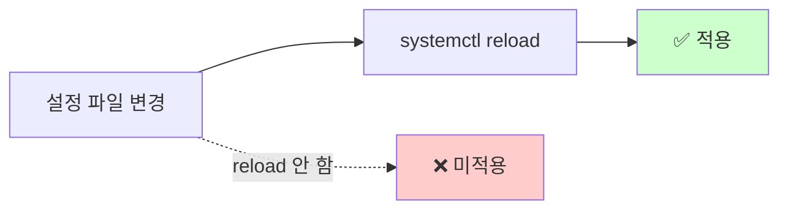

# SSH 설정 (sshd_config)

> **한 줄로** · B1-1 명세는 "**SSH 접속 포트를 20022로 변경**"하고 "**Root 원격 로그인을 차단**"하라고 요구. 두 가지 모두 `/etc/ssh/sshd_config` 파일의 두 줄 수정 + `systemctl reload sshd`로 처리. **변경 전 다른 터미널에서 새 SSH 세션을 미리 열어두는 것**이 lockout 사고 방어 핵심.

---

## 과제 요구사항

### 회사 비유로 이해하기

서버에는 SSH라는 **"원격 출입문"**이 있어, 외부에서 명령을 보내고 받을 수 있게 합니다. 이 출입문은 두 가지 보안 약점이 있어요.

**1. 모두가 22번 문 위치를 안다**
- 22번은 SSH의 표준 포트 (전화번호 같은 것)
- 자동화된 공격 봇이 끊임없이 22번 문을 두드리며 비밀번호 시도
- → 잘 안 알려진 위치(20022)로 옮기면 자동 봇의 표적에서 거의 사라짐

**2. `root`는 모든 시스템에 있는 알려진 사용자명**
- 공격자가 root만 시도해도 시스템 절반은 root 계정 보유
- → root 원격 접속 자체를 막으면 표적 면적이 사라짐 (일반 사용자로 들어와서 sudo로 권한 빌리기)

### 명세 원문 (verbatim)

> **SSH 설정**
> - SSH 접속 포트를 20022로 변경한다.
> - Root 원격 로그인을 차단한다.
>
> **확인 방법(예시)**
> - sshd 설정 파일에서 포트/PermitRootLogin 확인
> - 포트 리슨 상태 확인: `ss -tulnp` 후 sshd 관련 라인 확인

### 무엇을 바꾸나

`/etc/ssh/sshd_config` 파일에서 정확히 두 줄.

| 항목 | 기존 (기본값) | 변경 후 |
|---|---|---|
| Port | `22` (주석 처리되어 있을 수 있음) | **`20022`** |
| PermitRootLogin | `prohibit-password` 또는 `yes` | **`no`** |

### 잘 됐는지 확인하는 방법 (명세 워딩)

```bash
# 1. sshd 설정 파일에서 포트/PermitRootLogin 확인 (명세)
grep -E '^(Port|PermitRootLogin)' /etc/ssh/sshd_config
# 기대:
#   Port 20022
#   PermitRootLogin no

# 2. sshd 데몬에 실제 적용된 설정 확인
sudo sshd -T | grep -E '^(port|permitrootlogin)'
# 기대:
#   port 20022
#   permitrootlogin no

# 3. 포트 리슨 상태 확인 (명세): ss -tulnp 후 sshd 관련 라인 확인
sudo ss -tulnp | grep sshd
# 기대: ... :20022 ... sshd ...
```

---

## 구현 방법

### Step 1 — `sed`로 두 줄 변경 (멱등)

```bash
# Port를 20022로 (주석 처리된 줄도 함께 처리)
sudo sed -i 's/^#\?Port .*/Port 20022/' /etc/ssh/sshd_config

# Root 원격 접속 차단
sudo sed -i 's/^#\?PermitRootLogin .*/PermitRootLogin no/' /etc/ssh/sshd_config
```

`^#\?`의 의미: 줄 시작이 `#` 있어도 없어도 매칭 → 주석 처리된 줄도 함께 갱신 → 멱등.

### Step 2 — 문법 검증 (★ 필수)

```bash
sudo sshd -t
```

출력 없으면 OK. 문법 오류면 즉시 메시지 출력. **이 검증 안 하고 reload하면 sshd가 시작 안 되어 lockout 위험**.

### Step 3 — 안전한 reload

> [!WARNING]
> 변경 전 **다른 터미널에서 새 SSH 세션을 미리 열어두세요**. 만약 설정 실수로 접속이 끊겨도 미리 열어둔 세션으로 롤백 가능. 클라우드 서버에서는 콘솔 가야 복구 가능하므로 필수.

```bash
sudo systemctl reload ssh    # Ubuntu/Debian
# 또는
sudo systemctl reload sshd   # RHEL/Fedora
```

`reload`는 기존 SSH 연결을 끊지 않고 새 설정만 적용. `restart`보다 안전.

### Step 4 — 검증

```bash
# 변경 적용 확인
sudo sshd -T | grep -E '^(port|permitrootlogin)'

# 새 포트로 접속 가능 (다른 터미널에서)
ssh -p 20022 user@host
```

전체 스크립트: [setup/01-ssh.sh](https://github.com/codewhite7777/codyssey_b1_1/blob/main/setup/01-ssh.sh)

### 안전한 변경 흐름


---

## 개념

### `sshd_config`가 뭔가

`/etc/ssh/sshd_config`는 SSH 데몬(sshd)의 설정 파일입니다. 한 줄에 한 옵션의 `KEY VALUE` 형식. `#`으로 시작하면 주석.

```
# /etc/ssh/sshd_config 일부
Port 22
PermitRootLogin prohibit-password
PasswordAuthentication yes
PubkeyAuthentication yes
```

이 파일이 바뀌어도 sshd는 시작할 때 한 번만 읽으므로 변경 후 reload 필요.

### Port 변경의 효과

22번 포트는 SSH의 표준이라 자동화 봇의 단골 표적. 22번 노출 서버의 `auth.log` 일부:

```
May 12 03:14:01 host sshd: Failed password for root from 91.x.x.x port 60294
May 12 03:14:03 host sshd: Failed password for admin from 188.x.x.x port 41020
May 12 03:14:08 host sshd: Invalid user oracle from 103.x.x.x
May 12 03:14:15 host sshd: Failed password for postgres from 92.x.x.x port 51234
```

분 단위로 random IP에서 root·admin·user 같은 일반 계정명으로 시도. 포트를 20022로 옮기면 random scanning이 거의 못 찾음 → 로그 noise 극적 감소.

**한계**: 결정된 공격자(targeted)에게는 `nmap` 한 번이면 들통. 즉 자동화 봇 방어용이지 진정한 보안 아님. 둘을 구분해서 이해.

### `PermitRootLogin no`의 가치

root는 모든 시스템에 존재하는 알려진 사용자명입니다. 공격자가 사용자명을 추측 안 해도 되므로 brute-force가 효과적.

| 가치 | 설명 |
|---|---|
| 표적 면적 ↓ | root는 알려진 이름. 일반 사용자명은 비공개 정보 |
| 추적성 ↑ | sudo로 권한 얻으면 `/var/log/auth.log`에 누가 무엇 했는지 기록 |
| 권한 분리 | sudoers 정책으로 특정 명령만 허용 가능 |

### 변경 후 reload 필수

sshd는 시작할 때 한 번만 설정 파일을 읽음. 파일 수정만으로는 적용 안 됨.



"내가 분명 바꿨는데 왜 안 먹지" 함정의 99%가 reload 잊음.

---

## 참고

- `man sshd_config` — 모든 옵션의 정식 정의
- `man sshd` — 데몬 자체
- 관련 노트: [ssh-deep-dive.md](./ssh-deep-dive.md) — SSH 핸드셰이크 깊이
- 관련 노트: [ports-and-listening.md](./ports-and-listening.md) — `ss -tulnp` 사용법

---
출처: B1-1 (Layer 2.2) · 학습일: 2026-05-12
