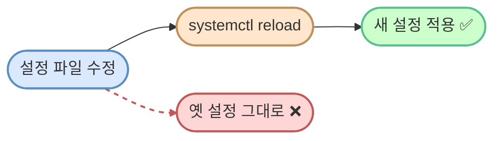

# SSH 설정

> **한 줄로** · 이 과제는 **외부에서 들어오는 통로(SSH)의 보안을 강화**하는 작업입니다. 두 가지를 합니다 — (1) 통로 위치를 22번에서 20022번으로 옮기고, (2) "관리자(root)"가 직접 들어오는 것을 막습니다. 설정 파일 두 줄만 바꾸면 끝.

---

## 과제 요구사항

### 이게 무슨 작업?

여러분의 컴퓨터가 회사의 한 사무실이라고 상상해 보세요. 멀리 있는 사람이 들어와서 일할 수 있게 **뒷문 하나**를 열어둡니다. 이 뒷문이 바로 **SSH**라는 통로입니다.

이 뒷문에 두 가지 약점이 있어요.

#### 약점 1 — 누구나 뒷문 위치를 알고 있다

- SSH 뒷문은 기본적으로 **"22번"**이라는 위치에 있어요
- 119, 112처럼 누구나 외우는 번호여서, 인터넷에 있는 **공격용 자동 프로그램**들이 끊임없이 22번 문을 두드리며 비밀번호를 추측합니다
- **해결책**: 잘 알려지지 않은 위치(예: 20022번)로 옮기면 자동 프로그램이 거의 못 찾아냅니다

#### 약점 2 — `root`(최고 관리자) 이름은 모두가 안다

- 거의 모든 리눅스 컴퓨터에 `root`라는 이름의 최고 권한 사용자가 있어요
- 공격자는 사용자 이름을 추측할 필요 없이 `root`만 시도해도 됩니다
- **해결책**: `root`로 직접 들어오는 것을 막아두면 공격자는 어느 사용자 이름인지부터 추측해야 함 (난이도 ↑)
- 평소엔 일반 사용자로 들어와서 필요할 때만 `sudo`(잠깐 관리자 권한 빌리기) 명령을 사용합니다

### 명세 원문 (원본 그대로)

> **SSH 설정**
> - SSH 접속 포트를 20022로 변경한다.
> - Root 원격 로그인을 차단한다.
>
> **확인 방법(예시)**
> - sshd 설정 파일에서 포트/PermitRootLogin 확인
> - 포트 리슨 상태 확인: `ss -tulnp` 후 sshd 관련 라인 확인

### 무엇을 바꾸나

`/etc/ssh/sshd_config`라는 파일에서 정확히 두 줄만 수정합니다.

| 항목 | 지금 (기본값) | 바꾼 후 |
|---|---|---|
| Port (통로 위치 번호) | `22` (또는 주석 처리됨) | **`20022`** |
| PermitRootLogin (관리자 직접 접속) | `prohibit-password` 또는 `yes` | **`no` (완전 차단)** |

### 잘 됐는지 확인하기

세 가지를 확인합니다.

**1) 파일에 잘 적혔는지**
```bash
grep -E '^(Port|PermitRootLogin)' /etc/ssh/sshd_config
```
기대 결과:
```
Port 20022
PermitRootLogin no
```

**2) SSH 서비스가 새 설정으로 동작 중인지**
```bash
sudo sshd -T | grep -E '^(port|permitrootlogin)'
```
기대 결과:
```
port 20022
permitrootlogin no
```

**3) 20022번에서 외부 연결을 기다리고 있는지** (명세 워딩)
```bash
sudo ss -tulnp | grep sshd
```
기대 결과: `... :20022 ... sshd ...`

---

## 구현 방법

### Step 1 — 설정 파일 두 줄 바꾸기

`sed`라는 도구로 파일을 자동 편집합니다. 명령 한 번이 한 줄을 바꿔요.

```bash
# Port를 20022로 변경
sudo sed -i 's/^#\?Port .*/Port 20022/' /etc/ssh/sshd_config

# Root 직접 접속 차단
sudo sed -i 's/^#\?PermitRootLogin .*/PermitRootLogin no/' /etc/ssh/sshd_config
```

`^#\?`의 의미: 줄 시작에 `#`이 있어도 없어도 매칭. 즉 **주석 처리된 줄도 함께 바꿈**. 그래서 이 명령을 여러 번 실행해도 결과는 똑같음(안전).

### Step 2 — 문법 검증 (★ 빼먹지 말기)

```bash
sudo sshd -t
```

출력이 없으면 OK. 만약 오류가 있으면 메시지가 나옵니다. **이 검증을 안 하고 다음 단계로 가면 SSH 서비스가 멈춰서 우리가 못 들어가는 사고가 날 수 있어요.**

### Step 3 — SSH 서비스 다시 읽기 (`reload`)

> [!WARNING]
> **반드시 이걸 먼저 하세요**: 변경 전에 **다른 터미널 창에서 SSH 한 번 더 접속해두기**. 만약 설정에 실수가 있어 첫 접속이 끊겨도, 미리 열어둔 창으로 들어가서 되돌릴 수 있어요. 클라우드 서버라면 이걸 안 하면 콘솔에 직접 접속해서 복구해야 합니다.

```bash
sudo systemctl reload ssh    # Ubuntu/Debian의 경우
# 또는
sudo systemctl reload sshd   # RHEL/Fedora의 경우
```

`reload`(다시 읽기)는 기존 SSH 연결을 끊지 않고 새 설정만 적용합니다.

### Step 4 — 새 포트로 들어가지는지 확인

```bash
# 새 터미널 또는 다른 컴퓨터에서
ssh -p 20022 사용자이름@서버주소
```

`-p 20022` 옵션은 "20022번 통로로 들어가기"라는 의미예요.

전체 자동화 스크립트: [setup/01-ssh.sh](https://github.com/codewhite7777/codyssey_b1_1/blob/main/setup/01-ssh.sh)

### 안전한 변경 흐름


---

## 개념

### `sshd_config`는 어떤 파일인가요?

`/etc/ssh/sshd_config`는 **SSH 서비스의 규칙을 적어둔 메모장**입니다. 한 줄에 한 규칙씩 적혀 있고, 앞에 `#`이 붙으면 "이 줄은 무시"(주석)를 의미해요.

```
# /etc/ssh/sshd_config 일부
Port 22
PermitRootLogin prohibit-password
PasswordAuthentication yes
```

이 파일이 바뀌어도 SSH 서비스는 **시작할 때 한 번만** 이 파일을 읽습니다. 그래서 변경 후에는 "다시 읽으라"는 명령(`reload`)이 꼭 필요해요.

### 포트 번호를 바꾸면 정말 안전해질까?

22번 포트를 노출한 서버의 로그(`auth.log`)를 잠깐만 봐도 이런 시도가 끊이지 않아요.

```
May 12 03:14:01 host sshd: Failed password for root from 91.x.x.x port 60294
May 12 03:14:03 host sshd: Failed password for admin from 188.x.x.x port 41020
May 12 03:14:08 host sshd: Invalid user oracle from 103.x.x.x
May 12 03:14:15 host sshd: Failed password for postgres from 92.x.x.x port 51234
```

분 단위로 전 세계 IP에서 `root`·`admin`·`oracle` 같은 흔한 이름으로 비밀번호 시도가 들어옵니다.

포트를 20022로 옮기면 이런 자동 공격은 거의 사라져요. 하지만 **결심한 공격자**는 `nmap`이라는 도구로 우리 컴퓨터의 모든 통로를 한 번에 스캔해서 SSH 통로를 찾아낼 수 있어요. 즉:

- ✅ 자동화된 잡음(noise) 방어 — 확실히 효과적
- ❌ 표적 공격(특정 컴퓨터 노린 공격) — 못 막음

포트 변경은 다른 보안 조치(비밀번호 정책, 키 인증, 방화벽 등)와 함께 쓸 때 의미가 있어요.

### `root` 차단의 진짜 가치

| 가치 | 설명 |
|---|---|
| 공격 대상이 줄어듦 | `root`는 알려진 이름. 우리가 만든 이름(`agent-admin` 등)은 외부인이 모름 |
| 추적이 쉬워짐 | 일반 사용자로 들어와 `sudo`로 권한 얻으면 "누가 무엇을 했는지" 기록됨 |
| 권한을 잘게 쪼갬 | `sudoers` 설정으로 "이 사용자는 이 명령만 가능" 같은 세밀한 제어 |

### 변경 후 `reload`가 꼭 필요한 이유



→ **빨간 점선** = `reload 안 했을 때` 경로 (옛 설정 잔존).

"분명 파일은 바꿨는데 왜 안 먹지?" 함정의 90%가 reload 잊음.

---

## 참고

- `man sshd_config` — 모든 옵션의 정식 정의
- `man sshd` — SSH 데몬 자체
- 관련 노트: [ssh-deep-dive.md](./ssh-deep-dive.md) — SSH의 동작 원리
- 관련 노트: [ports-and-listening.md](./ports-and-listening.md) — `ss -tulnp` 사용법

---
출처: B1-1 (Layer 2.2) · 학습일: 2026-05-12
