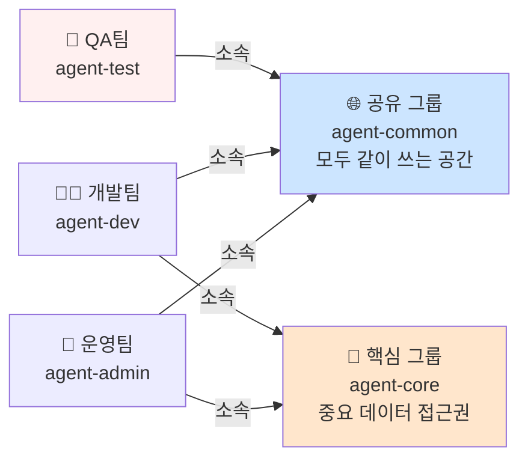
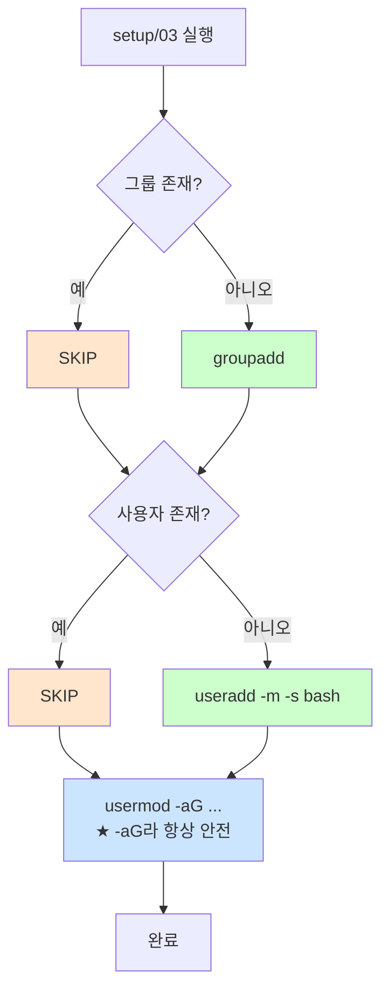
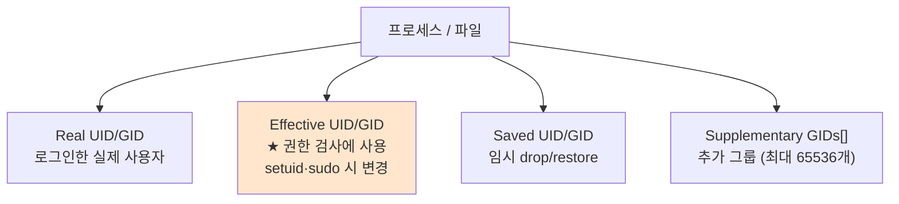
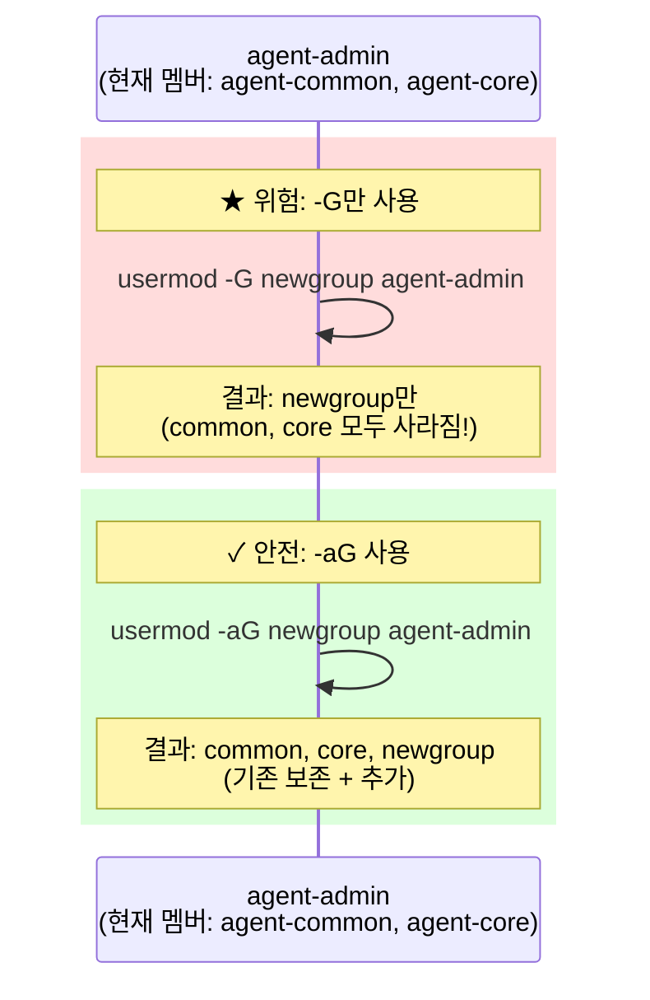
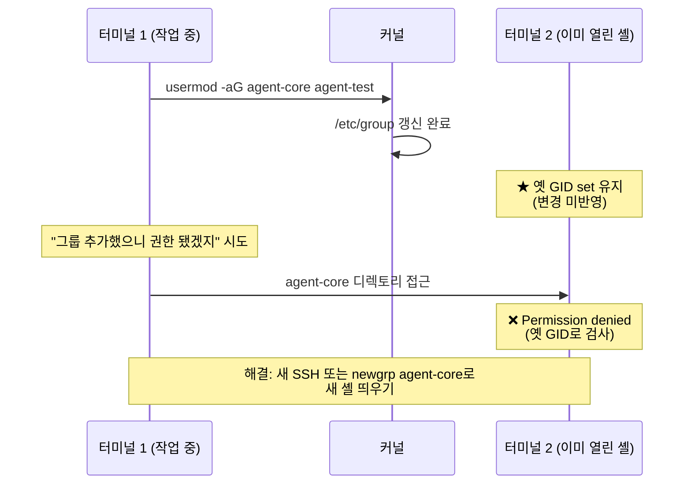

# 사용자와 그룹

> **한 줄로** · 한 서버에서 일하는 사람들의 **역할을 나누고** 각자 들어갈 수 있는 폴더를 분리하는 작업. 운영·개발·테스트 세 역할을 만들고, **테스트 담당자는 실제 비밀번호·로그에 접근 못 하게** 막는 게 핵심.

---

## 과제 요구사항

### 회사 비유로 이해하기

이 과제는 회사의 부서·권한 구조와 비슷합니다. 한 회사에 세 명의 직원이 있다고 상상하세요.

| 직원 | 사용자 이름 | 무슨 일을 하나? |
|---|---|---|
| 👔 운영팀 | `agent-admin` | 서버 관리, 정해진 시간에 자동 작업 실행 |
| 👨‍💻 개발팀 | `agent-dev` | 모니터링 스크립트(monitor.sh) 같은 도구 작성 |
| 🧪 QA팀 | `agent-test` | 테스트 담당 (실제 운영 데이터는 보면 안 됨) |

그리고 두 개의 "권한 그룹"을 만듭니다 — 회사의 공용 공간과 보안 구역처럼.

| 그룹 | 비유 | 누가 들어갈 수 있나 |
|---|---|---|
| 🌐 `agent-common` | 회의실·휴게실 (모두 사용) | 운영팀, 개발팀, QA팀 |
| 🔐 `agent-core` | 인사팀·금고실 (자격자만) | 운영팀, 개발팀 (QA팀 ❌) |

### 관계 그림



### 누가 어디에 들어갈 수 있나

| 직원 | 📁 공유 폴더<br/>(upload_files) | 🔑 비밀번호 폴더<br/>(api_keys) | 📊 모니터링 로그<br/>(/var/log/agent-app) |
|---|:---:|:---:|:---:|
| 👔 운영팀 | ✅ 가능 | ✅ 가능 | ✅ 가능 |
| 👨‍💻 개발팀 | ✅ 가능 | ✅ 가능 | ✅ 가능 |
| **🧪 QA팀** | ✅ 가능 | **❌ 차단** | **❌ 차단** |

**왜 이렇게?** 테스트 담당자가 실수로 진짜 비밀번호나 운영 로그를 건드리면 사고가 날 수 있습니다. 회사에서 신입 인턴이 회사 금고에 못 들어가게 막는 것과 같은 개념입니다.

### 명세 원문 (참고)

> **생성 계정**
> - `agent-admin` (운영/관리, cron 실행자)
> - `agent-dev` (개발/운영, monitor.sh 작성자)
> - `agent-test` (QA/테스트)
>
> **생성 그룹**
> - `agent-common`: admin, dev, test
> - `agent-core`: admin, dev

### 잘 됐는지 확인하는 방법

```bash
# 1. 각 직원의 정보 확인 (어느 그룹에 속하는지)
id agent-admin
id agent-dev
id agent-test

# 2. 그룹 멤버 확인
getent group agent-common      # 운영·개발·QA 셋 다 보여야 함
getent group agent-core        # 운영·개발만 (QA 없어야 함)

# 3. QA 담당자가 비밀번호 폴더 접근 시도 → 차단되어야 함
sudo -u agent-test ls /home/agent-admin/agent-app/api_keys
# 결과 기대: "Permission denied" (접근 거부)
```

---

## 구현 방법

### Step 1 — 그룹 생성 (멱등)

```bash
for group in agent-common agent-core; do
    if getent group "$group" >/dev/null 2>&1; then
        echo "[SKIP] group $group 이미 존재"
    else
        sudo groupadd "$group"
        echo "[OK] group $group 생성"
    fi
done
```

**기대 출력 (첫 실행)**:
```
[OK] group agent-common 생성
[OK] group agent-core 생성
```

### Step 2 — 사용자 생성

```bash
for user in agent-admin agent-dev agent-test; do
    if id "$user" >/dev/null 2>&1; then
        echo "[SKIP] user $user 이미 존재"
    else
        sudo useradd -m -s /bin/bash "$user"
        echo "[OK] user $user 생성"
    fi
done
```

옵션:
- `-m`: 홈 디렉토리(`/home/$user`) 자동 생성
- `-s /bin/bash`: 기본 셸 지정

### Step 3 — 그룹 멤버십 (★ `-aG` 필수)

```bash
sudo usermod -aG agent-common,agent-core agent-admin
sudo usermod -aG agent-common,agent-core agent-dev
sudo usermod -aG agent-common agent-test
```

> [!WARNING]
> `-a`(append) 빼면 기존 supplementary 그룹이 **모두 삭제**됨. 자동화에서 절대 사고. 항상 `-aG` 명시.

### Step 4 — 검증

```
$ id agent-admin
uid=1001(agent-admin) gid=1001(agent-admin) groups=1001(agent-admin),1002(agent-common),1003(agent-core)

$ id agent-test
uid=1003(agent-test) gid=1003(agent-test) groups=1003(agent-test),1002(agent-common)
                                                                                  ^^^
                                              ★ agent-core 없음 (의도된 격리)
```

### 멱등성 — 재실행 안전 흐름



전체 스크립트: [setup/03-users-groups.sh](https://github.com/codewhite7777/codyssey_b1_1/blob/main/setup/03-users-groups.sh)

---

## 개념

### Linux 신원 모델 — `(uid, gid, supplementary GIDs)`

Linux의 모든 프로세스·파일은 신원을 가진다. 커널 내부에서는 다음 다층 구조.



**왜 3종 UID 분리?** `passwd` 같은 setuid 프로그램에서 effective UID는 root(권한 행사), real UID는 호출자(감사 추적). 권한 위임의 다층 안전장치.

### Primary vs Supplementary Group

```
agent-admin
├── primary gid: agent-admin    ← 새 파일 만들면 이 그룹이 owner
└── supplementary: [agent-common, agent-core]  ← 기존 파일 접근 권한 검사
```

| | Primary | Supplementary |
|---|---|---|
| 개수 | 정확히 1개 | 0개 이상 |
| 저장 | `/etc/passwd` 4번째 필드 | `/etc/group` 멤버 목록 |
| 새 파일 소유 | ✅ 기본 group owner | ❌ 영향 X |
| 기존 파일 권한 | (owner 매칭 안 되면 검사) | ✅ 매칭되면 group 권한 |

★ 단, **setgid 디렉토리**(`/var/log/agent-app`)에서는 새 파일이 그 디렉토리의 그룹 상속 → primary 무시.

### `usermod -G` vs `-aG` 함정



자동화 스크립트에서 가장 자주 만나는 사고. 항상 `-aG`.

### 그룹 변경의 비동기성



→ 그룹 추가 직후 같은 셸에서 즉시 권한 작업하면 실패. 새 세션 필요.

---

## 참고

- `man 5 passwd`, `man 5 group`, `man 5 shadow`
- `man useradd`, `man usermod`, `man getent`
- `man 7 credentials` — UID/GID 모델 전반
- 관련 노트: [file-permissions.md](./file-permissions.md) (권한 검사 알고리즘)
- 관련 노트: [shell-environment.md](./shell-environment.md) (그룹 변경의 셸 환경 영향)

---
출처: B1-1 (Layer 1.2) · 학습일: 2026-05-12
