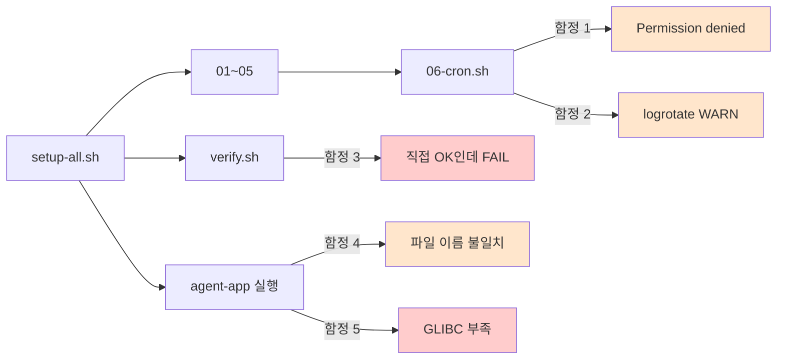
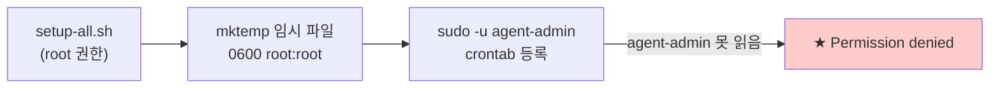
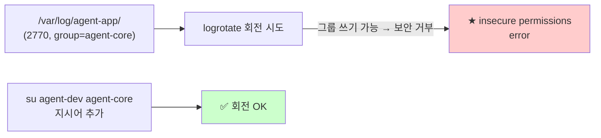
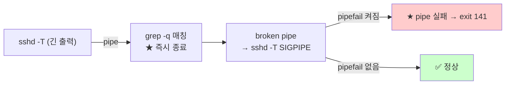
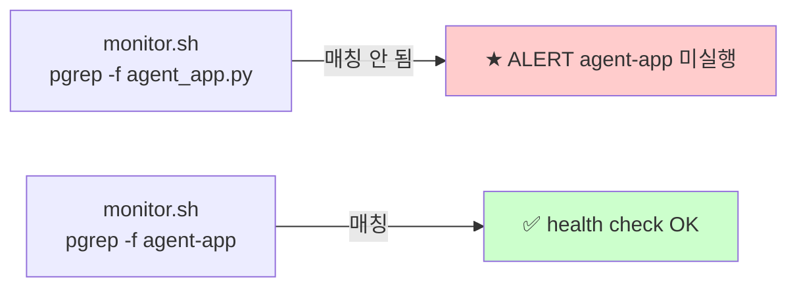
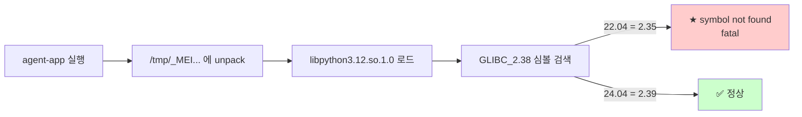
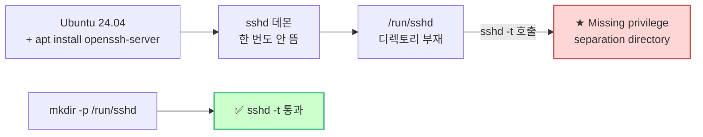

# B1-1 트러블슈팅 회고 — 5가지 함정과 해결

> **한 줄로** · OrbStack VM 에서 B1-1 산출물을 직접 실행·검증하면서 만난 **5가지 함정**과 그 해결 과정. 각 함정은 운영 자동화에서 자주 만나는 보편적 함정의 사례로, 자기평가·향후 과제의 학습 자산.

---

## 전체 흐름 — 어디서 어떤 함정?



5개 함정은 **공통적으로 "표면 동작 vs 실제 동작의 미묘한 차이"** 가 본질. 직접 명령은 통과하는데 자동화에서는 막힘, 또는 환경 권한·버전이 보이지 않게 다름.

---

## 함정 1: cron 등록 시 Permission denied

> **한 줄로** · `mktemp` 으로 만든 임시 파일을 다른 사용자가 읽지 못해 cron 등록 실패. 권한 한 줄(`chmod 0644`) 로 해결.

### 회사 비유

회의록을 **잠금 봉투** 에 넣었는데(`mktemp` 기본 0600 = 소유자만), 그 봉투를 **다른 부서 직원**(agent-admin) 에게 전달해서 보라고 한 셈. 받은 사람이 못 열어 → 작업 중단.

### 무슨 일



실제 메시지:
```
/tmp/tmp.kd4ZhgmBAC: Permission denied
```

### 해결 (commit `2793402`)

`setup/06-cron.sh:30` 에 한 줄 추가:
```bash
TMPCRON=$(mktemp)
chmod 0644 "$TMPCRON"      # ★ 추가 — agent-admin 도 읽을 수 있게
trap "rm -f $TMPCRON" EXIT
```

`/tmp` 는 sticky bit 보호 + trap 으로 즉시 삭제되므로 0644 도 안전.

### 배운 점

- `mktemp` 기본 권한이 **0600** 이라 다른 사용자에게 전달 시 함정
- `sudo -u other_user` 패턴은 파일 권한도 함께 고려 필요
- 운영 자동화에서 "내가 만든 파일 → 다른 사용자가 사용" 패턴은 **권한 명시** 가 안전

---

## 함정 2: logrotate dry-run 경고

> **한 줄로** · 로그 디렉토리가 그룹 쓰기 가능(`2770`) 으로 만들어져 있어서 logrotate 가 보안상 회전 거부. `su agent-dev agent-core` 한 줄로 해결.

### 회사 비유

회사 보안 정책: **그룹원이 자유롭게 쓸 수 있는 폴더(2770)** 에 있는 로그는 logrotate(보안 직원) 가 **변조 위험** 으로 판단해 거부. "그 폴더 정리할 거면 누구의 권한으로 정리할지 명시해라" 라고 요구.

### 무슨 일



logrotate 메시지:
```
error: skipping ".../monitor.log" because parent directory has
insecure permissions (It's world writable or writable by group which is not "root")
Set "su" directive in config file to tell logrotate which user/group should be used.
```

### 해결 (commit `415c3e0`)

`setup/06-cron.sh` 의 logrotate config 에 한 줄 추가:
```
/var/log/agent-app/monitor.log {
    su agent-dev agent-core    ★ 추가
    size 10M
    rotate 10
    ...
}
```

logrotate 가 회전 시 해당 user/group 권한으로 동작 → 보안 검사 통과.

### 배운 점

- 명세는 **그룹 협업** 위해 setgid + 그룹 쓰기 권한을 요구
- logrotate 는 **보안 위해** group-writable 디렉토리 회전 거부
- 두 요구의 **균형점** 이 `su` 지시어 — "그룹원이 쓰는 디렉토리지만 회전은 지정 사용자로"
- 운영에서 자주 만나는 "협업 편의 vs 보안" 트레이드오프의 표준 해결법

---

## 함정 3 (★ 최대 발견): verify.sh — 직접 실행 OK, 스크립트 안 FAIL

> **한 줄로** · `set -o pipefail` + `grep -q` + 긴 출력 = SIGPIPE 함정. 자동화 스크립트의 보편적 함정으로 학습 가치 가장 높음.

### 회사 비유

보고서를 비서가 **만 페이지** 들고 와서 읽고 있는데(`sshd -T` 긴 출력), 내가 **첫 문장만 보고 "OK"** 하고 가버림(`grep -q` 즉시 종료). 비서가 다음 페이지 넘기다 손이 멈춤(SIGPIPE) → 비서가 "보고 완료 못 함" 보고. 안전 모드(`pipefail`) 가 이를 "보고서 실패" 로 잡아서 결과적으로 "FAIL".

근데 내가 직접 같은 보고서 보면(인터랙티브 셸) — 비서 멈춤은 "정상 동작" 으로 무시 → OK.

### 무슨 일



증명:
```bash
$ sudo bash -c 'set -uo pipefail; sudo sshd -T | grep -q "^port 20022$"; echo $?'
141       ← SIGPIPE

$ sudo bash -c 'set -u; sudo sshd -T | grep -q "^port 20022$"; echo $?'
0         ← OK
```

### 해결 (commit `45db2e7`)

`setup/verify.sh:5` 의 `set -uo pipefail` → `set -u` (pipefail 제거). check 함수는 cmd 의 exit code 만 보므로 pipefail 불필요.

```bash
set -u
# 주의: pipefail 의도적으로 비활성.
# check 함수의 cmd 안에서 `... | grep -q ...` 패턴을 자주 쓰는데,
# grep -q 가 첫 매칭에서 즉시 종료하면 앞 명령이 SIGPIPE(141)로 끝남.
# pipefail 켜져 있으면 이를 pipe 실패로 잡아 false negative 발생.
```

### 배운 점

이 함정은 운영 자동화에서 **가장 흔한 false negative** 패턴 중 하나:

| 요소 | 의도 | 부작용 |
|---|---|---|
| `set -o pipefail` | 안전 모드 — pipe 중간 실패 감지 | grep -q 의 즉시 종료를 "실패" 로 잡음 |
| `grep -q` | 효율 — 첫 매칭에서 즉시 종료 | 앞 명령에 SIGPIPE 유발 |
| 긴 stdout | 정상 동작 | SIGPIPE 더 자주 발생 |

대응 패턴:
1. **단순 검사 스크립트는 pipefail 끄기** (verify·진단용)
2. **변경 스크립트는 pipefail 켜기** (setup용 — 함정보다 안전 우선)
3. **grep 사용 변경** — `grep ... > /dev/null` 같이 명시적으로 모두 소비

자기평가의 핵심 답변 — "안전 모드 옵션 (`set -euo pipefail`) 의 적용 범위와 한계":
- 변경 스크립트 (setup-all.sh): 안전 모드 전체 적용
- 검증 스크립트 (verify.sh): pipefail 빼야 SIGPIPE 함정 회피

---

## 함정 4: agent_app.py vs agent-app — 파일명 불일치

> **한 줄로** · 명세는 예시 이름 `agent_app.py` 를 쓰지만 실제 제공 파일은 PyInstaller 로 빌드된 ELF 바이너리 `agent-app`. monitor.sh 의 `APP_NAME` 을 실제 파일명에 맞춰야 health check 통과.

### 회사 비유

회사 매뉴얼에 "**김 대리(예시 이름)**, 또는 실제 담당자 이름을 호출하라" 고 적혀 있는데, 실제 출근한 사람은 **박 차장**. 호출 시스템이 "김 대리" 만 부르면 박 차장이 응답 안 함 → "담당자 없음" 보고. 시스템을 "박 차장 호출" 로 바꿔야 함.

### 무슨 일

명세 line 129:
> 프로세스: `agent_app.py` (**또는 제공 앱 파일명**) 실행 상태를 확인하고...

실제 제공 파일:
- 이름: `agent-app` (확장자 없음)
- 정체: PyInstaller 로 빌드된 ELF 바이너리 (Python 인터프리터 + 코드 + 의존 패키지 통째)

monitor.sh:22 의 `APP_NAME` 기본값이 `agent_app.py` 였음:



### 해결 (commit `efc4abd`)

`bin/monitor.sh:22` 변경:
```bash
APP_NAME="agent_app.py"    # 변경 전
APP_NAME="agent-app"        # 변경 후
```

추가로 메시지 워딩 정정 — 명세 line 134 의 "`[ALERT] agent-app 미실행`" 그대로 사용:
```bash
log_to_file "[ALERT] agent-app 미실행"        # 명세 원문 매칭
log_to_file "[ALERT] agent-app PID:.. is zombie"
log_to_file "[ALERT] port .. not LISTEN"
```

### 배운 점

- **명세 예시 = 절대값이 아님** — "또는 제공 앱 파일명" 같은 조항을 놓치면 함정
- **파일 이름은 정체를 반영** — `.py` 가 아닌 ELF 바이너리에 `.py` 붙이면 의미 왜곡
- **변경 범위는 *내가 만든 코드* 에 한정** — 외부 제공 파일은 원본 유지
- **`pgrep -f` 는 명령줄 전체 매칭** — 실행 명령에 보이는 이름과 매칭해야

---

## 함정 5 (★ 환경): GLIBC 2.38 부족 — 명세 22.04 vs 빌드 24.04

> **한 줄로** · 제공 agent-app 바이너리가 GLIBC 2.38 (Ubuntu 24.04 기준) 요구하는데 명세 권장 Ubuntu 22.04 는 2.35. agent-app 실행 자체가 fatal error 로 종료. 명세의 "동등 리눅스" 조항으로 24.04 사용.

### 회사 비유

회사가 **2024년 빌드된 신형 장비** (agent-app, GLIBC 2.38 필요) 를 보냈는데, 사무실은 여전히 **2022년 표준** (Ubuntu 22.04, GLIBC 2.35). 장비가 "여기엔 2024년 부품 없음" 하며 켜지지 않음. 옵션: (1) 사무실 2024년으로 업그레이드, (2) 장비를 2022년용으로 재빌드 요청.

### 무슨 일



에러 메시지 (가장 직접 증거):
```
[PYI-4720:ERROR] Failed to load Python shared library
'/tmp/_MEId0SQMi/libpython3.12.so.1.0':
/lib/x86_64-linux-gnu/libm.so.6: version `GLIBC_2.38' not found
```

OS·GLIBC 매핑:

| Ubuntu | GLIBC | Python(기본) | agent-app |
|---|---|---|---|
| 22.04 LTS (명세 권장) | 2.35 | 3.10 | ❌ |
| 24.04 LTS | 2.39 | 3.12 | ✅ |

### 해결 (임시 대응 + 운영진 문의)

**즉시**: 명세의 "Ubuntu 22.04 **또는 동등 리눅스**" 조항 활용 → Ubuntu 24.04 amd64 VM 으로 재생성.

```bash
orb create --arch amd64 ubuntu:24.04 codyssey-b1-1
```

**운영진 문의 (게시 완료)**: agent-app GLIBC 의존성 명세 명시 / 22.04 재빌드 가능성 / 평가 클러스터 OS 공개 요청.

`README.md` 에 GLIBC 박스 + 트러블슈팅 항목 추가 (commit `bb3fac9`).

### 배운 점

- **명세 권장과 제공 자료가 모순** — 명세 충실성 vs 자료 호환성 트레이드오프
- **GLIBC 는 OS 핵심 라이브러리** — 후속 패치·우회 불가능, 환경 자체 업그레이드 필요
- **PyInstaller 바이너리 = 빌드 환경 OS 의존** — 배포 환경 ≥ 빌드 환경 원칙
- **"동등 리눅스" 조항을 적극 활용** — 명세 의도에 맞는 방향이면 더 새 OS 도 수용
- **사실 발견 시 운영진 문의** — 같은 함정 재발 방지 + 평가 환경 정합성

---

## 함정 6 (★ 신규 환경): Ubuntu 24.04 에서 `/run/sshd` 부재

> **한 줄로** · 24.04 갓 설치 환경에서 `openssh-server` 가 막 설치되어 sshd 데몬이 한 번도 안 뜨면 `/run/sshd` 디렉토리가 없음. `setup/01-ssh.sh` 의 `sshd -t` 가 "Missing privilege separation directory" 로 실패. `mkdir -p /run/sshd` 한 줄로 회피.

### 회사 비유

새 사무실 입주 첫날 — 화장실 위치(`/run/sshd`)가 빌딩 설계도에는 있지만 청소부(systemd) 가 한 번 청소하기 전까지 실제로 만들어지지 않음. 안전 점검관(`sshd -t`)이 위치 확인하려는데 없어서 "안전 검사 불가" 보고. **수동으로 한 번 만들어두면 해결**.

### 무슨 일



실제 메시지:
```
Missing privilege separation directory: /run/sshd
[ERROR] sshd_config 문법 오류
```

22.04 에서는 어떤 이유로 `/run/sshd` 가 자동 생성됐지만 24.04 신규 환경에선 명시적 처리 필요.

### 해결 (commit `3aedeb7`)

`setup/01-ssh.sh` 에 한 줄 추가 + `reload` → `restart` 변경:

```bash
# /run/sshd 보장 (Ubuntu 24.04 함정 대응)
sudo mkdir -p /run/sshd

# 문법 검증
if ! sudo sshd -t; then ...

# 데몬 시작·재시작 (24.04 신규는 첫 시작 필요)
sudo systemctl enable ssh 2>/dev/null || true
sudo systemctl restart ssh 2>/dev/null || sudo systemctl restart sshd
```

### 배운 점

- **신규 설치 환경 vs 운영 환경의 차이** — 데몬이 한 번이라도 떠야 만들어지는 런타임 디렉토리들이 있음
- **`systemctl reload` 는 데몬이 떠 있어야 가능** — 첫 시작에는 `restart` 사용이 안전
- **OS 버전마다 미묘한 동작 차이** — 22.04 → 24.04 마이그레이션의 흔한 함정
- **운영 스크립트는 "0일차" 환경을 가정해야 견고** — 우리 setup-all.sh 멱등성의 진정한 의미는 *어떤 부분 상태든 + 신규 환경*에서 동일하게 수렴

---

## 종합 — 운영 엔지니어링의 보편적 함정

6개 함정을 추상화하면 운영 자동화에서 자주 만나는 패턴이 보임:

| 함정 | 보편 패턴 |
|---|---|
| 1. mktemp 권한 | "내가 만든 자원 → 다른 사용자가 소비" 시 권한 명시 필요 |
| 2. logrotate group-writable | 보안 정책 vs 협업 편의의 균형 — 명시적 `su` |
| 3. SIGPIPE × pipefail | **자동화의 표면 동작 vs 실제 동작 차이** (대표 사례) |
| 4. 파일명 불일치 | 명세 예시 ≠ 실제 자료, "또는" 조항 확인 |
| 5. GLIBC 버전 | 환경 의존성 = "OS 매뉴얼 버전" 매핑 |

### 자기평가 답변에 활용

명세의 자기평가 항목 중:
> "트러블슈팅을 통해 무엇이 어디에서 막혔고 어떻게 해결했는지를 설명할 수 있다"

→ 위 6개 함정 각각이 **재현 가능한 사례** + **원인 분석** + **해결 코드** + **운영 일반화** 가 갖춰진 풍부한 답변 재료.

특히 함정 3 (SIGPIPE × pipefail) 은 **운영 자동화 표준 함정** 중 하나로, "안전 모드 (`set -euo pipefail`) 의 적용 범위와 한계" 같은 깊이 있는 답변에 최적. 함정 6 (`/run/sshd` 부재) 는 *"멱등성·견고성이 신규 환경에서도 동작하는가"* 에 답할 때 활용.

---

## 참고

- 관련 commit: `2793402`, `415c3e0`, `45db2e7`, `efc4abd`, `bb3fac9`, `3aedeb7`
- 학습 노트: [bash-set-safe](../codyssey_b1_1_study/bash-set-safe.md), [cron-fundamentals](../codyssey_b1_1_study/cron-fundamentals.md), [log-rotation](../codyssey_b1_1_study/log-rotation.md)
- 관련 PR/이슈: 운영진 문의 게시 글 (2026-05-12)

---
회고일: 2026-05-12 · B1-1 트러블슈팅 5건 + 운영진 1건 문의
